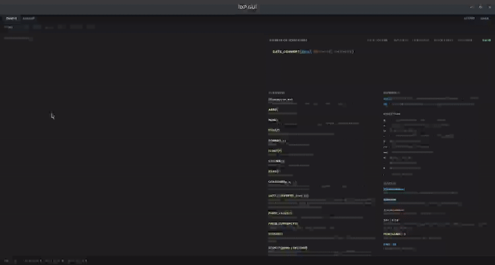

# BXP - Broker eXchange Parser

[](LICENSE.md)
[](https://github.com/zaxified/bxp/security/code-scanning)

> Convert broker exports into [Wealthfolio](https://wealthfolio.app/) and
> [brycht.app](https://brycht.app) CSV using declarative JSON5 templates.
> Privacy-respecting, single binary, no runtime dependencies.

## About

BXP is a general-purpose tabular ETL tool that turns broker and
open-data exports into clean, import-ready CSV. It ships as a desktop app
with a live row-by-row debugger, a headless CLI for pipelines, and an MCP
server for AI agents - all on a streaming, multicore engine, behind a
signed cross-platform release pipeline. It began as a Zig experiment and
grew into a complete product across Linux, macOS, and Windows.
Contributions - broker templates, datasets, code, documentation - are
welcome; see [`CONTRIBUTING.md`](CONTRIBUTING.md).

<details open>
<summary> bxp-gui preview demo</summary>



</details>

## What it does

BXP turns broker statements (CSV, XLSX, JSON) into
[Wealthfolio](https://wealthfolio.app/) and [brycht.app](https://brycht.app)
CSV import formats. Adding a new broker is a JSON5 template - no code, no
compilation. Two binaries ship together:

- **`bxp-cli`** - headless batch converter for scripts and pipelines.
- **`bxp-gui`** - desktop editor with autocomplete, syntax check, and a
  live dry-run debugger that streams per-row trace events.

Inputs CSV / XLSX / JSON / ZIP (zipped CSV exports); outputs CSV
(RFC 4180) or JSON. The two-pass pipeline supports cross-row joins
(paired transaction legs, fee refunds), 1:N row routing (one input row -
multiple output rows), and an expression language with conditionals,
math, string ops, date / currency parsing, lookups, and identifier
mapping. Input is streamed in chunks and processing fans out across CPU
cores, so peak memory is bounded by the chunk size, not the file size.

## Supported brokers

Built-in templates ship for Anycoin, Revolut X, Trading 212, and XTB
(both old and new formats), targeting both Wealthfolio and brycht.app. The full list lives in
[`resources/console/bxp-cli.examples.json`](resources/console/bxp-cli.examples.json) -
each entry is a working template with inline comments you can copy and
adapt. A new broker takes a JSON5 entry, not a code change.

## Why use BXP

- **GUI with a live transformation debugger.** Edit a template, hit
  dry-run, and watch every row's variables, rule matches, and output
  stream past live. Click any trace event to jump to the expression that
  produced it; typos surface as red underlines on the offending token
  before you save.
- **Fast and parallel.** A streaming, multicore pipeline converts
  millions of rows in seconds while peak memory stays flat (~25 MB)
  regardless of file size - the file is never loaded into RAM whole. See
  [Performance and limits](#performance-and-limits).
- **Handles messy real-world data.** CSV, XLSX, and JSON - or straight
  from a ZIP archive of many CSVs - with legacy code pages
  (Windows-1250 / 1252, Latin-1 / 2 / 9), non-comma delimiters, and
  locale number / date formats decoded on the way in.
- **A real expression language.** Over 50 built-in functions -
  conditionals, math, string and date ops, lookups, and identifier
  mapping (`CASE`, `IFERROR`, `REMAP`, `DATE_CONVERT`, `LOOKUP`, ...).
  Type and range errors are caught statically, before you run.
- **Agent-controllable over MCP.** Templates are JSON5 with comments an
  LLM can author from a sample export. A bundled MCP server lets an AI
  agent validate, evaluate, self-test templates, and even drive the GUI
  end to end.
- **Universal mini-ETL.** Wealthfolio and brycht.app are the shipping
  targets, but the engine is broker- and target-agnostic - anything
  expressible as "tabular in, tabular out, with row-level rules" fits.
- **Single static binary.** The `bxp-cli` engine is one self-contained
  executable - no Python, no Docker, no Java runtime - cross-compiled for
  Linux, macOS, and Windows; the desktop app ships as a self-contained
  bundle.
- **Clean install, secure updates.** Per-user install on Windows, with
  no administrator elevation required. The built-in updater verifies
  every download against a minisign-signed checksum manifest and fails
  closed on any mismatch.
- **Local-only.** Your statements never leave the machine. No cloud, no
  API keys, no telemetry.
- **Apache 2.0.** Use commercially, fork, modify.

## Performance and limits

The pipeline streams its input in chunks and fans the per-row work out
across CPU cores, so throughput scales with the machine and peak memory
stays flat regardless of how large the file is.

A real example, on an 8-core desktop with the shipped release build: a
~1 GB CSV (3.6 million rows) with a per-row date conversion plus column
transforms converts in about 11 seconds, peaking at ~24 MB of RAM. A
plain column passthrough of the same file finishes in ~7 seconds. Memory
stays near 25 MB either way - the file is never read into RAM whole.

And a real archive, end to end: the Czech national address register
(RÚIAN) ships as a 63 MB ZIP of 6,258 per-municipality Windows-1250 CSVs
(354 MB unpacked). bxp converts the whole thing straight from the `.zip`
in one run - parallel unpack, code-page transcode, date normalisation,
and a combined roll-up of 3,020,222 rows - in about 10 seconds at ~30 MB
RAM, no pre-unzip step. See
[`docs/examples/real-world/ruian-address-points`](docs/examples/real-world/ruian-address-points/index.md).

Practical limits:

- **CSV** - no file-size limit (streamed in chunks); up to 16,384
  columns per row.
- **XLSX** - worksheets are streamed (no file-size limit) and extracted
  in parallel across sheets; up to 16,384 columns; the shared-strings
  table is capped at 1 GiB.
- **ZIP** - zipped-CSV exports (`zip_input`) are unpacked in parallel
  and streamed member by member, with memory bounded to one inflate
  window per worker.

## Quick start

### 1. Console cli with examples

The console package ships `bxp-cli` + `bxp-mcp` (an MCP server that lets an
AI agent validate, evaluate, and self-test templates) + `bxp-cli.examples.json` (12 working
templates with inline comments) + a sample `bxp-cli.json`. Use this when
you want headless batch conversion, want to script `bxp-cli` into a
pipeline, or just need to read the template catalog without installing
the GUI.

Download from the
[releases page](https://github.com/zaxified/bxp/releases/latest) — pick
`bxp-console-<version>-<platform>.{tar.gz,zip}` for your OS.

### 2. Desktop gui debugger

#### Linux

```bash
sudo apt install libfuse2t64   # libfuse2 on older distros
mkdir -p ~/.local/bin && cd ~/.local/bin
rm bxp-desktop-linux-x86_64.AppImage   # delete previous downloads
wget https://github.com/zaxified/bxp/releases/latest/download/bxp-desktop-linux-x86_64.AppImage
chmod +x bxp-desktop-linux-x86_64.AppImage
./bxp-desktop-linux-x86_64.AppImage   # first launch prompts to install menu + icons + bxp-gui.json
```

The AppImage lives in `~/.local/bin/` (typically on `PATH`). User
preferences auto-save to `~/.local/share/bxp-gui/bxp-gui.json` on first
edit. After the first launch's integration prompt, the app is reachable
from the system menu.

#### Windows

Download
[`bxp-desktop-windows-x86_64.exe`](https://github.com/zaxified/bxp/releases/latest/download/bxp-desktop-windows-x86_64.exe)
and run the NSIS installer. SmartScreen may warn — "More info" → "Run
anyway". It installs per-user — no administrator rights required — to
`%LOCALAPPDATA%\Programs\bxp-gui`, with a Start menu entry and desktop
shortcut.

#### macOS (Apple Silicon)

Download
[`bxp-desktop-macos-arm64.dmg`](https://github.com/zaxified/bxp/releases/latest/download/bxp-desktop-macos-arm64.dmg),
open it, drag `bxp-gui.app` to `/Applications/`. First launch:
right-click `bxp-gui.app` → Open → Open (bypasses Gatekeeper once).
Subsequent launches go through Spotlight / Launchpad / Dock.

## Documentation

| For                                | Read                                                         |
| ---------------------------------- | ------------------------------------------------------------ |
| Using `bxp-cli` (terminal) or `bxp-gui` (desktop) | [`resources/readme.md`](resources/readme.md)  |
| Developer / architecture / roadmap | [`docs/`](docs/README.md)                                    |
| Contributing                       | [`CONTRIBUTING.md`](CONTRIBUTING.md)                         |
| Release history                    | [`CHANGELOG.md`](CHANGELOG.md)                               |

## Licence

Apache License 2.0. See [`LICENSE.md`](LICENSE.md).
