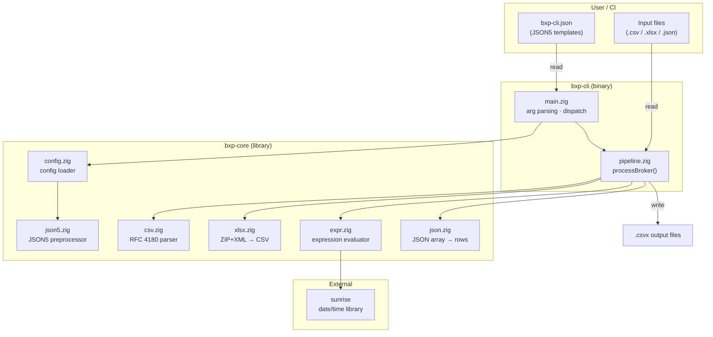
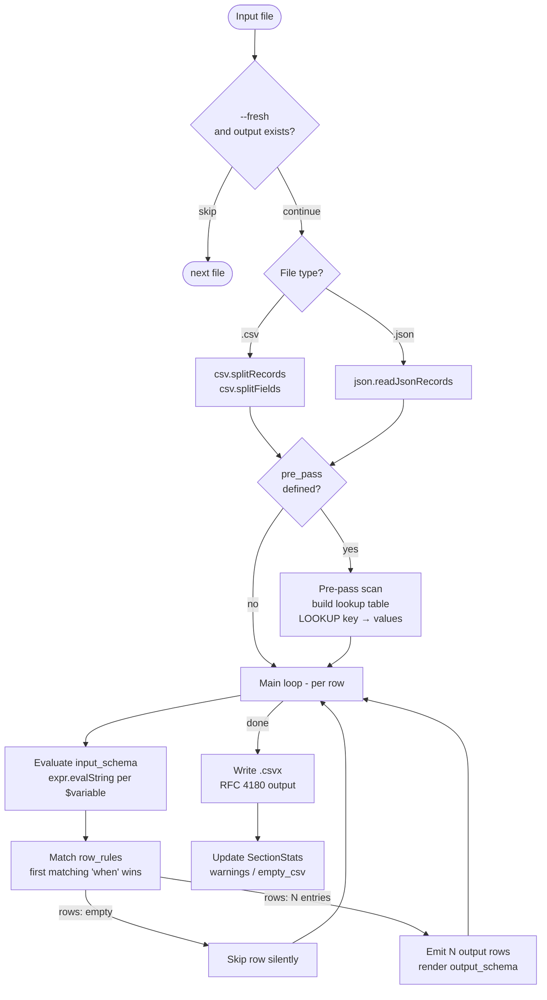
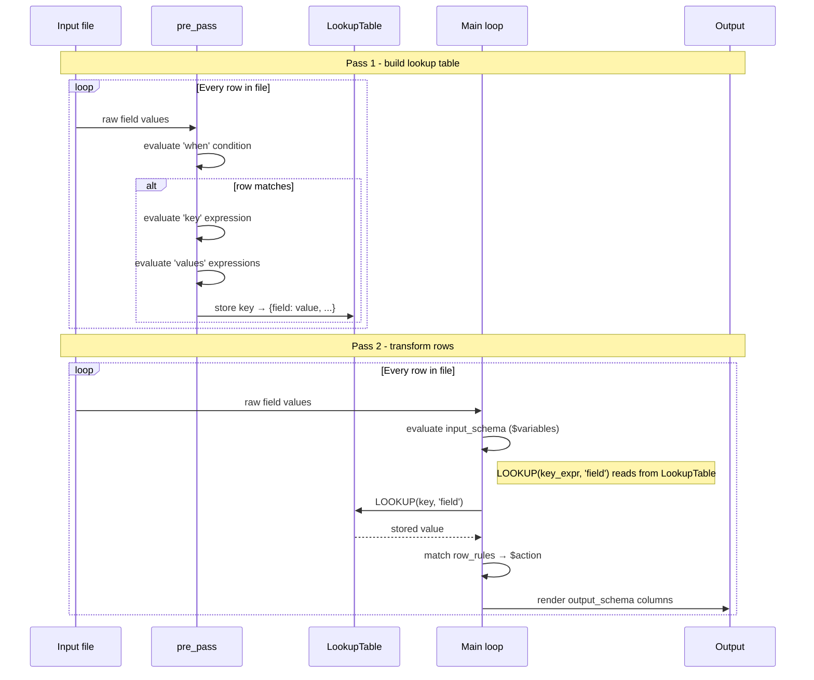
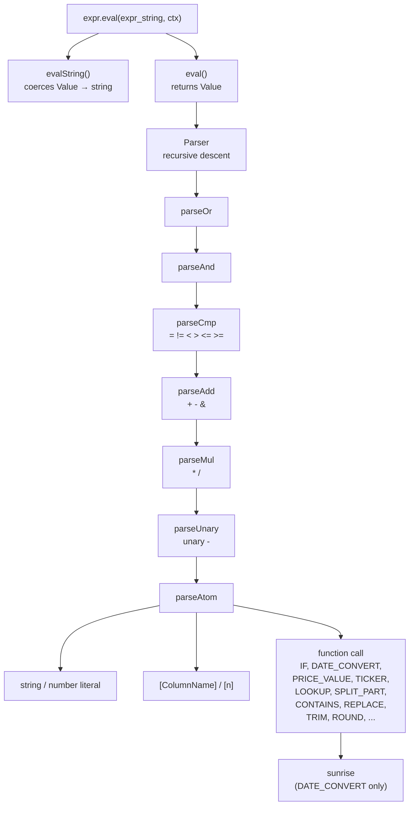
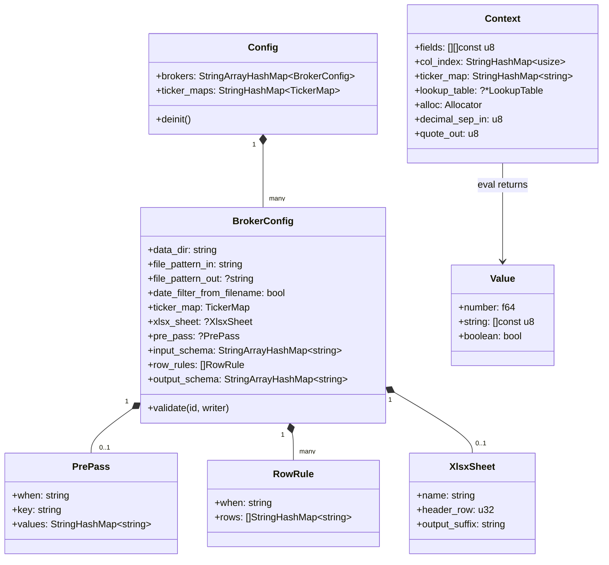

# BXP - Architecture

> Part of the [developer guide](devel.md).

---

## Bird's-eye View

BXP is a single-binary ETL tool. All broker logic lives in a JSON5 config file -
the binary is a generic engine. The diagram below shows the high-level relationship
between components.

---

## Execution Flow

Step-by-step flow when `bxp-cli` is invoked.

---

## Per-File Processing (processBroker)

For each input file matched by `file_pattern_in`:

---

## Two-Pass Pipeline Detail

The `pre_pass` mechanism enables **cross-row lookups** - values from one row
can be referenced when processing a different row.

**Example use case (AnyCoin):** A `trade payment` row holds the currency; a `trade fill`
row holds the ticker and quantity. Both share an `Order ID`. `pre_pass` indexes payment
rows by `Order ID`; the main loop uses `LOOKUP([Order ID], 'currency')` when processing
fill rows.

---

## Expression Evaluator - Call Stack

---

## Data Structures

