# BXP - Architecture

> [← docs/](README.md)

- [Bird's-eye View](#birds-eye-view)
- bxp-cli
  - [Execution Flow](#execution-flow)
  - [Per-File Processing (processBroker)](#per-file-processing-processbroker)
  - [Two-Pass Pipeline Detail](#two-pass-pipeline-detail)
  - [Expression Evaluator - Why a Custom DSL?](#expression-evaluator---why-a-custom-dsl)
  - [Expression Evaluator - Call Stack](#expression-evaluator---call-stack)
- Config validation
  - [Validation Pipeline](#config-validation-pipeline)
- bxp-gui
  - [Layers and Components](#bxp-gui-layers-and-components)
  - [Dry-run / Runner Flow](#dry-run--runner-flow)
  - [Cancellation and watchdog](#cancellation-and-watchdog)
  - [Config Loading and Parse Pipeline](#config-loading-and-parse-pipeline)
  - [Config Editing and AST](#config-editing-and-ast)
  - [Undo / Redo](#undo--redo)
  - [Expr Playground](#expr-playground)
  - [Auto-updater Flow](#auto-updater-flow)
- [Data Structures](#data-structures)

---

## Bird's-eye View

BXP is a single-binary ETL tool. All broker logic lives in a JSON5 config file -
the binary is a generic engine. The diagram below shows the high-level relationship
between components.

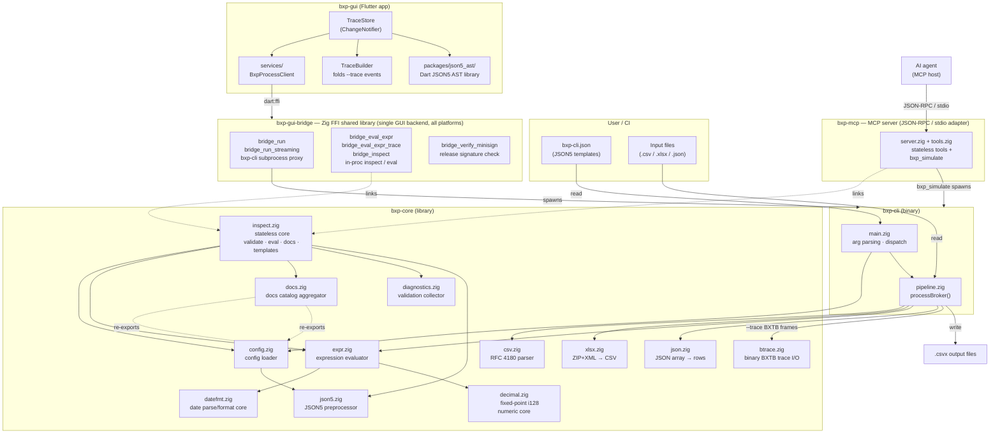

`bxp-gui-bridge` is the FFI shim the GUI loads via `dart:ffi` at startup. Since
the v0.3.0 proxy flip (2026-06-09) it is the GUI's **single backend on every
platform** — there is no `bxp-fmt` spawn and no `Process.start` route. Three
roles in one shared library: (1) the **subprocess proxy**
(`bridge_run` / `bridge_run_streaming`) wraps the `bxp-cli` runs the GUI needs
(dry-run / full-run `--trace=bin`, `--version`) from native code, sidestepping
dart-lang/sdk#1727 (~8 KB stdout cutoff that kills `--trace`); (2) the **in-proc
inspect / eval** family (`bridge_eval_expr` / `bridge_eval_expr_trace` /
`bridge_inspect`) links `bxp-core/inspect` directly, so the editor's live
validation, the ExprPlayground, and the docs / config / template ops avoid the
~50 ms subprocess spawn cost; (3) `bridge_verify_minisign` checks the release
`SHA256SUMS` signature for the auto-updater. Library probe failure at startup is
**fatal** on all platforms — a missing library means a broken install.

For the **per-call transport matrix** (which GUI calls use which transport on
each OS, plus the two-cause "why" behind the split), see
[`devel.md`'s "Why the bridge exists" + "Per-call routing"](devel.md#why-the-bridge-exists)
section. The bridge's C-ABI surface and Debug→ReleaseSafe build rationale live
in [`bxp-gui-bridge/CLAUDE.md`](../bxp-gui-bridge/CLAUDE.md).

`docs.zig` is an aggregator — it owns no schema of its own. The dotted arrows
indicate that it re-exports `expr.builtins` (the `FnDoc` catalog) and flattens
each `config.zig` struct's `fields[]` table into the docs catalog JSON.
Adding a new built-in or config field updates the docs automatically.

the config validator (`inspect.annotateRaw`) also calls `json5.preprocessAnnotated` directly to
emit `$comm_*` / `$err_*` siblings — that's the source of the `INSPECT → JSON5`
arrow that bypasses the normal config loader.

---

## Execution Flow

Step-by-step flow when `bxp-cli` is invoked.

---

## Per-File Processing (processBroker)

For each input file matched by `file_pattern_in`:

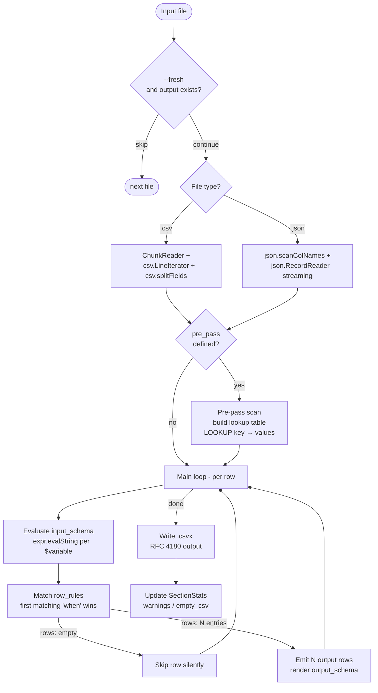

A single input row can produce **0, 1, or N output rows** depending on
`row_rules`:

- `rows: []` — silent skip (e.g. internal accounting events that don't
  belong in the activity log).
- `rows: [{...}]` — one-to-one (the typical buy/sell/deposit case).
- `rows: [{...}, {...}, ...]` — multi-row expansion. Used when a single
  source event represents multiple Wealthfolio activities — e.g. a Trading
  212 dividend with adjustment may emit separate `DIVIDEND` and
  `DIV_TAX` rows from one input line.

The `--debug` flag prints rows that match no rule when
`row_rules_debug_missing: true` is set on the template — useful when
authoring a new template. xlsx files take an earlier path: `xlsxPrePass`
extracts each sheet to an intermediate `.csv` before this loop runs, so
xlsx and csv inputs follow the same code from the chunked CSV reader onwards.

The `Main loop - per row` box above is the **logical** view. Physically each
chunk's rows are evaluated by a fork-join worker pool — see
[Parallel Evaluation](#parallel-evaluation-per-block-fork-join) below.

---

## Parallel Evaluation (per-block fork-join)

`input_schema` / `row_rules` evaluation is the CPU-bound hot path, and each
output row is a pure function of one input row plus the (already-built)
pre_pass lookup table — so rows within a block are independent and evaluate
in parallel. `processBlockParallel` (`bxp-cli/src/pipeline.zig`) buffers a
block of rows, fans them out across `K = runtime.max_workers` worker tasks on
a shared `std.Thread.Pool` (owned by `main.zig`, carried on `Runtime`,
`K = std.Thread.getCpuCount()` typically), then re-stitches the results in
source order so the output stays byte-identical to the serial path.

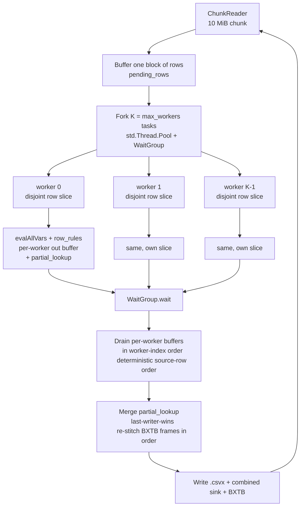

Determinism guarantees that make the parallel path a drop-in for the serial
one:

- **Output order** — workers write into private buffers; the main thread
  drains them in worker-index (= source-row) order after `WaitGroup.wait()`,
  so `.csvx` rows and BXTB `output_row` frames come out in input order.
- **pre_pass writes** — each worker accumulates into its own `partial_lookup`
  map; the drain merges them into the shared `lookup_table` with
  last-writer-wins, matching the serial "later row overwrites earlier" rule.
- **Memory** — block size (`JSON_PARALLEL_BLOCK_SIZE = 1024` for JSON;
  chunk-bounded for CSV) amortises dispatch overhead while keeping the
  per-block arena footprint bounded.

The BXTB trace stream itself stays single-stream — the `chunk_id` frame field
is reserved for a future multi-stream dispatch but is always `0` today
(see [trace-protokol.md](trace-protokol.md)).

For the broader runtime cost model (what else speeds up / slows down a run)
and the benchmark harness, see
[devel.md → Performance model](devel.md#performance-model).

---

## Two-Pass Pipeline Detail

The `pre_pass` mechanism enables **cross-row lookups** - values from one row
can be referenced when processing a different row.

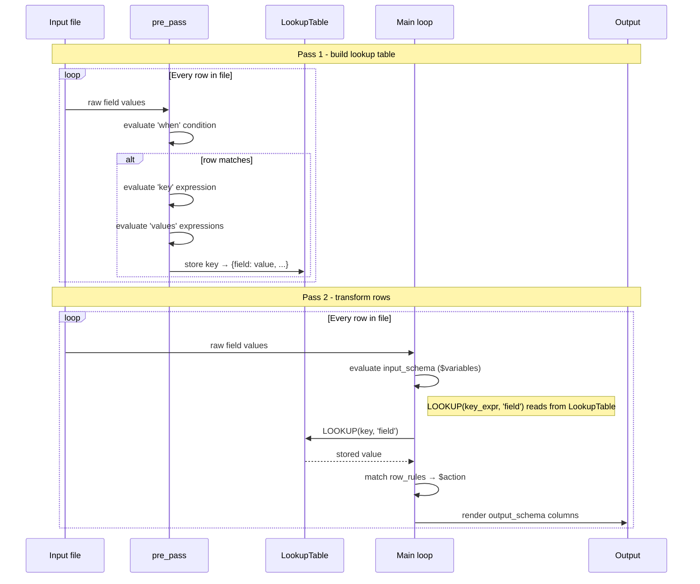

**Example use case (AnyCoin):** A `trade payment` row holds the currency; a `trade fill`
row holds the ticker and quantity. Both share an `Order ID`. `pre_pass` indexes payment
rows by `Order ID`; the main loop uses `LOOKUP([Order ID], 'currency')` when processing
fill rows.

### Single block vs named blocks

`pre_pass` accepts two shapes:

- **Legacy single block** — `{ when, key, values }` directly. Internally bound
  to the synthetic namespace `_default`; accessed via 2-arg
  `LOOKUP(key_expr, 'field')`.
- **Named blocks** — `{ name1: { when, key, values }, name2: { ... } }`. Each
  block is its own namespace; accessed via 3-arg
  `LOOKUP('name1', key_expr, 'field')`. Use this when one template needs
  multiple independent lookup tables.

The lookup table is keyed internally by a composite `name\x00key\x00field`
string, which is why both forms share the same `LookupTable` storage —
the legacy 2-arg form just gets `_default` synthesized as the namespace.

---

## Expression Evaluator - Why a Custom DSL?

bxp's expression language (`expr.zig`) is a custom **SQL/Excel-style
expression DSL** — not an embedded Lua, JavaScript, Python, or off-the-shelf
expression engine. This section explains the choice so it doesn't have to be
re-researched on every audit.

### Naming convention

The DSL is intentionally **SQL/Excel-flavored**:

| Surface | bxp expr              | Origin                                  |
| ------- | --------------------- | --------------------------------------- |
| Column  | `[ColumnName]`        | Excel structured ref, SQL bracket-quote |
| Equal   | `=`                   | SQL (not `==`)                          |
| Concat  | `&`                   | Excel / SQL Server                      |
| Logic   | `AND`, `OR`, `NOT`    | SQL keywords                            |
| Cond    | `IF(cond, yes, no)`   | Excel `IF`                              |
| String  | `'text'`              | SQL single-quote                        |
| Funcs   | `UPPER_CASE` builtins | SQL/Excel convention                    |

Built-ins map onto recognisable SQL/Excel functions wherever possible:
`COALESCE`, `NULLIF`, `IN`, `SUBSTR`, `LEFT`/`RIGHT`, `UPPER`/`LOWER`,
`TRIM`, `ROUND`, `FLOOR`/`CEILING`, `REPLACE`, `SPLIT_PART` (PostgreSQL),
`STARTS_WITH`/`ENDS_WITH` (PostgreSQL `starts_with`/`ends_with`),
`CONTAINS` (SQL Server), `LOOKUP` (Excel). Domain extensions (`DATE_CONVERT`,
`PRICE_VALUE`, `PRICE_CURRENCY`, `REMAP`) follow the same `UPPER_CASE`
shape.

The target persona is an Excel-comfortable analyst (broker statement
authoring, CRM migration mapping), not a Python/JS programmer. A Lua-style
(`if x then ... end`) or Python-style (`y if cond else z`) syntax would
alienate that user; SQL/Excel idioms transfer directly from a spreadsheet
workflow.

### Why not embed Lua / JavaScript / Python / expr-lang?

Surveyed alternatives:

- **Lua** via ziglua (~250 KB, full programming language with GC)
- **JavaScript** via QuickJS (~700 KB, ES2020+ sandbox)
- **Go expr-lang / CEL** (no Zig port exists; would require a from-scratch implementation)
- **Python** (CPython too heavy to embed; ~5–10 MB runtime)

Tradeoff for our workload (per-row eval over 100k–10M rows):

| Aspect                                         | bxp expr (current)           | Hosted engine swap            |
| ---------------------------------------------- | ---------------------------- | ----------------------------- |
| Per-row eval cost (2M rows S1 bench)           | 6.5 s (measured 2026-05-25)  | 10–100× slower (GC, dispatch) |
| Binary footprint                               | included in bxp-cli          | +250 KB to +700 KB            |
| Trace highlighting (off/len in GUI playground) | shipped                      | rebuild from scratch          |
| `FnDoc` autocomplete (single source of truth)  | co-located with each builtin | rebuild binding layer         |
| Domain builtins (`DATE_CONVERT`, `LOOKUP`, …)  | inline impl, zero deps       | reimplement as native funcs   |
| Sandboxing                                     | implicit (no loops, no I/O)  | strip Lua `io`/`os` / harden  |

The value of `expr.zig` is **not** the parser (~600 LOC, recursive
descent). It's the **integration**: per-row arena pattern, trace stream
hooks, `FnDoc` autocomplete in `bxp-gui`, `error_detail` diagnostics
returned through `Context`, byte-exact reproducibility across the cross-runner
expression corpus and the dataset regression suite. All of that would have to be
rebuilt around any hosted engine while paying the perf and footprint cost.

### When to revisit

Only revisit the build-vs-buy decision if **both** become true:

1. A user-meaningful capability (e.g. user-defined functions, loops over
   sub-records, complex aggregations) lands on the roadmap that genuinely
   needs a full programming language.
2. A native-Zig expression engine matures with comparable perf, embedded
   sandboxing, and a stable allocator-aware API.

Until then, the SQL/Excel-style DSL is a deliberate fit for the user
persona and workload, not legacy inertia.

---

## Expression Evaluator - Call Stack

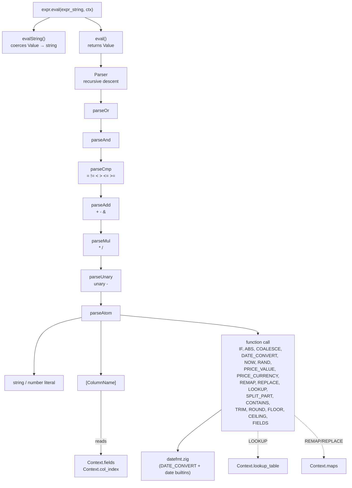

Side context dependencies (dotted lines): `[ColumnName]` references (and
`FIELDS(n)` positional access) read `Context.fields` via `Context.col_index`; `LOOKUP(...)` reads
`Context.lookup_table` populated by the pre-pass; `REMAP(...)` (whole-value) and
`REPLACE(..., 'name')` (substring) read `Context.maps` — the named-map registry
resolved at config-load time from the top-level `maps` registry merged with each
template's local `maps` block.

### Static analysis path (parallel to runtime eval)

The config validator's passes don't run expressions — they walk the parse
tree to find typos and dead references. Three top-level entry points in
`expr.zig`:

| Function                       | What it returns                                | Used by                                               |
| ------------------------------ | ---------------------------------------------- | ----------------------------------------------------- |
| `staticReferences(src, alloc)` | Set of every `[X]` and `$var` referenced       | `validateUnknownKeysCollect`, `validateUnusedCollect` |
| `staticCheckCalls(src, …)`     | Per-call FnArg arity + signature errors        | config validation (added in Phase G6)                 |
| `staticCheckSplitPart(src, …)` | Token-scan for `SPLIT_PART(_, _, ≤0)` literals | config validation                                     |

These share the parser front-end with `eval()` — same recursive descent, no
duplicated grammar — but emit `Diagnostic` records into a `*Diagnostics` sink
instead of producing values.

---

## bxp-gui: Layers and Components

The GUI is divided into three layers. Each layer has a single direction of
dependency: UI reads from Store, Store calls Services, Services talk to the OS
and to the bxp-cli subprocess (proxied by the bridge).

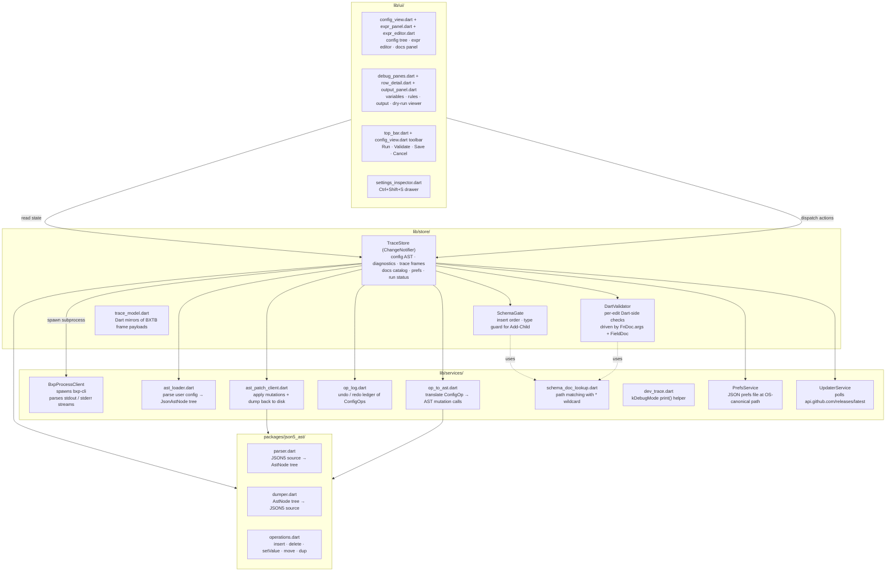

Key invariants:

- **TraceStore is the single source of truth.** All UI state — config AST,
  diagnostics, trace events, docs catalog, user prefs — lives in TraceStore.
  Services are stateless; they do not cache results.
- **json5_ast is the live config representation.** The config is held in memory
  as an `AstNode` tree so edits preserve JSON5 comments and produce canonical
  JSON5 output. The validator's annotated JSON output is overlaid as diagnostics, not
  merged into the AST.
- **No fallback FnDocs.** The docs catalog is the single source for the
  language catalog. If the binary is missing at startup, the app shows a fatal
  error gate; there are no hardcoded fallback catalogs.
- **One backend, two call shapes.** Since the v0.3.0 proxy flip
  `BxpProcessClient` routes **every** backend call through
  `bxp-gui-bridge.{dll,so,dylib}` on all platforms — there is no `Process.start`
  path. The bridge offers two call shapes:
  - **In-process inspect / eval** (`bridge_eval_expr` / `bridge_eval_expr_trace`
    for the expr editor's live validation + ExprPlayground; `bridge_inspect` for
    docs / config / template / eval-batch ops) links `bxp-core/inspect` directly
    and runs synchronously on the main isolate — no spawn, avoiding the ~50 ms
    per-keystroke subprocess cost.
  - **Subprocess proxy** (`bridge_run` / `bridge_run_streaming` +
    `bridge_cancel` + `bridge_ack` for backpressure) wraps the `bxp-cli` runs
    (dry-run / full-run `--trace=bin`, `--version`), draining pipes in native
    Zig code to sidestep a `dart:io` pipe-truncation bug (dart-lang/sdk#1727)
    that kills `--trace` (megabytes) on Windows. Library probe failure at
    startup is **fatal** on every platform — there is no subprocess fallback.

---

## Dry-run / Runner Flow

Two toolbar buttons spawn `bxp-cli`: **dry-run** runs `--trace` only (no
`.csvx` files written, just the BXTB frame stream for the debugger);
**full-run** writes real output. Neither has a keyboard shortcut — both
share the same plumbing, only the `dry: bool` argument to `_streamRunBtrace`
differs. Frames stream back as binary BXTB; the in-store reader folds each
frame into `TraceStore`. To avoid a rebuild storm (PlutoGrid reallocates
quadratically on every `notifyListeners`), incremental row updates go through
`ValueNotifier<int>` counters; the full `notifyListeners()` fires only twice:
at stream start and after the `done` frame.

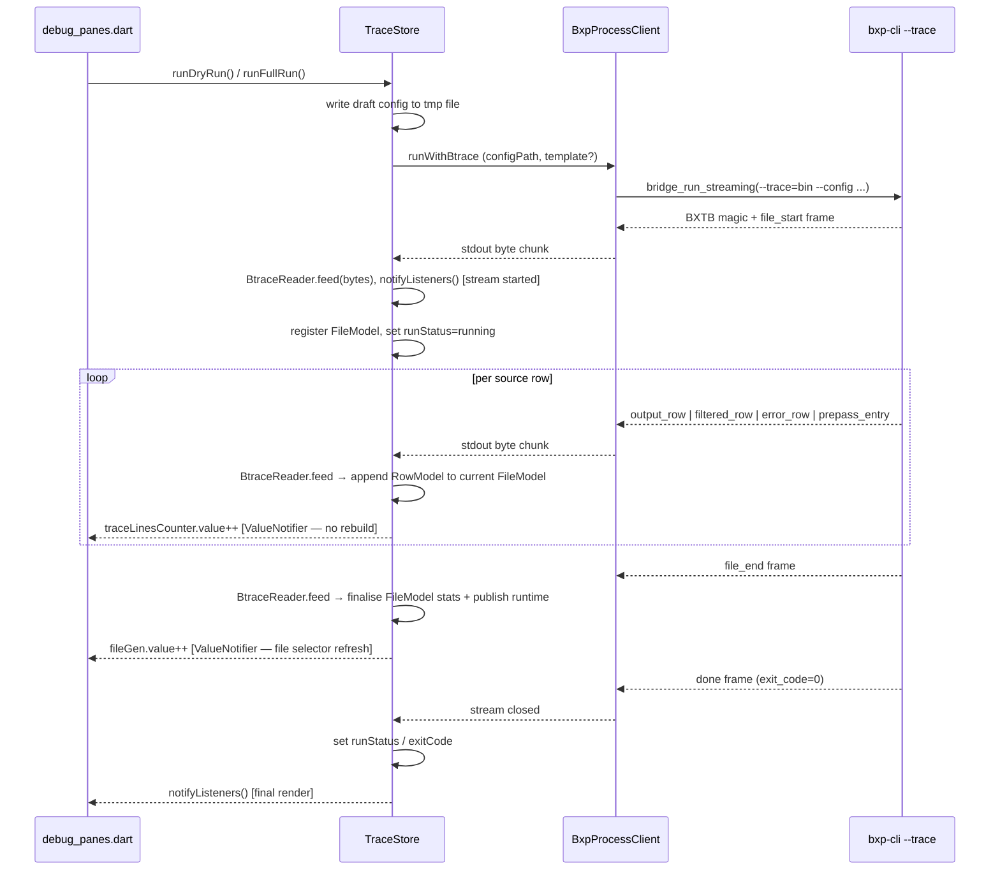

### Cancellation and watchdog

The user can cancel a run mid-stream (the run-button label flips to `cancel`
while a stream is active); a hung subprocess is also caught by an internal
idle watchdog. Both paths share the same termination plumbing:

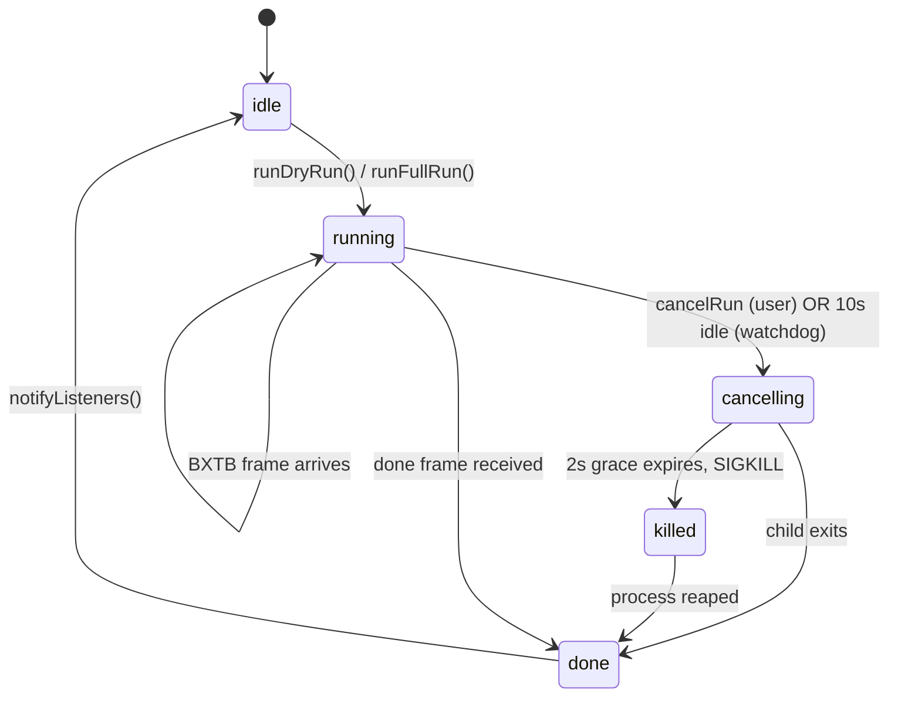

Step detail:

- **User cancel.** `cancelRun()` sets `_cancelRequested = true` and sends
  `SIGTERM` to the bxp-cli child. The streaming loop in `_streamRun` detects
  the flag, drains remaining stdout, and exits.
- **Watchdog.** A periodic timer in `_streamRunBtrace` measures time since
  the last BXTB frame. If the gap exceeds 10 seconds, it triggers the same
  SIGTERM path. This catches a child stuck before emitting `done` (rare but
  seen during early `--check-fs=N` development).
- **SIGKILL escalation.** If the process doesn't exit within 2 seconds of
  SIGTERM, the watchdog escalates to SIGKILL. Negative exit codes from
  signal-driven termination are treated as cancellation, not a fault.
- **Final notify.** `notifyListeners()` fires once in the `finally` block so
  the toolbar transitions out of `cancelling` regardless of how the run
  ended (clean done, cancel, kill, error).

---

## Config loading and parse pipeline

Symmetric counterpart to **Config Editing and AST** below. Triggered by
opening a file (`Ctrl+O`), pressing `Ctrl+R` (reload), or being called as
post-save reload from `saveConfig`. Two parallel parses run on the same
bytes:

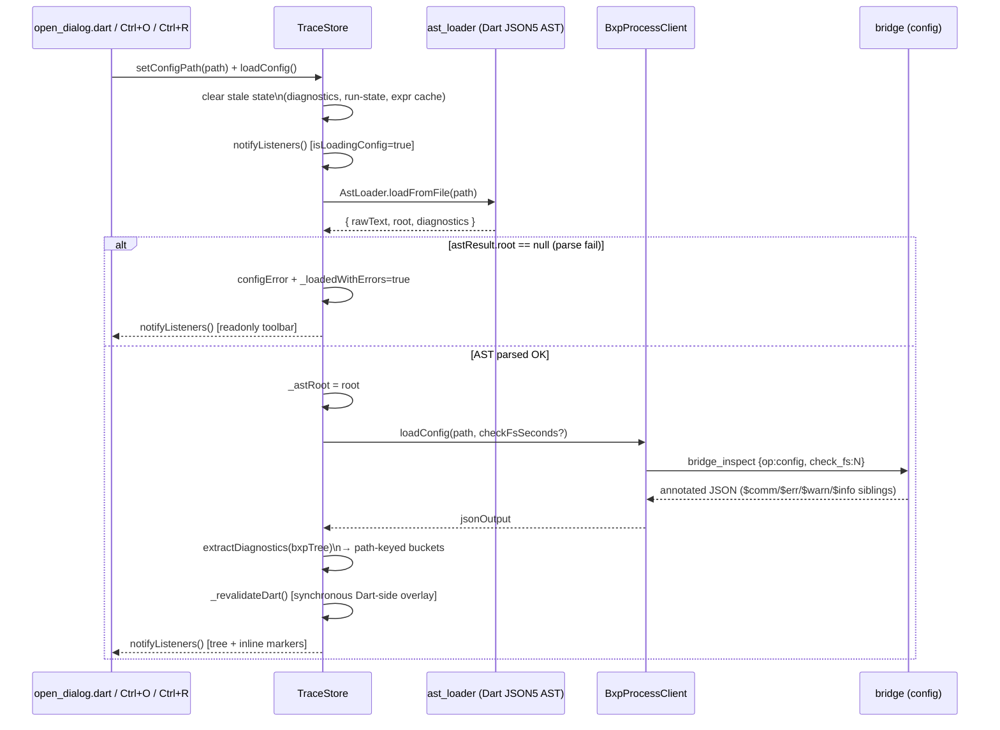

Key points:

- **AST is the primary loader.** Even if config validation fails or is slow,
  the user can still see the tree because `ast_loader` only depends on the
  Dart JSON5 library — no subprocess.
- **AST parse failure is the only readonly trigger.** `_loadedWithErrors` is
  flipped only when AST can't build a tree at all; validator diagnostics are
  shown as inline `$err_*` markers and the pre-save guard blocks bad saves —
  but the user can keep editing toward the fix.
- **Diagnostics are path-keyed.** `$err_*` siblings in the annotated JSON are
  flattened into `Map<String, List<Diagnostic>>` keyed by dot-path. The tree
  renderer queries this map per-node to draw inline error chips.
- **Dart re-validation runs synchronously after the validator response.** It
  populates a separate set of buckets driven by `FnDoc.args` + `FieldDoc`
  validators — instant feedback even for buckets the validator didn't surface yet.

---

## Config validation pipeline

When the GUI validates a config (`bridge_inspect {config}` → `inspect.annotateRaw`), it runs a sequence of
diagnostic passes against the loaded config. Each pass appends to either the
legacy `errors[]` list or the structured `Diagnostics` bag; both are merged
into the annotated JSON output before exit.

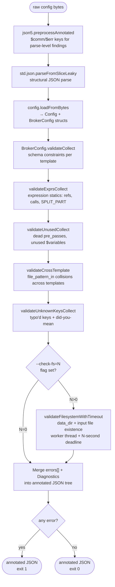

Severity routing in the merged JSON: `.error` → `$err_<N>`, `.warning` →
`$warn_<N>`, `.info` → `$info_<N>`. All three carry an optional `off` / `len`
byte span and `suggest` did-you-mean string. Each finding is inserted as a
sibling immediately before the offending key in its parent object (or
appended to the parent when the offending field doesn't exist).

`bxp-cli` runs only the first three passes (load) and skips the entire
diagnostic chain — its job is to convert files, not validate. Hence the same
typo that surfaces as a `$warn_*` sibling in the annotated JSON appears as a
plain stderr warning line during a real run.

---

## bxp-mcp: MCP adapter over the shared core

`bxp-mcp` is a second adapter over the same stateless `inspect` core that
the shared `inspect` core serves — but speaking MCP (JSON-RPC 2.0 over stdio) to an AI agent
instead of argv/stdout to a shell. An agent host spawns it as a child and pipes
one JSON object per line; every stateless tool is a direct in-process `inspect`
call (microseconds, no subprocess). The lone exception is `bxp_simulate`, which
needs the full conversion pipeline and therefore spawns the **co-located
`bxp-cli`** — the same "heavy workhorse runs as a child, the adapter translates"
pattern the GUI uses.

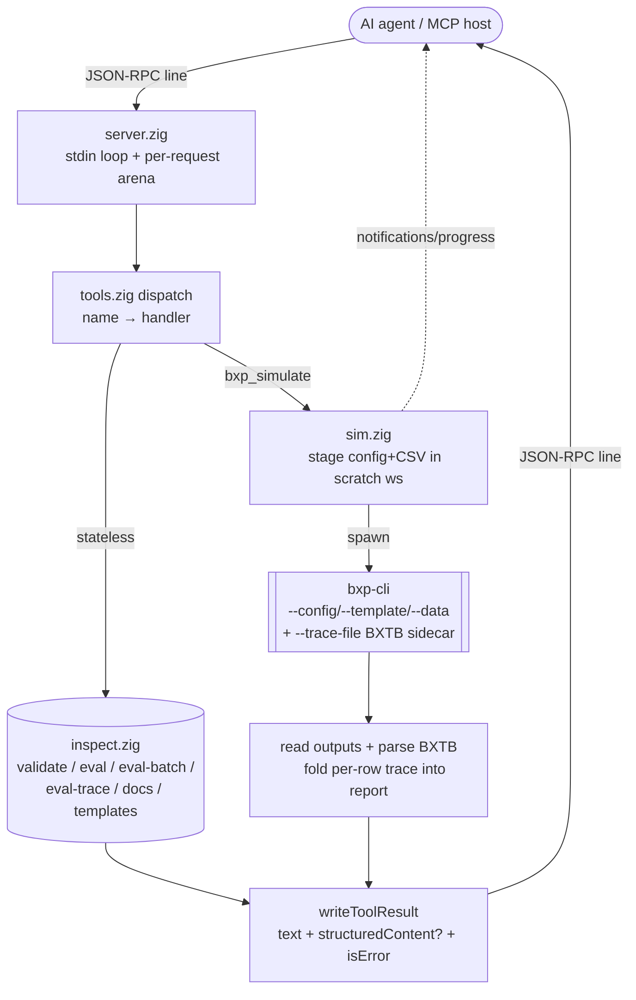

Key boundaries a developer should keep straight:

- **`isError` vs domain `ok:false`.** `isError:true` is reserved for a transport
  failure (missing required argument, unexpected error, spawn/IO). An expression
  error, a not-found template id, or a `bxp_simulate` orchestration report comes
  back as a normal result with `isError:false` — it is a valid answer to read.
- **`structuredContent` is gated by tool identity**, not by sniffing the output
  shape: a single-object tool exposes the parsed object; `bxp_eval_trace` is
  NDJSON and stays text-only even when a trivial expression yields one line.
- **Memory is two-tier**: a base arena for startup + persistent reused buffers,
  and a per-request arena reset (`retain_capacity`) after every response, so RSS
  reaches a steady state sized to the largest single request.

Full detail — tool catalog, wire protocol, the `bxp_simulate` workspace + BXTB
fold, build/test — lives in [`mcp.md`](mcp.md) and
[`bxp-mcp/CLAUDE.md`](../bxp-mcp/CLAUDE.md).

---

## Config Editing and AST

Every user edit in the config tree (insert field, delete, setValue, reorder) is
expressed as a `ConfigOp` and applied to the live `AstNode` tree via
`json5_ast/operations.dart`. The dumper re-serialises the AST to JSON5 for display and
for saving. `DartValidator` runs synchronously for fast per-field feedback;
Config validation runs on every Save for the authoritative full-config
validation.

`DartValidator` is a thin Dart interpreter driven by the same `FnDoc.args` and
`FieldDoc` tables exported by the docs catalog. It does not reimplement
validation logic — it reads the single-source-of-truth catalog so that adding a
new built-in function automatically extends the live validator.

### Undo / redo

The op log is the canonical record of "what the user did since the last
load." Every applied `ConfigOp` is paired with its inverse so undo doesn't
require re-parsing — it just reapplies the inverse against the live AST.

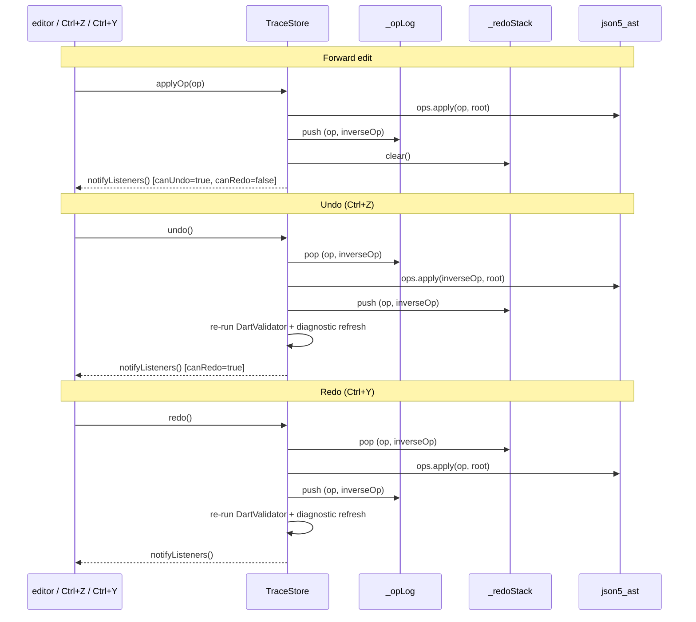

Edge cases handled:

- **Ctrl+Z inside a text field** falls through to native typo-undo. The
  global handler only fires when focus is somewhere structural (tree, panel,
  top bar). See `_focusInEditableText()` in `main_view.dart`.
- **Save clears the redo stack but keeps the undo log.** The user can still
  undo edits made before the save — the AST mutations are reversible
  regardless of disk persistence.
- **Reset draft (Ctrl+T)** clears both stacks and re-loads from disk —
  it's a hard reset, not an undo.

---

## Expr Playground

Expressions are validated live (per keystroke, debounced ~300 ms) via
the bridge expr validator. When the user switches to the **Variables** panel, the
playground calls the bridge's expr-trace with the current row context and streams
per-call results into the Variables table. Token-level error spans (byte
`off`/`len` from Phase G1) are used to underline the offending token directly
in the expr editor.

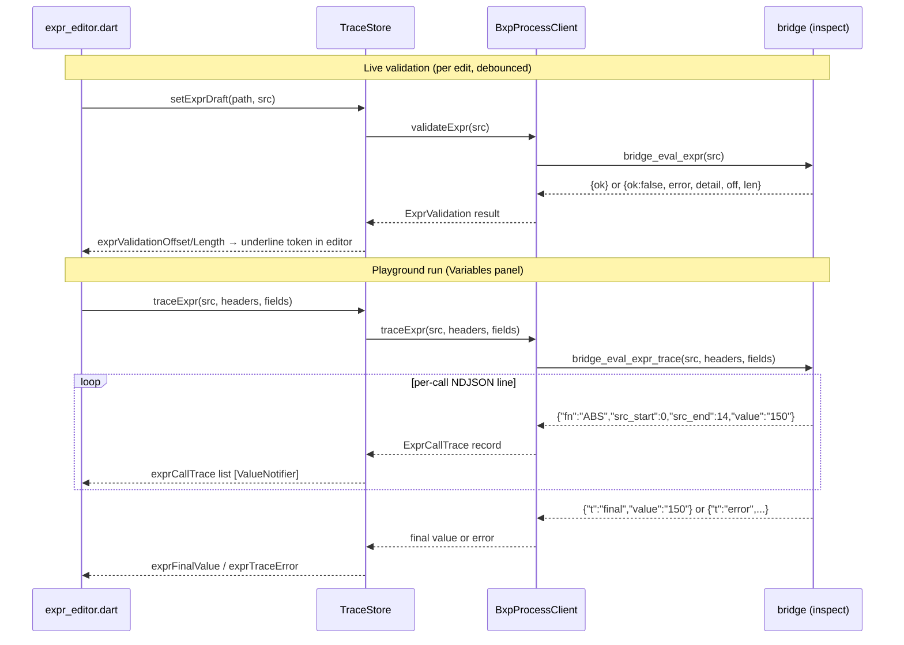

---

## Auto-updater flow

`UpdaterService` runs in the background from app launch onwards. It polls
GitHub Releases, surfaces newer versions through a `ChangeNotifier`, and on
user accept downloads → verifies → installs the matching native artifact.

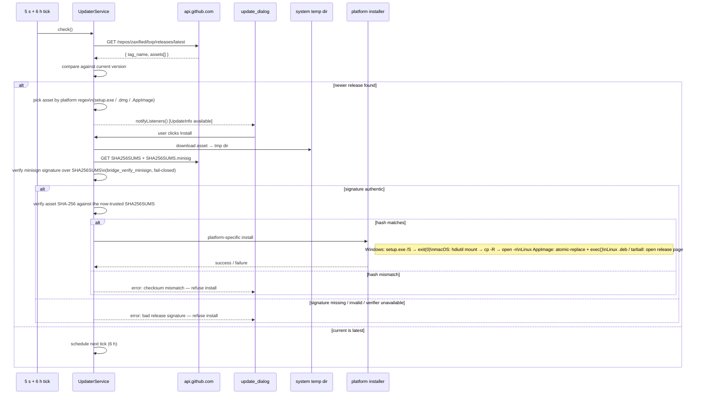

Notes:

- **Two-step fail-closed verification before any install.** First **authenticity**
  — the `SHA256SUMS.minisig` minisign signature over `SHA256SUMS` is checked
  against the public key embedded in `UpdaterService.minisignPublicKey` (native
  Ed25519 + Blake2b-512 via `bridge_verify_minisign`, no Dart crypto dep); then
  **integrity** — the asset's SHA-256 is matched against the now-trusted
  `SHA256SUMS`. Both compares see the same fetched bytes (no verify→use swap
  window). A missing/invalid signature, a missing/mismatched checksum, or an
  unavailable verifier all refuse the install. Signing is automated in CI
  (`release.yml`).
- **Initial poll fires 5 s after launch.** Avoids slowing app startup; a 6 h
  recurring tick handles long-running sessions.
- **macOS DMGs target ARM only.** Intel Macs get `assetUrl == null` and the
  dialog redirects to the GitHub release page — no auto-install path. The
  release workflow doesn't produce an x86_64 DMG.
- **Linux dual path.** AppImage is atomically replaced and `exec()`'d back
  in-place; `.deb` and `.tar.gz` users go to the release page since
  in-place self-update doesn't fit those formats.
- **`kDebugMode` skips the auto-check.** Dev runs don't accidentally
  download installers over the working tree.

---

## Data Structures

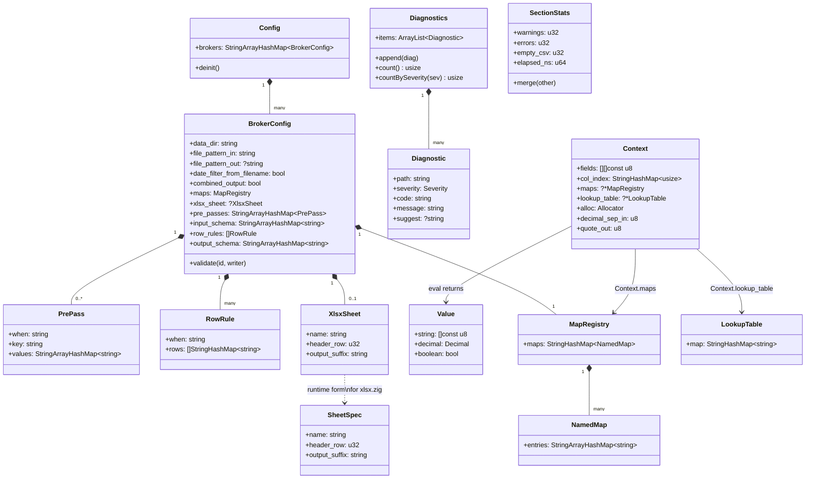

`SectionStats` is bxp-cli's per-section accumulator (one per template, plus
a top-level total). Warnings tick the exit code from 0 → 2 even when the run
completes; errors push it to 1.

`LookupTable` is owned by `Context` for the duration of one file's main
loop. The composite key encoding keeps multi-namespace `pre_passes` sharing
one storage map without needing nested structures.

`MapRegistry` is each template's resolved named-map view: the top-level
`maps: { name: { ... } }` registry merged with the template's own `maps` block
(template-local wins on a name collision), built once at config-load time. Each
`NamedMap` preserves JSON key order (`StringArrayHashMap`) so `REPLACE` applies a
map's pairs in declaration order; `REMAP` uses the same map for O(1) whole-value
lookup. `REMAP(s, 'name')` / `REPLACE(s, 'name')` resolve the name against it.
