# BXP - Architecture

> [← docs/](README.md)

- [Bird's-eye View](#birds-eye-view)
- bxp-cli
  - [Execution Flow](#execution-flow)
  - [Per-File Processing (processBroker)](#per-file-processing-processbroker)
  - [Two-Pass Pipeline Detail](#two-pass-pipeline-detail)
  - [Expression Evaluator - Call Stack](#expression-evaluator---call-stack)
- bxp-fmt
  - [Validation Pipeline](#bxp-fmt-validation-pipeline)
- bxp-gui
  - [Layers and Components](#bxp-gui-layers-and-components)
  - [Dry-run / Runner Flow](#dry-run--runner-flow)
  - [Cancellation and watchdog](#cancellation-and-watchdog)
  - [Config Loading and Parse Pipeline](#config-loading-and-parse-pipeline)
  - [Config Editing and AST](#config-editing-and-ast)
  - [Undo / Redo](#undo--redo)
  - [Expr Playground](#expr-playground)
  - [Auto-updater Flow](#auto-updater-flow)
- [Data Structures](#data-structures)

---

## Bird's-eye View

BXP is a single-binary ETL tool. All broker logic lives in a JSON5 config file -
the binary is a generic engine. The diagram below shows the high-level relationship
between components.

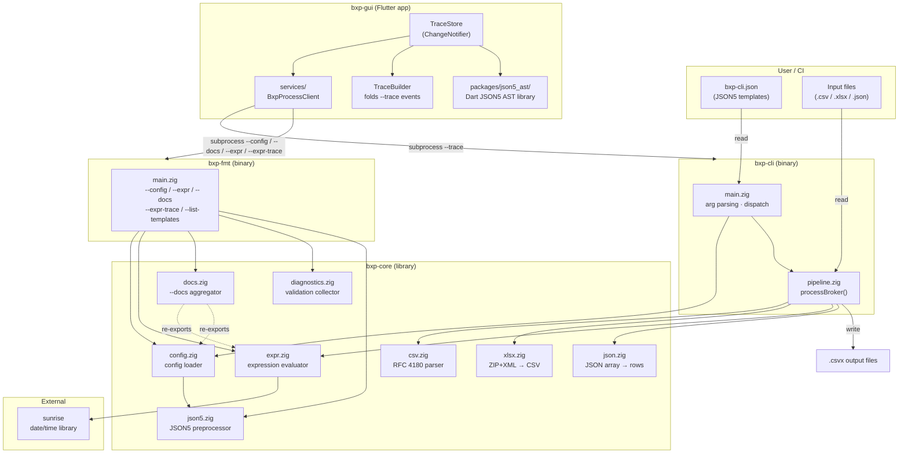

`docs.zig` is an aggregator — it owns no schema of its own. The dotted arrows
indicate that it re-exports `expr.builtins` (the `FnDoc` catalog) and flattens
each `config.zig` struct's `fields[]` table into the `bxp-fmt --docs` JSON.
Adding a new built-in or config field updates the docs automatically.

`bxp-fmt`'s `--config` path also calls `json5.preprocessAnnotated` directly to
emit `$comm_*` / `$err_*` siblings — that's the source of the FMT → JSON5
arrow that bypasses the normal config loader.

---

## Execution Flow

Step-by-step flow when `bxp-cli` is invoked.

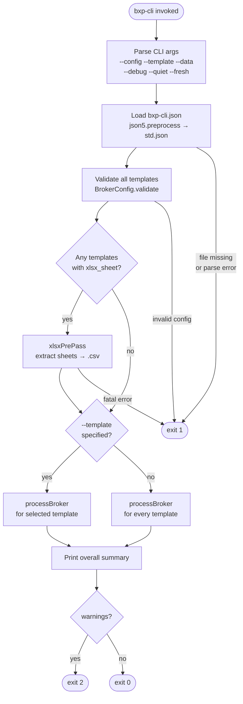

---

## Per-File Processing (processBroker)

For each input file matched by `file_pattern_in`:


A single input row can produce **0, 1, or N output rows** depending on
`row_rules`:

- `rows: []` — silent skip (e.g. internal accounting events that don't
  belong in the activity log).
- `rows: [{...}]` — one-to-one (the typical buy/sell/deposit case).
- `rows: [{...}, {...}, ...]` — multi-row expansion. Used when a single
  source event represents multiple Wealthfolio activities — e.g. a Trading
  212 dividend with adjustment may emit separate `DIVIDEND` and
  `DIV_TAX` rows from one input line.

The `--debug` flag prints rows that match no rule when
`row_rules_debug_missing: true` is set on the template — useful when
authoring a new template. xlsx files take an earlier path: `xlsxPrePass`
extracts each sheet to an intermediate `.csv` before this loop runs, so
xlsx and csv inputs follow the same code from `csv.splitRecords` onwards.

---

## Two-Pass Pipeline Detail

The `pre_pass` mechanism enables **cross-row lookups** - values from one row
can be referenced when processing a different row.

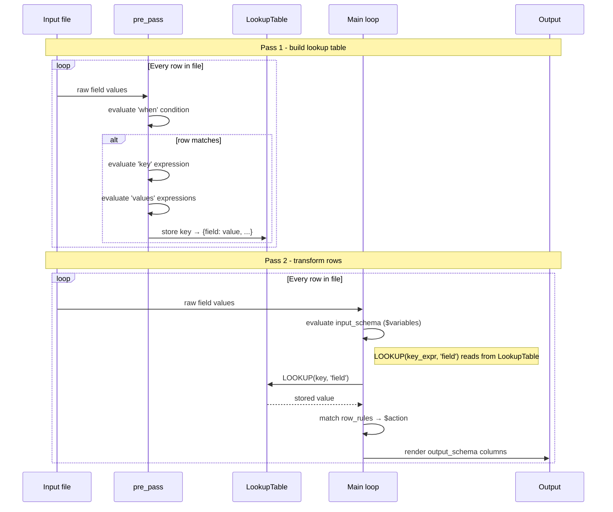

**Example use case (AnyCoin):** A `trade payment` row holds the currency; a `trade fill`
row holds the ticker and quantity. Both share an `Order ID`. `pre_pass` indexes payment
rows by `Order ID`; the main loop uses `LOOKUP([Order ID], 'currency')` when processing
fill rows.

### Single block vs named blocks

`pre_pass` accepts two shapes:

- **Legacy single block** — `{ when, key, values }` directly. Internally bound
  to the synthetic namespace `_default`; accessed via 2-arg
  `LOOKUP(key_expr, 'field')`.
- **Named blocks** — `{ name1: { when, key, values }, name2: { ... } }`. Each
  block is its own namespace; accessed via 3-arg
  `LOOKUP('name1', key_expr, 'field')`. Use this when one template needs
  multiple independent lookup tables.

The lookup table is keyed internally by a composite `name\x00key\x00field`
string, which is why both forms share the same `LookupTable` storage —
the legacy 2-arg form just gets `_default` synthesized as the namespace.

---

## Expression Evaluator - Call Stack

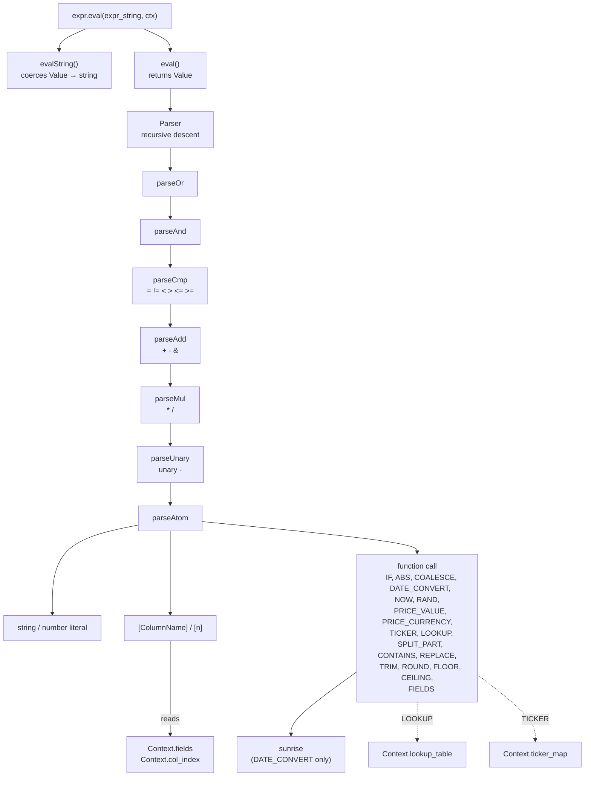

Side context dependencies (dotted lines): `[ColumnName]` and `[n]` references
read `Context.fields` via `Context.col_index`; `LOOKUP(...)` reads
`Context.lookup_table` populated by the pre-pass; `TICKER(...)` reads
`Context.ticker_map` (resolved at config-load time from inline objects or the
top-level `ticker_maps` registry).

### Static analysis path (parallel to runtime eval)

`bxp-fmt`'s validation passes don't run expressions — they walk the parse
tree to find typos and dead references. Three top-level entry points in
`expr.zig`:

| Function                       | What it returns                                | Used by                                               |
| ------------------------------ | ---------------------------------------------- | ----------------------------------------------------- |
| `staticReferences(src, alloc)` | Set of every `[X]` and `$var` referenced       | `validateUnknownKeysCollect`, `validateUnusedCollect` |
| `staticCheckCalls(src, …)`     | Per-call FnArg arity + signature errors        | `bxp-fmt --config` (added in Phase G6)                |
| `staticCheckSplitPart(src, …)` | Token-scan for `SPLIT_PART(_, _, ≤0)` literals | `bxp-fmt --config`                                    |

These share the parser front-end with `eval()` — same recursive descent, no
duplicated grammar — but emit `Diagnostic` records into a `*Diagnostics` sink
instead of producing values.

---

## bxp-gui: Layers and Components

The GUI is divided into three layers. Each layer has a single direction of
dependency: UI reads from Store, Store calls Services, Services talk to the OS
and to bxp-cli / bxp-fmt subprocesses.

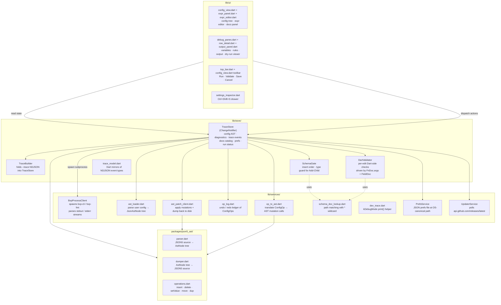

Key invariants:

- **TraceStore is the single source of truth.** All UI state — config AST,
  diagnostics, trace events, docs catalog, user prefs — lives in TraceStore.
  Services are stateless; they do not cache results.
- **json5_ast is the live config representation.** The config is held in memory
  as an `AstNode` tree so edits preserve JSON5 comments and produce canonical
  JSON5 output. bxp-fmt annotated JSON output is overlaid as diagnostics, not
  merged into the AST.
- **No fallback FnDocs.** bxp-fmt `--docs` is the single source for the
  language catalog. If the binary is missing at startup, the app shows a fatal
  error gate; there are no hardcoded fallback catalogs.
- **Subprocess transport is platform-split.** On Linux and macOS,
  `BxpProcessClient` calls `Process.start` / `Process.run` directly — every
  `Process.start(...)` arrow in the diagrams below is a literal `dart:io`
  call. **On Windows, all those arrows route through `bxp-gui-bridge.dll`**
  (a Zig FFI shim, see [`../bxp-gui-bridge/`](../../bxp-gui-bridge/)) —
  the protocol on the wire is identical (same args, same NDJSON), but the
  transport sidesteps a dart:io pipe-truncation bug
  (dart-lang/sdk#1727) on `--docs` / `--config` / `--trace`. The DLL is
  mandatory on Windows; probe failure at startup is fatal. Cross-platform
  consolidation is on the v0.3.0 roadmap (see
  [`roadmap.md`](roadmap.md)).

---

## Dry-run / Runner Flow

Two toolbar buttons spawn `bxp-cli`: **dry-run** runs `--trace` only (no
`.csvx` files written, just the NDJSON event stream for the debugger);
**full-run** writes real output. Neither has a keyboard shortcut — both
share the same plumbing, only the `dry: bool` argument to `_streamRun`
differs. Events stream back as NDJSON lines; `TraceBuilder` folds each event
into `TraceStore`. To avoid a rebuild storm (PlutoGrid reallocates
quadratically on every `notifyListeners`), incremental row updates go through
`ValueNotifier<int>` counters; the full `notifyListeners()` fires only twice:
at stream start and after the `done` event.

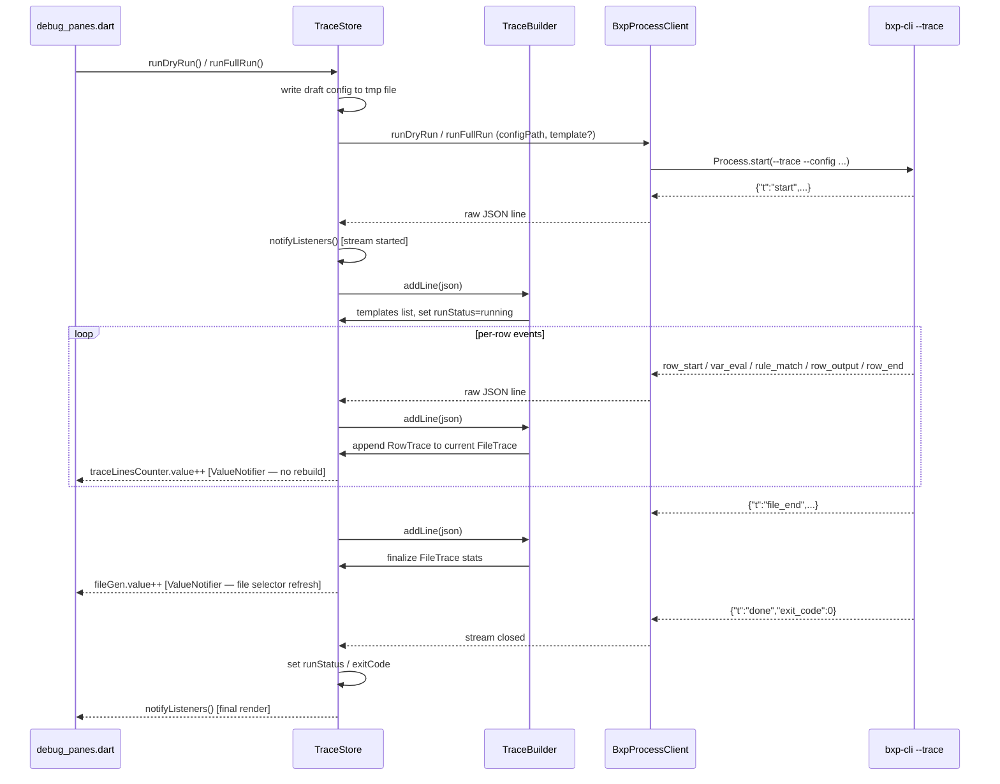

### Cancellation and watchdog

The user can cancel a run mid-stream (the run-button label flips to `cancel`
while a stream is active); a hung subprocess is also caught by an internal
idle watchdog. Both paths share the same termination plumbing:

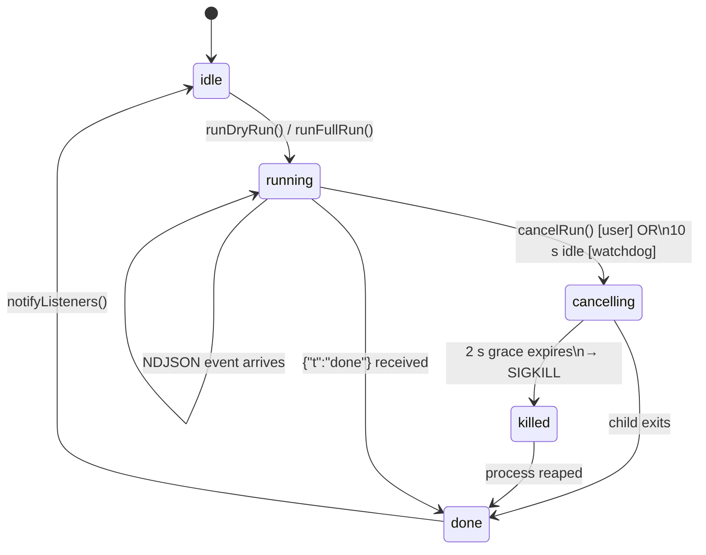

Step detail:

- **User cancel.** `cancelRun()` sets `_cancelRequested = true` and sends
  `SIGTERM` to the bxp-cli child. The streaming loop in `_streamRun` detects
  the flag, drains remaining stdout, and exits.
- **Watchdog.** A periodic timer in `_streamRun` measures time since the last
  NDJSON line. If the gap exceeds 10 seconds, it triggers the same SIGTERM
  path. This catches a child stuck before emitting `done` (rare but seen
  during early `--check-fs=N` development).
- **SIGKILL escalation.** If the process doesn't exit within 2 seconds of
  SIGTERM, the watchdog escalates to SIGKILL. Negative exit codes from
  signal-driven termination are treated as cancellation, not a fault.
- **Final notify.** `notifyListeners()` fires once in the `finally` block so
  the toolbar transitions out of `cancelling` regardless of how the run
  ended (clean done, cancel, kill, error).

---

## Config loading and parse pipeline

Symmetric counterpart to **Config Editing and AST** below. Triggered by
opening a file (`Ctrl+O`), pressing `Ctrl+R` (reload), or being called as
post-save reload from `saveConfig`. Two parallel parses run on the same
bytes:

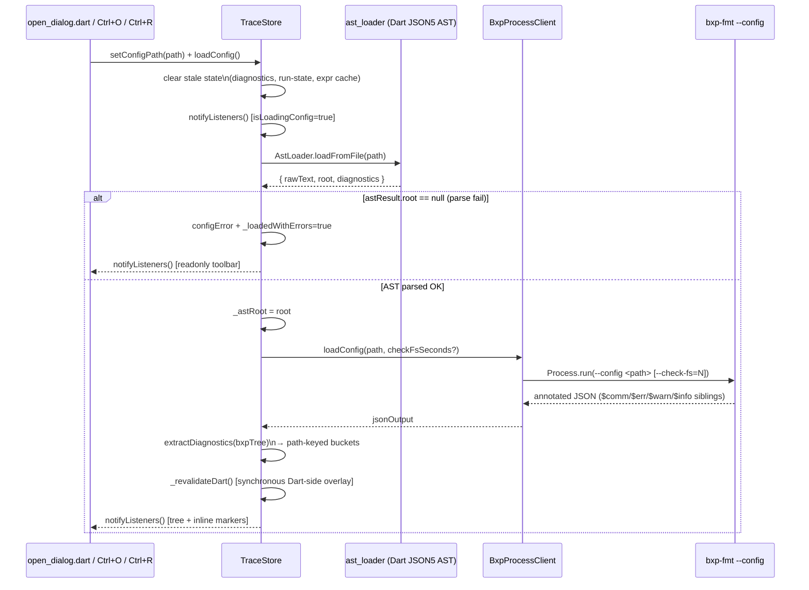

Key points:

- **AST is the primary loader.** Even if `bxp-fmt --config` fails or is slow,
  the user can still see the tree because `ast_loader` only depends on the
  Dart JSON5 library — no subprocess.
- **AST parse failure is the only readonly trigger.** `_loadedWithErrors` is
  flipped only when AST can't build a tree at all; bxp-fmt diagnostics are
  shown as inline `$err_*` markers and the pre-save guard blocks bad saves —
  but the user can keep editing toward the fix.
- **Diagnostics are path-keyed.** `$err_*` siblings in the annotated JSON are
  flattened into `Map<String, List<Diagnostic>>` keyed by dot-path. The tree
  renderer queries this map per-node to draw inline error chips.
- **Dart re-validation runs synchronously after the bxp-fmt response.** It
  populates a separate set of buckets driven by `FnDoc.args` + `FieldDoc`
  validators — instant feedback even for buckets bxp-fmt didn't surface yet.

---

## bxp-fmt validation pipeline

When the GUI calls `bxp-fmt --config <path>`, the binary runs a sequence of
diagnostic passes against the loaded config. Each pass appends to either the
legacy `errors[]` list or the structured `Diagnostics` bag; both are merged
into the annotated JSON output before exit.

```mermaid
flowchart TD
    INPUT([raw config bytes]) --> P1[json5.preprocessAnnotated\n$comm/$err keys for parse-level findings]
    P1 --> P2[std.json.parseFromSliceLeaky\nstructural JSON parse]
    P2 --> P3[config.loadFromBytes\n→ Config + BrokerConfig structs]

    P3 --> V1[BrokerConfig.validateCollect\nschema constraints per template]
    V1 --> V2[validateExprsCollect\nexpression statics: refs, calls, SPLIT_PART]
    V2 --> V3[validateUnusedCollect\ndead pre_passes, unused $variables]
    V3 --> V4[validateCrossTemplate\nfile_pattern_in collisions across templates]
    V4 --> V5[validateUnknownKeysCollect\ntypo'd keys + did-you-mean]
    V5 --> V6{--check-fs=N\nflag set?}
    V6 -->|N>0| V7[validateFilesystemWithTimeout\ndata_dir + input file existence\nworker thread + N-second deadline]
    V6 -->|N=0| MERGE
    V7 --> MERGE[Merge errors[] + Diagnostics\ninto annotated JSON tree]
    MERGE --> EXIT{any error?}
    EXIT -->|yes| OUT1([annotated JSON\nexit 1])
    EXIT -->|no| OUT0([annotated JSON\nexit 0])
```

Severity routing in the merged JSON: `.error` → `$err_<N>`, `.warning` →
`$warn_<N>`, `.info` → `$info_<N>`. All three carry an optional `off` / `len`
byte span and `suggest` did-you-mean string. Each finding is inserted as a
sibling immediately before the offending key in its parent object (or
appended to the parent when the offending field doesn't exist).

`bxp-cli` runs only the first three passes (load) and skips the entire
diagnostic chain — its job is to convert files, not validate. Hence the same
typo that surfaces as a `$warn_*` sibling in `bxp-fmt`'s JSON appears as a
plain stderr warning line during a real run.

---

## Config Editing and AST

Every user edit in the config tree (insert field, delete, setValue, reorder) is
expressed as a `ConfigOp` and applied to the live `AstNode` tree via
`json5_ast/operations.dart`. The dumper re-serialises the AST to JSON5 for display and
for saving. `DartValidator` runs synchronously for fast per-field feedback;
`bxp-fmt --config` is called on every Save for the authoritative full-config
validation.


`DartValidator` is a thin Dart interpreter driven by the same `FnDoc.args` and
`FieldDoc` tables exported by `bxp-fmt --docs`. It does not reimplement
validation logic — it reads the single-source-of-truth catalog so that adding a
new built-in function automatically extends the live validator.

### Undo / redo

The op log is the canonical record of "what the user did since the last
load." Every applied `ConfigOp` is paired with its inverse so undo doesn't
require re-parsing — it just reapplies the inverse against the live AST.

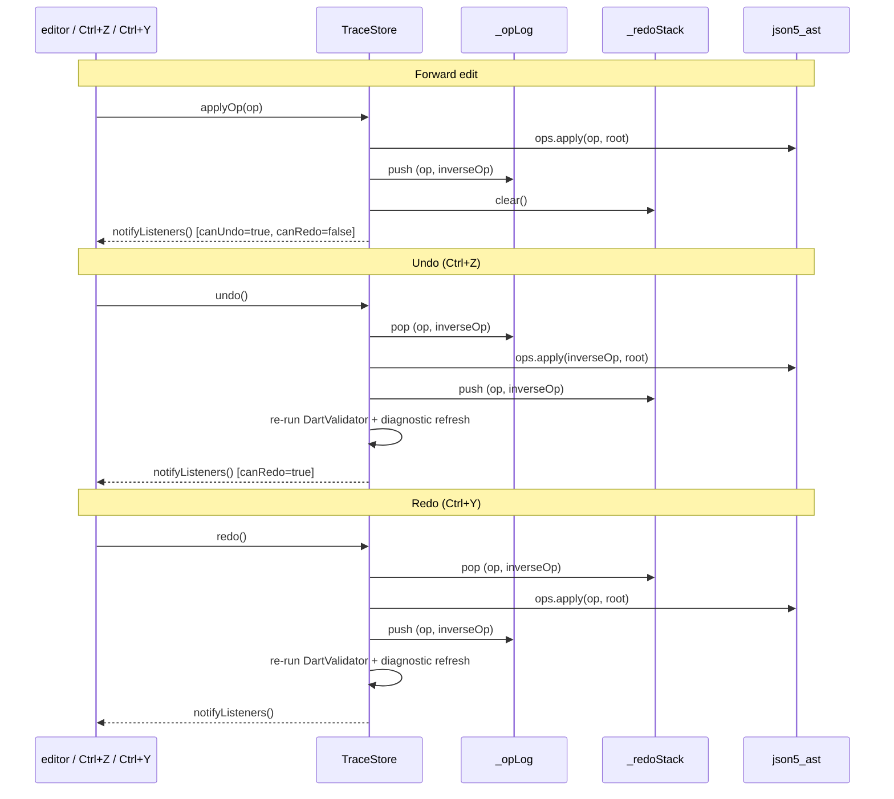

Edge cases handled:

- **Ctrl+Z inside a text field** falls through to native typo-undo. The
  global handler only fires when focus is somewhere structural (tree, panel,
  top bar). See `_focusInEditableText()` in `main_view.dart`.
- **Save clears the redo stack but keeps the undo log.** The user can still
  undo edits made before the save — the AST mutations are reversible
  regardless of disk persistence.
- **Reset draft (Ctrl+T)** clears both stacks and re-loads from disk —
  it's a hard reset, not an undo.

---

## Expr Playground

Expressions are validated live (per keystroke, debounced ~300 ms) via
`bxp-fmt --expr`. When the user switches to the **Variables** panel, the
playground calls `bxp-fmt --expr-trace` with the current row context and streams
per-call results into the Variables table. Token-level error spans (byte
`off`/`len` from Phase G1) are used to underline the offending token directly
in the expr editor.

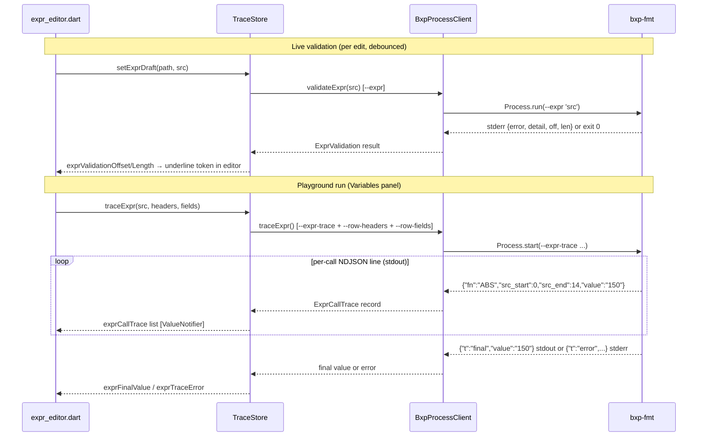

---

## Auto-updater flow

`UpdaterService` runs in the background from app launch onwards. It polls
GitHub Releases, surfaces newer versions through a `ChangeNotifier`, and on
user accept downloads → verifies → installs the matching native artifact.

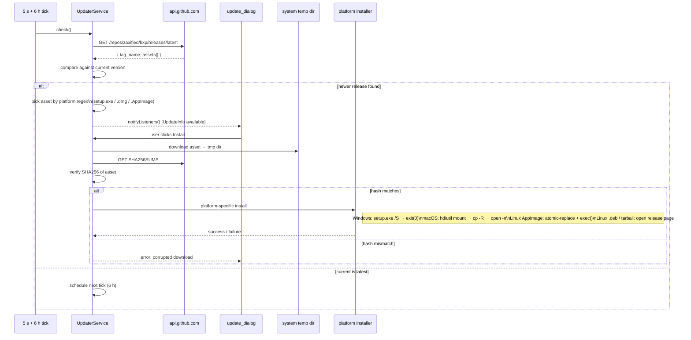

Notes:

- **Initial poll fires 5 s after launch.** Avoids slowing app startup; a 6 h
  recurring tick handles long-running sessions.
- **macOS DMGs target ARM only.** Intel Macs get `assetUrl == null` and the
  dialog redirects to the GitHub release page — no auto-install path. The
  release workflow doesn't produce an x86_64 DMG.
- **Linux dual path.** AppImage is atomically replaced and `exec()`'d back
  in-place; `.deb` and `.tar.gz` users go to the release page since
  in-place self-update doesn't fit those formats.
- **`kDebugMode` skips the auto-check.** Dev runs don't accidentally
  download installers over the working tree.

---

## Data Structures

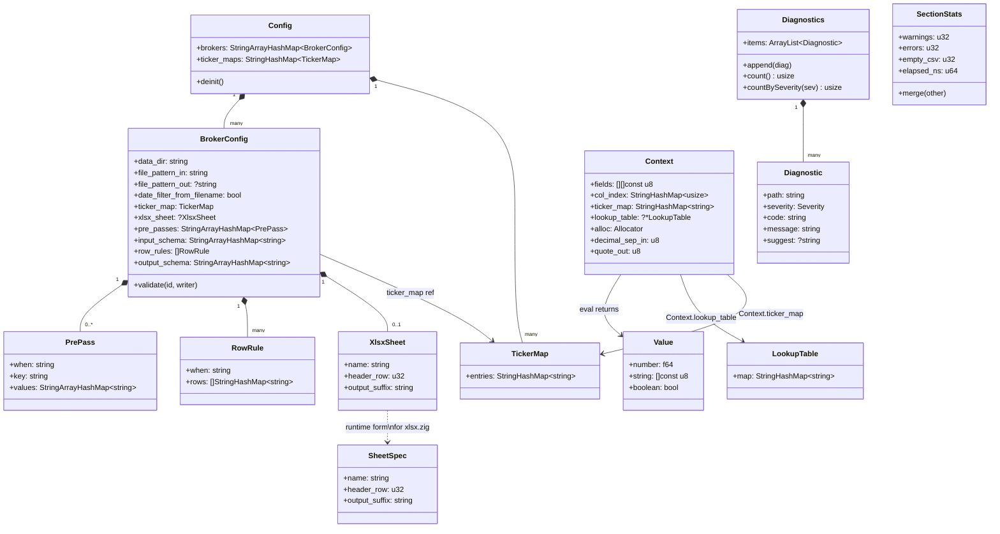

`SectionStats` is bxp-cli's per-section accumulator (one per template, plus
a top-level total). Warnings tick the exit code from 0 → 2 even when the run
completes; errors push it to 1.

`LookupTable` is owned by `Context` for the duration of one file's main
loop. The composite key encoding keeps multi-namespace `pre_passes` sharing
one storage map without needing nested structures.

`TickerMap` can be inline (per-template `ticker_map: { ... }`) or a named
reference into the top-level `ticker_maps: { name: { ... } }` registry —
config loader resolves the reference at load time, so by the time `Context`
gets it, it's always a flat `StringHashMap`.
