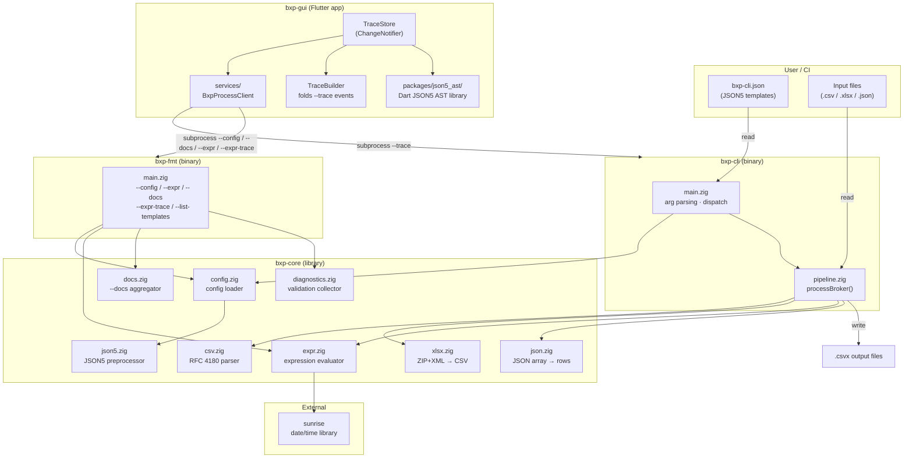
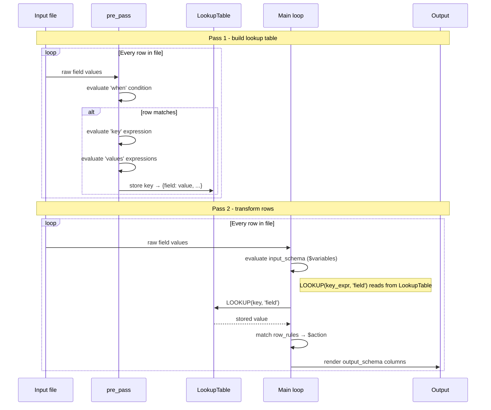
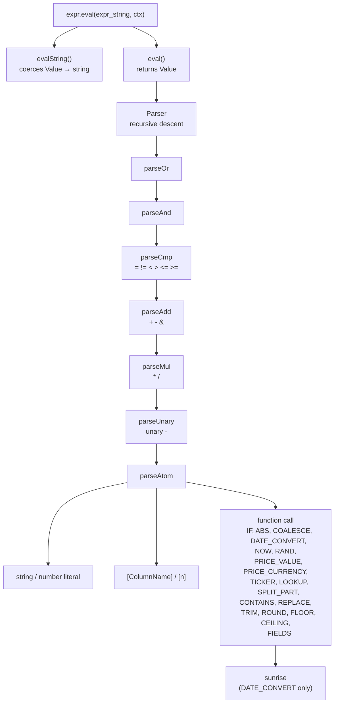
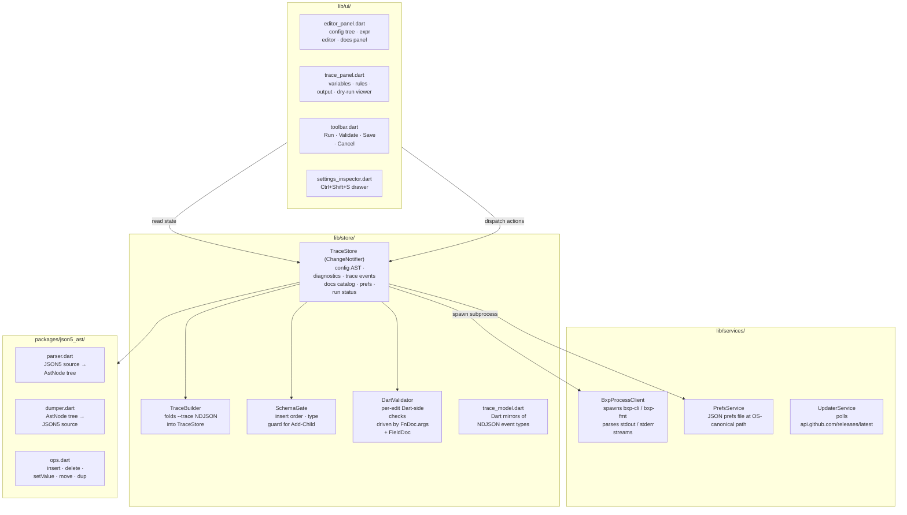
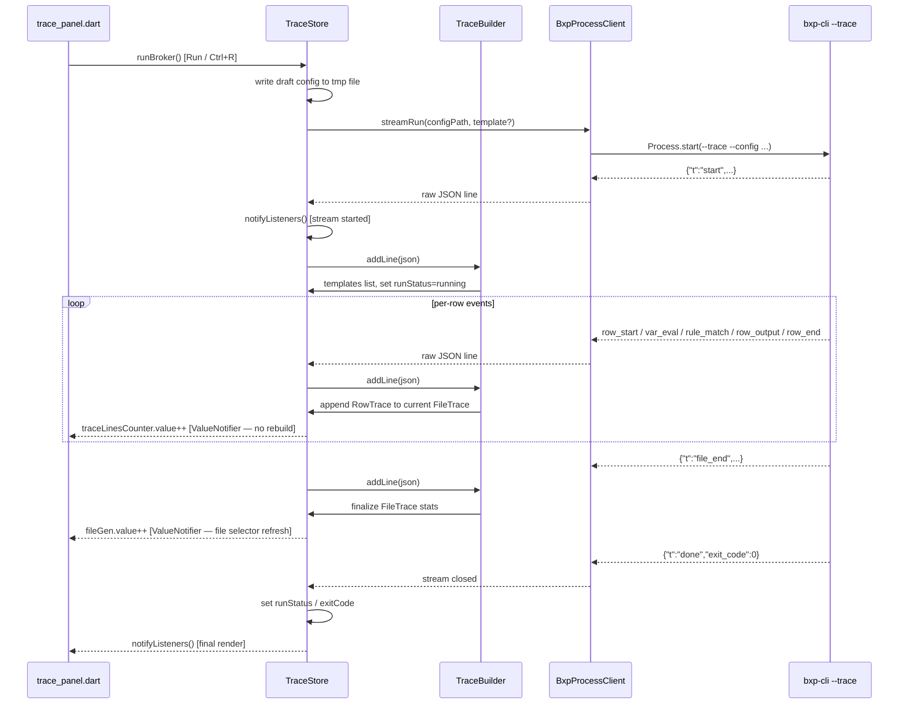
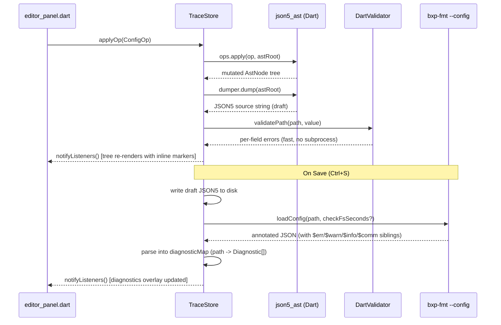
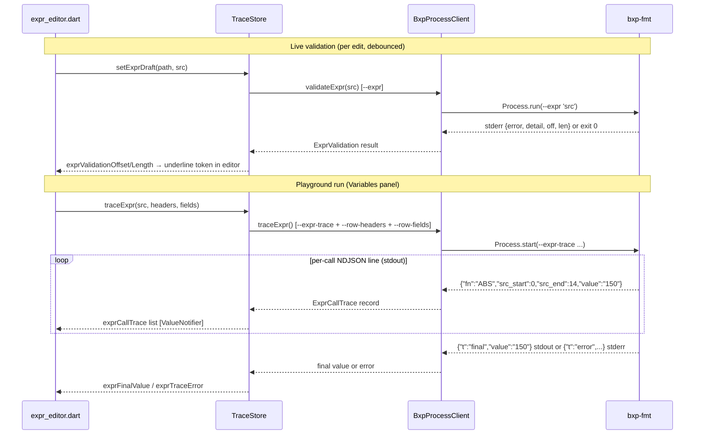
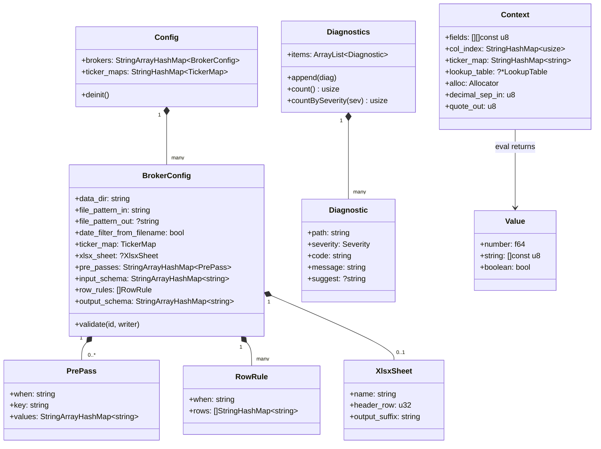

# BXP - Architecture

> [← docs/](README.md)

- [Bird's-eye View](#birds-eye-view)
- bxp-cli
  - [Execution Flow](#execution-flow)
  - [Per-File Processing (processBroker)](#per-file-processing-processbroker)
  - [Two-Pass Pipeline Detail](#two-pass-pipeline-detail)
  - [Expression Evaluator - Call Stack](#expression-evaluator---call-stack)
- bxp-gui
  - [Layers and Components](#bxp-gui-layers-and-components)
  - [Dry-run / Runner Flow](#dry-run--runner-flow)
  - [Config Editing and AST](#config-editing-and-ast)
  - [Expr Playground](#expr-playground)
- [Data Structures](#data-structures)

---

## Bird's-eye View

BXP is a single-binary ETL tool. All broker logic lives in a JSON5 config file -
the binary is a generic engine. The diagram below shows the high-level relationship
between components.

---

## Execution Flow

Step-by-step flow when `bxp-cli` is invoked.

---

## Per-File Processing (processBroker)

For each input file matched by `file_pattern_in`:

---

## Two-Pass Pipeline Detail

The `pre_pass` mechanism enables **cross-row lookups** - values from one row
can be referenced when processing a different row.

**Example use case (AnyCoin):** A `trade payment` row holds the currency; a `trade fill`
row holds the ticker and quantity. Both share an `Order ID`. `pre_pass` indexes payment
rows by `Order ID`; the main loop uses `LOOKUP([Order ID], 'currency')` when processing
fill rows.

---

## Expression Evaluator - Call Stack

---

## bxp-gui: Layers and Components

The GUI is divided into three layers. Each layer has a single direction of
dependency: UI reads from Store, Store calls Services, Services talk to the OS
and to bxp-cli / bxp-fmt subprocesses.

Key invariants:

- **TraceStore is the single source of truth.** All UI state — config AST,
  diagnostics, trace events, docs catalog, user prefs — lives in TraceStore.
  Services are stateless; they do not cache results.
- **json5_ast is the live config representation.** The config is held in memory
  as an `AstNode` tree so edits preserve JSON5 comments and produce canonical
  JSON5 output. bxp-fmt annotated JSON output is overlaid as diagnostics, not
  merged into the AST.
- **No fallback FnDocs.** bxp-fmt `--docs` is the single source for the
  language catalog. If the binary is missing at startup, the app shows a fatal
  error gate; there are no hardcoded fallback catalogs.

---

## Dry-run / Runner Flow

Clicking **Run** (or pressing Ctrl+R) triggers a full broker conversion with
`bxp-cli --trace`. Events stream back as NDJSON lines; `TraceBuilder` folds
each event into `TraceStore`. To avoid a rebuild storm (PlutoGrid reallocates
quadratically on every `notifyListeners`), incremental row updates go through
`ValueNotifier<int>` counters; the full `notifyListeners()` fires only twice:
at stream start and after the `done` event.

A 10-second streaming idle watchdog fires `SIGTERM` → `SIGKILL` if no events
arrive for 10 seconds, preventing a hung subprocess from blocking the UI.

---

## Config Editing and AST

Every user edit in the config tree (insert field, delete, setValue, reorder) is
expressed as a `ConfigOp` and applied to the live `AstNode` tree via
`json5_ast/ops.dart`. The dumper re-serialises the AST to JSON5 for display and
for saving. `DartValidator` runs synchronously for fast per-field feedback;
`bxp-fmt --config` is called on every Save for the authoritative full-config
validation.

`DartValidator` is a thin Dart interpreter driven by the same `FnDoc.args` and
`FieldDoc` tables exported by `bxp-fmt --docs`. It does not reimplement
validation logic — it reads the single-source-of-truth catalog so that adding a
new built-in function automatically extends the live validator.

Undo / redo is implemented as an op log (`_opLog` / `_redoStack`) on top of the
AST. Each `ConfigOp` is invertible; undo re-applies the inverse op and
re-validates the same way as a forward edit.

---

## Expr Playground

Expressions are validated live (per keystroke, debounced ~300 ms) via
`bxp-fmt --expr`. When the user switches to the **Variables** panel, the
playground calls `bxp-fmt --expr-trace` with the current row context and streams
per-call results into the Variables table. Token-level error spans (byte
`off`/`len` from Phase G1) are used to underline the offending token directly
in the expr editor.

---

## Data Structures

