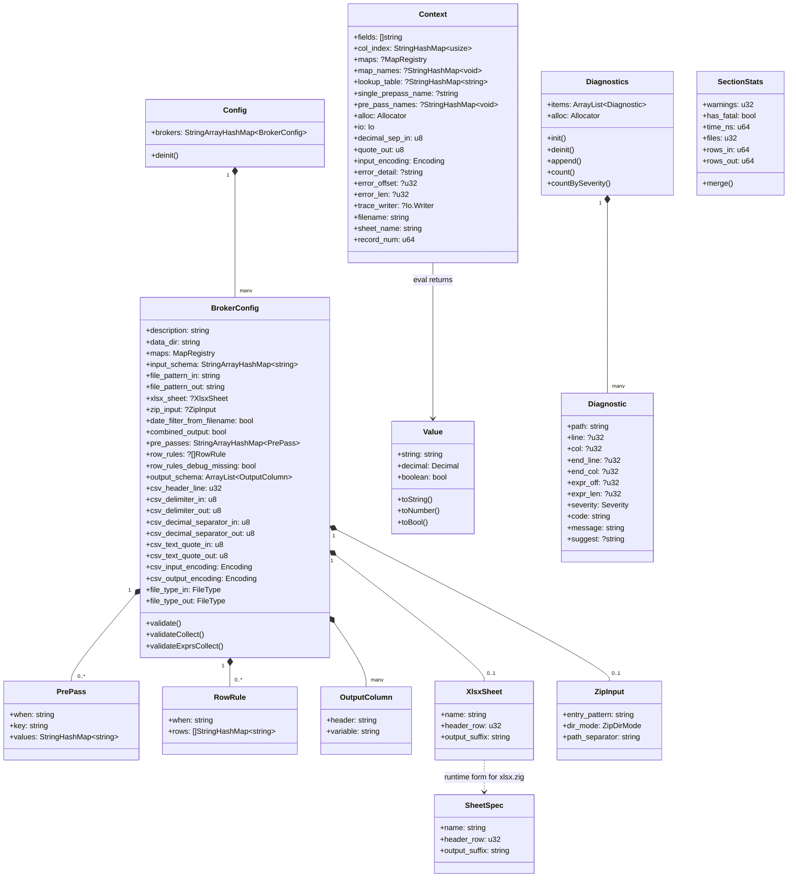

# Data structures

<!-- GENERATED by tools/zig-doc-gen from @typeInfo. Do not edit. -->

The runtime shape of a `bxp-cli` run, read out of the types themselves —
field names, field types and public methods are what the compiler sees, so
this diagram cannot fall behind the code.

## Type aliases

Names the code uses for a bare `std` container. They carry no fields of
their own, so they are spelled out here rather than drawn as classes.

| Alias | Expands to |
| --- | --- |
| <code class="hl-type">MapRegistry</code> | <code>StringHashMap~StringArrayHashMap~string~~</code> |

**`Config`** — The whole loaded `bxp-cli.json`: a template registry plus the arena every string in it points into. `deinit()` frees the lot; nothing below it owns its own memory.

**`BrokerConfig`** — One template. Everything the engine needs to turn one family of input files into one family of output files — where to read, how to parse, what to compute, where to write. The field-by-field reference with defaults and validation rules is the generated [config schema](../../reference/config-schema.md).

**`SheetSpec`** — The runtime form of `XlsxSheet`: the same three values, handed to the converter once the config layer is out of the picture.

**`Value`** — The result of evaluating one expression — a tagged union, not a string. `decimal` is the fixed-point `i128` core, so `75,00` and `75.00` compare equal without a float ever appearing.

**`Context`** — Everything one expression can see while it is being evaluated: the current row, the column index, the resolved named maps, the active `pre_pass` lookup, and the out-parameters an error or a trace writes back through. Built once per row, not per expression.

**`Diagnostics`** — The structured finding collector behind config validation. `bxp-cli` passes a null sink and pays nothing; `bxp-mcp` and the GUI bridge collect into it and turn each entry into an `$err_<N>` / `$warn_<N>` / `$info_<N>` sibling.

**`SectionStats`** — `bxp-cli`'s per-section accumulator — one per template plus a top-level total. `warnings` ticks the exit code from 0 to 2 even when the run completes; `has_fatal` pushes it to 1. The row and file counters exist for the `--debug=json` run summary and are ignored by the human one.

**`MapRegistry`** — Each template's resolved named-map view: the top-level `maps` registry merged with the template's own block, template-local winning on a name collision, built once at config-load time. Its values are `expr.NamedMap`s, which preserve JSON key order — which is why `REPLACE` applies a map's pairs in declaration order, while `REMAP` uses the same map for an O(1) whole-value lookup.
