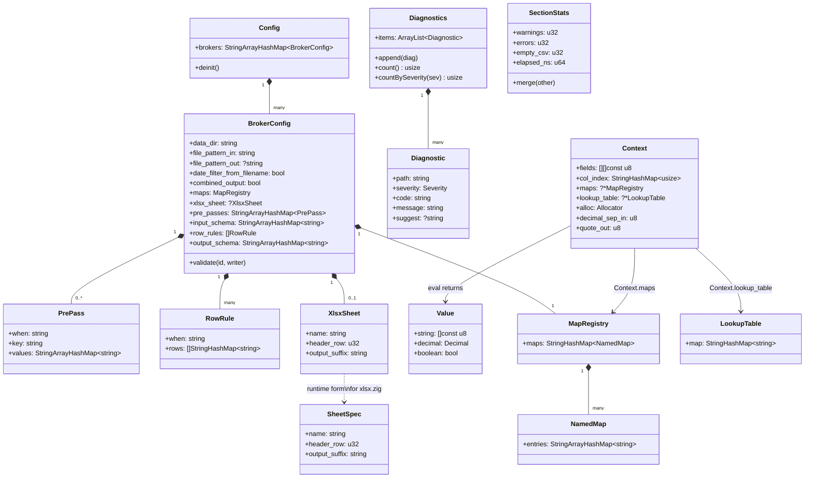

# Data Structures

`SectionStats` is bxp-cli's per-section accumulator (one per template, plus
a top-level total). Warnings tick the exit code from 0 → 2 even when the run
completes; errors push it to 1.

`LookupTable` is owned by `Context` for the duration of one file's main
loop. The composite key encoding keeps multi-namespace `pre_passes` sharing
one storage map without needing nested structures.

`MapRegistry` is each template's resolved named-map view: the top-level
`maps: { name: { ... } }` registry merged with the template's own `maps` block
(template-local wins on a name collision), built once at config-load time. Each
`NamedMap` preserves JSON key order (`StringArrayHashMap`) so `REPLACE` applies a
map's pairs in declaration order; `REMAP` uses the same map for O(1) whole-value
lookup. `REMAP(s, 'name')` / `REPLACE(s, 'name')` resolve the name against it.
