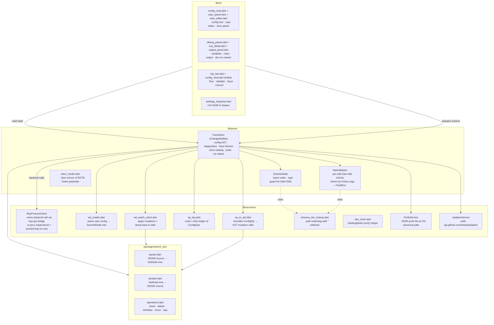
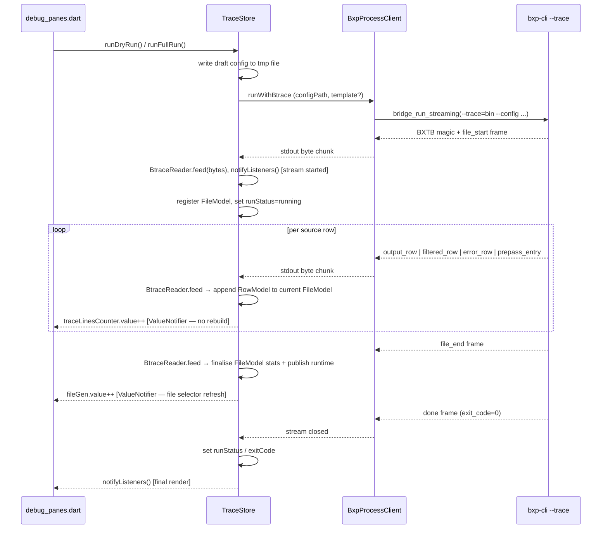
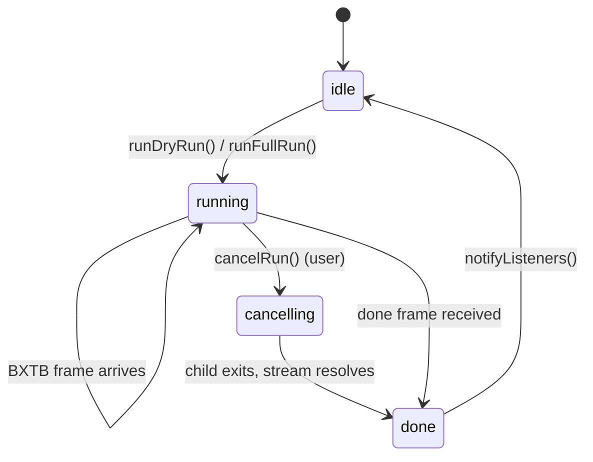
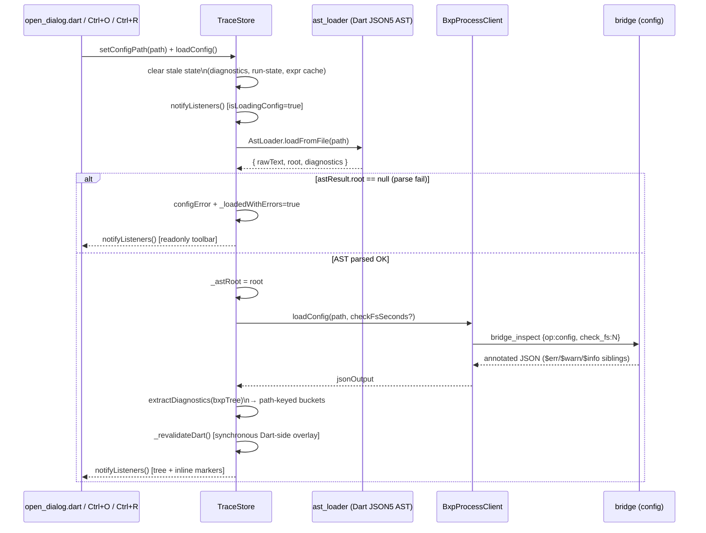
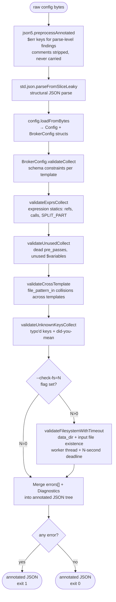
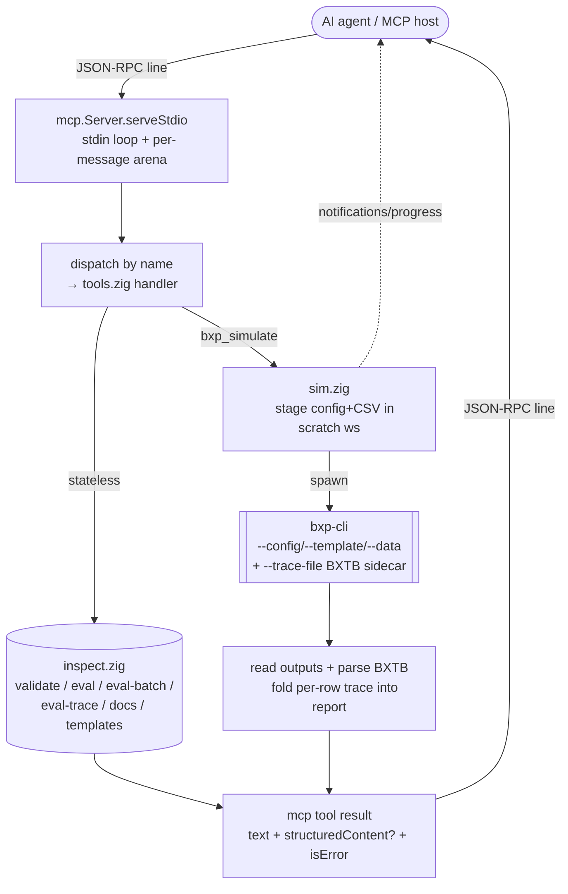
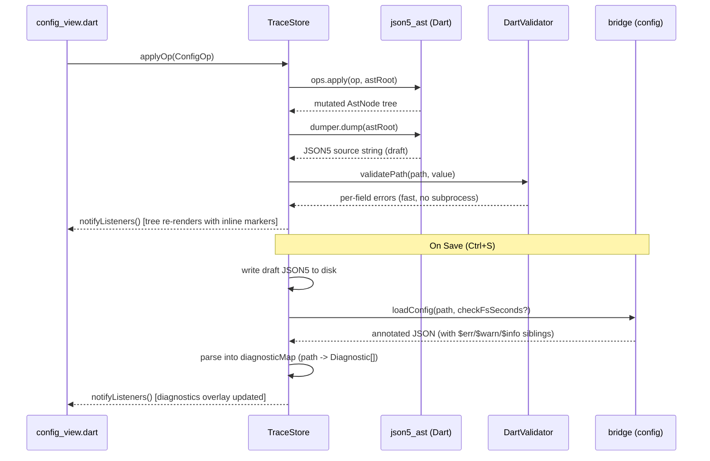
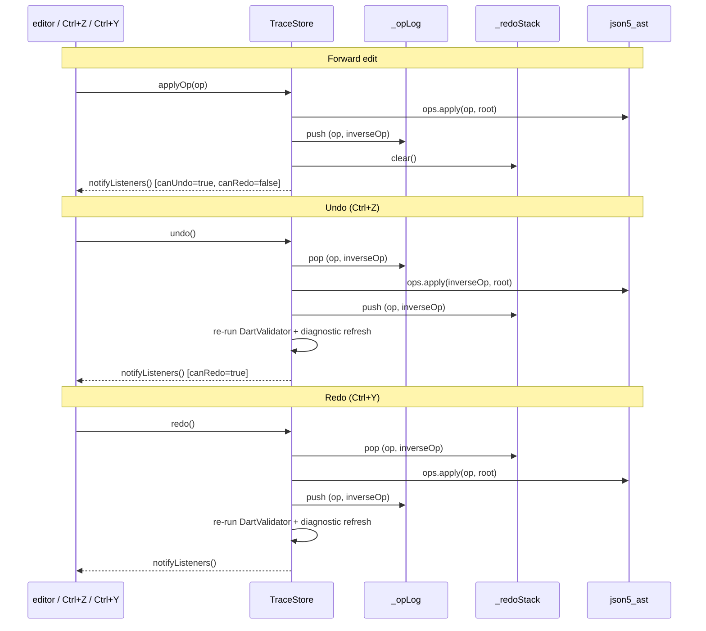
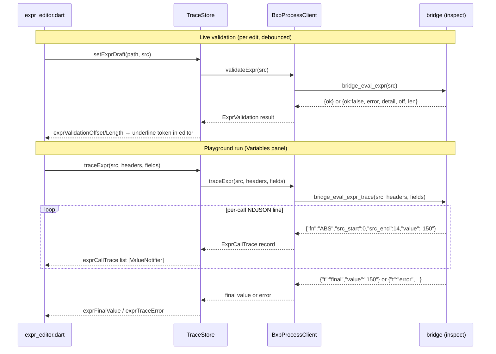
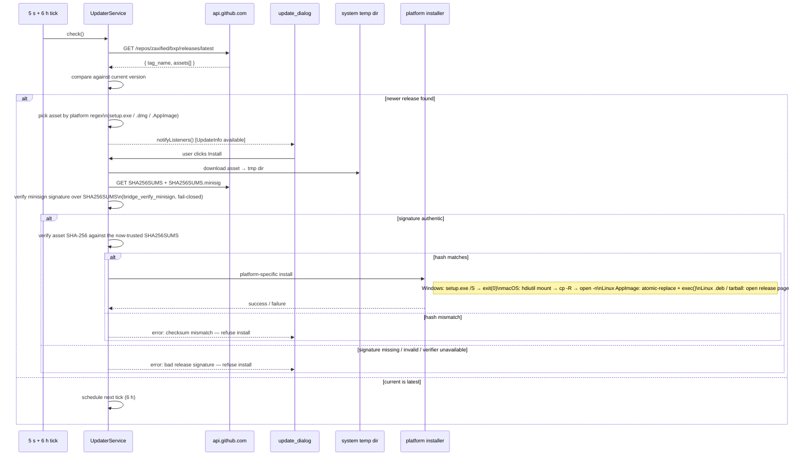

# GUI Architecture

## bxp-gui: Layers and Components

The GUI is divided into three layers. Each layer has a single direction of
dependency: UI reads from Store, Store calls Services, Services talk to the OS
and to the bxp-cli subprocess (proxied by the bridge).

Key invariants:

- **TraceStore is the single source of truth.** All UI state — config AST,
  diagnostics, trace events, docs catalog, user prefs — lives in TraceStore.
  Services are stateless; they do not cache results.
- **json5_ast is the live config representation.** The config is held in memory
  as an `AstNode` tree so edits preserve JSON5 comments and produce canonical
  JSON5 output. The validator's annotated JSON output is overlaid as diagnostics, not
  merged into the AST.
- **No fallback FnDocs.** The docs catalog is the single source for the
  language catalog. If the binary is missing at startup, the app shows a fatal
  error gate; there are no hardcoded fallback catalogs.
- **One backend, two call shapes.** `BxpProcessClient` routes **every** backend
  call through
  `bxp-gui-bridge.{dll,so,dylib}` on all platforms — there is no `Process.start`
  path. The bridge offers two call shapes:
  - **In-process inspect / eval** (`bridge_eval_expr` / `bridge_eval_expr_trace`
    for the expr editor's live validation + ExprPlayground; `bridge_inspect` for
    docs / config / template / eval-batch ops) links `bxp-core/inspect` directly
    and runs synchronously on the main isolate — no spawn, avoiding the ~50 ms
    per-keystroke subprocess cost.
  - **Subprocess proxy** (`bridge_run` / `bridge_run_streaming` +
    `bridge_cancel` + `bridge_ack` for backpressure) wraps the `bxp-cli` runs
    (dry-run / full-run `--trace=bin`, `--version`), draining pipes in native
    Zig code to sidestep a `dart:io` pipe-truncation bug (dart-lang/sdk#1727)
    that kills `--trace` (megabytes) on Windows. Library probe failure at
    startup is **fatal** on every platform — there is no subprocess fallback.

---

## Dry-run / Runner Flow

Two toolbar buttons run `bxp-cli` through the bridge: **dry-run** runs `--trace` only (no
`.csvx` files written, just the BXTB frame stream for the debugger);
**full-run** writes real output. Neither has a keyboard shortcut — both
share the same plumbing, only the `dry: bool` argument to `_streamRunBtrace`
differs. Frames stream back as binary BXTB; the in-store reader folds each
frame into `TraceStore`. To avoid a rebuild storm (PlutoGrid reallocates
quadratically on every `notifyListeners`), incremental row updates go through
`ValueNotifier<int>` counters; the full `notifyListeners()` fires only twice:
at stream start and after the `done` frame.

### Cancellation

The user can cancel a run mid-stream (the run-button label flips to `cancel`
while a stream is active). Cancellation is **user-driven only** — there is no
idle watchdog and no SIGKILL escalation; a child that never exits keeps the
run in `cancelling` until it does.

Step detail:

- **User cancel.** `cancelRun()` sets `_cancelRequested = true` and calls
  `BxpProcessClient.cancelBtrace(handle)` → `bridge_cancel`, which signals the
  `bxp-cli` child (SIGTERM on POSIX, `TerminateProcess` on Windows) and wakes
  any reader parked on the backpressure semaphore. The bridge's reader threads
  drain what is already buffered, the wait thread reaps the exit, and
  `_streamRunBtrace` collapses to its post-loop cleanup with whatever landed —
  partial output stays visible.
- **Cancel before the handle exists.** A click between `status = running` and
  the bridge handle arriving finds `_runBridgeHandle == null`; the flag is set
  anyway so the `onBridgeSpawn` callback cancels the moment the handle shows
  up, instead of silently no-opping.
- **Signal exit codes.** Negative exit codes from signal-driven termination are
  treated as cancellation, not a fault.
- **Final notify.** `notifyListeners()` fires once in the `finally` block so
  the toolbar transitions out of `cancelling` regardless of how the run
  ended (clean done, cancel, error).

!!! note "Grandchildren are not reached"

    `bridge_cancel` signals the direct child only. Not live today — `bxp-cli`
    forks nothing (its parallelism is threads) — but see the roadmap entry
    before that changes.

---

## Config loading and parse pipeline

Symmetric counterpart to **Config Editing and AST** below. Triggered by
opening a file (`Ctrl+O`), pressing `Ctrl+R` (reload), or being called as
post-save reload from `saveConfig`. Two parallel parses run on the same
bytes:

Key points:

- **AST is the primary loader.** Even if config validation fails or is slow,
  the user can still see the tree because `ast_loader` only depends on the
  Dart JSON5 library — no subprocess.
- **AST parse failure is the only readonly trigger.** `_loadedWithErrors` is
  flipped only when AST can't build a tree at all; validator diagnostics are
  shown as inline `$err_*` markers and the pre-save guard blocks bad saves —
  but the user can keep editing toward the fix.
- **Diagnostics are path-keyed.** `$err_*` siblings in the annotated JSON are
  flattened into `Map<String, List<Diagnostic>>` keyed by dot-path. The tree
  renderer queries this map per-node to draw inline error chips.
- **Dart re-validation runs synchronously after the validator response.** It
  populates a separate set of buckets driven by `FnDoc.args` + `FieldDoc`
  validators — instant feedback even for buckets the validator didn't surface yet.

---

## Config validation pipeline

When the GUI validates a config (`bridge_inspect {config}` → `inspect.annotateRaw`), it runs a sequence of
diagnostic passes against the loaded config. Each pass appends to either the
legacy `errors[]` list or the structured `Diagnostics` bag; both are merged
into the annotated JSON output before exit.

Severity routing in the merged JSON: `.error` → `$err_<N>`, `.warning` →
`$warn_<N>`, `.info` → `$info_<N>`. All three carry an optional `off` / `len`
byte span and `suggest` did-you-mean string. Each finding is inserted as a
sibling immediately before the offending key in its parent object (or
appended to the parent when the offending field doesn't exist).

`bxp-cli` runs only the first three passes (load) and skips the entire
diagnostic chain — its job is to convert files, not validate. Hence the same
typo that surfaces as a `$warn_*` sibling in the annotated JSON appears as a
plain stderr warning line during a real run.

---

## bxp-mcp: MCP adapter over the shared core

`bxp-mcp` is a second adapter over the same stateless `inspect` core the GUI
bridge links — but speaking MCP (JSON-RPC 2.0 over stdio) to an AI agent
instead of FFI to a Dart process. An agent host spawns it as a child and pipes
one JSON object per line; every stateless tool is a direct in-process `inspect`
call (microseconds, no subprocess). The lone exception is `bxp_simulate`, which
needs the full conversion pipeline and therefore spawns the **co-located
`bxp-cli`** — the same "heavy workhorse runs as a child, the adapter translates"
pattern the GUI uses.

Key boundaries a developer should keep straight:

- **`isError` vs domain `ok:false`.** `isError:true` is reserved for a transport
  failure (missing required argument, unexpected error, spawn/IO). An expression
  error, a not-found template id, or a `bxp_simulate` orchestration report comes
  back as a normal result with `isError:false` — it is a valid answer to read.
- **`structuredContent` is gated by tool identity**, not by sniffing the output
  shape: a single-object tool exposes the parsed object; `bxp_eval_trace` is
  NDJSON and stays text-only even when a trivial expression yields one line.
- **Memory is two-tier**: a base arena in `main.zig` for startup (argv + the
  registered tool table), and a **per-message arena the `mcp` module creates and
  destroys** around each response — destroyed, not reset with
  `retain_capacity`, so no pointer can survive into the next request's parse.
  A handler reaches it as `call.arena`: allocate freely, never store past the
  call.

Full detail — tool catalog, wire protocol, the `bxp_simulate` workspace + BXTB
fold, build/test — lives in [`mcp.md`](../mcp.md) and
[`bxp-mcp/CLAUDE.md`](https://github.com/zaxified/bxp/blob/master/bxp-mcp/CLAUDE.md).

### Two agent-control surfaces

The bird's-eye view shows **two** ways an agent reaches BXP, and they are not the
same server:

- **`bxp-mcp`** (the `MCPSRV` node) — a standalone Zig binary, **stateless** tools
  over **stdio**, wrapping the `inspect` core. An agent uses it to author and
  verify a config with no GUI running.
- **gui-mcp** (`GuiMcpServer`, the `GUIMCP` node) — an MCP server embedded
  **inside the running Flutter app**, **stateful** tools over **localhost HTTP**,
  wrapping the live `TraceStore`. An agent uses it to drive the live GUI (open /
  edit / dry-run / read trace); every tool is the same action the UI dispatches,
  so parity is definitional.

Different binary, transport, and state model; they share only the MCP protocol.
See [`mcp.md`](../mcp.md) (bxp-mcp) and [`gui/agent.md`](../gui/agent.md#agent-control-gui-mcp)
(gui-mcp).

---

## Config Editing and AST

Every user edit in the config tree (insert field, delete, setValue, reorder) is
expressed as a `ConfigOp` and applied to the live `AstNode` tree via
`json5_ast/operations.dart`. The dumper re-serialises the AST to JSON5 for display and
for saving. `DartValidator` runs synchronously for fast per-field feedback;
Config validation runs on every Save for the authoritative full-config
validation.

`DartValidator` is a thin Dart interpreter driven by the same `FnDoc.args` and
`FieldDoc` tables exported by the docs catalog. It does not reimplement
validation logic — it reads the single-source-of-truth catalog so that adding a
new built-in function automatically extends the live validator.

### Undo / redo

The op log is the canonical record of "what the user did since the last
load." Every applied `ConfigOp` is paired with its inverse so undo doesn't
require re-parsing — it just reapplies the inverse against the live AST.

Edge cases handled:

- **Ctrl+Z inside a text field** falls through to native typo-undo. The
  global handler only fires when focus is somewhere structural (tree, panel,
  top bar). See `_focusInEditableText()` in `main_view.dart`.
- **Save clears the redo stack but keeps the undo log.** The user can still
  undo edits made before the save — the AST mutations are reversible
  regardless of disk persistence.
- **Reset draft (Ctrl+T)** clears both stacks and re-loads from disk —
  it's a hard reset, not an undo.

---

## Expr Playground

Expressions are validated live (per keystroke, debounced ~300 ms) via
the bridge expr validator. When the user switches to the **Variables** panel, the
playground calls the bridge's expr-trace with the current row context and streams
per-call results into the Variables table. Token-level error spans (byte
`off`/`len`) are used to underline the offending token directly
in the expr editor.

---

## Auto-updater flow

`UpdaterService` runs in the background from app launch onwards. It polls
GitHub Releases, surfaces newer versions through a `ChangeNotifier`, and on
user accept downloads → verifies → installs the matching native artifact.

Notes:

- **Two-step fail-closed verification before any install.** First **authenticity**
  — the `SHA256SUMS.minisig` minisign signature over `SHA256SUMS` is checked
  against the public key embedded in `UpdaterService.minisignPublicKey` (native
  Ed25519 + Blake2b-512 via `bridge_verify_minisign`, no Dart crypto dep); then
  **integrity** — the asset's SHA-256 is matched against the now-trusted
  `SHA256SUMS`. Both compares see the same fetched bytes (no verify→use swap
  window). A missing/invalid signature, a missing/mismatched checksum, or an
  unavailable verifier all refuse the install. Signing is automated in CI
  (`release.yml`).
- **Initial poll fires 5 s after launch.** Avoids slowing app startup; a 6 h
  recurring tick handles long-running sessions.
- **macOS DMGs target ARM only.** Intel Macs get `assetUrl == null` and the
  dialog redirects to the GitHub release page — no auto-install path. The
  release workflow doesn't produce an x86_64 DMG.
- **Linux dual path.** AppImage is atomically replaced and `exec()`'d back
  in-place; `.deb` and `.tar.gz` users go to the release page since
  in-place self-update doesn't fit those formats.
- **`kDebugMode` skips the auto-check.** Dev runs don't accidentally
  download installers over the working tree.

---
