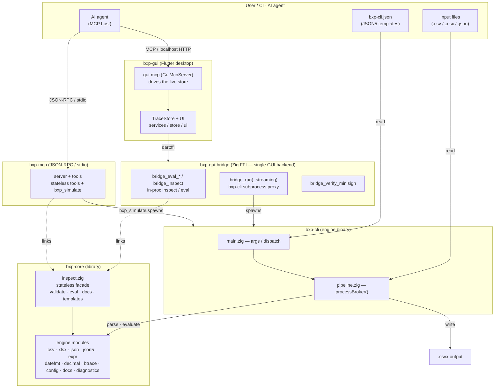

# Architecture

## Bird's-eye View

BXP is a single-binary ETL tool. All broker logic lives in a JSON5 config file -
the binary is a generic engine. The diagram below shows the high-level relationship
between components. It is a high-level topology (who talks to whom); the
individual `bxp-core` modules and their internal dependencies are detailed in
the [bxp-core modules table](../internals/modules.md#bxp-core-modules) and the
[Expression Evaluator — Call Stack](pipeline.md#expression-evaluator---call-stack) diagram.

`bxp-gui-bridge` is the FFI shim the GUI loads via `dart:ffi` at startup. It is
the GUI's **single backend on every platform** — there is no `bxp-fmt` spawn and
no `Process.start` route. Three
roles in one shared library: (1) the **subprocess proxy**
(`bridge_run` / `bridge_run_streaming`) wraps the `bxp-cli` runs the GUI needs
(dry-run / full-run `--trace=bin`, `--version`) from native code, sidestepping
dart-lang/sdk#1727 (~8 KB stdout cutoff that kills `--trace`); (2) the **in-proc
inspect / eval** family (`bridge_eval_expr` / `bridge_eval_expr_trace` /
`bridge_inspect`) links `bxp-core/inspect` directly, so the editor's live
validation, the ExprPlayground, and the docs / config / template ops avoid the
~50 ms subprocess spawn cost; (3) `bridge_verify_minisign` checks the release
`SHA256SUMS` signature for the auto-updater. Library probe failure at startup is
**fatal** on all platforms — a missing library means a broken install.

For the **per-call transport matrix** (which GUI calls use which transport on
each OS, plus the two-cause "why" behind the split), see
[`internals`'s "Why the bridge exists" + "Per-call routing"](../internals/index.md#why-the-bridge-exists)
section. The bridge's C-ABI surface and Debug→ReleaseSafe build rationale live
in [`bxp-gui-bridge/CLAUDE.md`](https://github.com/zaxified/bxp/blob/master/bxp-gui-bridge/CLAUDE.md).

The **engine modules** node groups two faces of `bxp-core`: the conversion
engine (`csv` / `xlsx` / `json` / `json5` / `expr` / `datefmt` / `decimal` /
`btrace`, driven by `bxp-cli`'s pipeline) and the support modules behind the
`inspect` facade. `datefmt`, `tz`, `encoding` and `json5` are drawn here as
engine modules because that is how the engine uses them, but they are no
longer in this tree — all four come from the pinned `zig_libs` fetch
dependency.

`docs.zig` aggregates the language/schema catalog —
re-exporting `expr.builtins` (the `FnDoc` catalog) and flattening each
`config.zig` struct's `fields[]` table — so adding a built-in or config field
updates the docs automatically. Config validation (`inspect.annotateRaw`) runs
`json5.preprocessAnnotated` to emit the `$comm_*` / `$err_*` siblings the GUI
renders.

---
