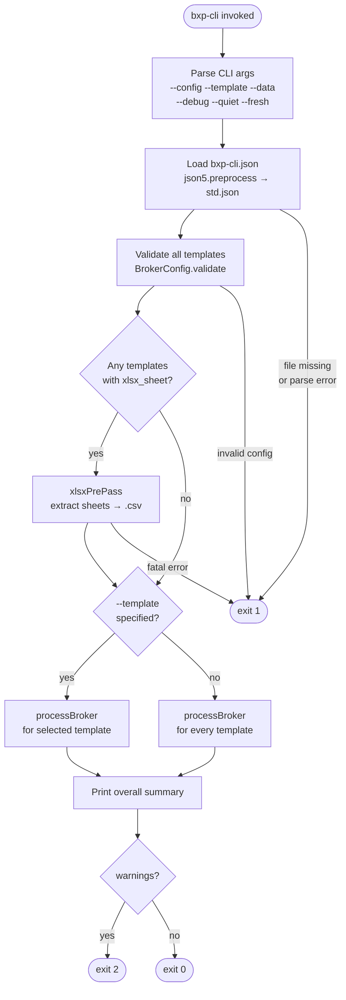
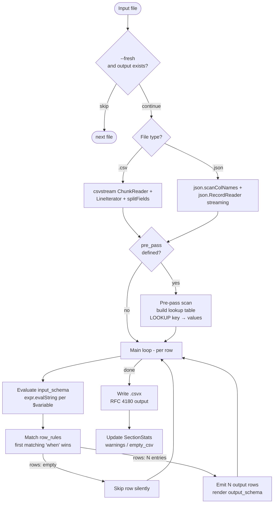
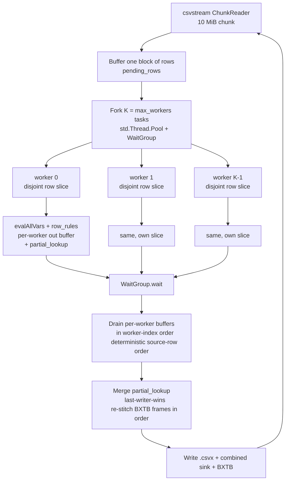
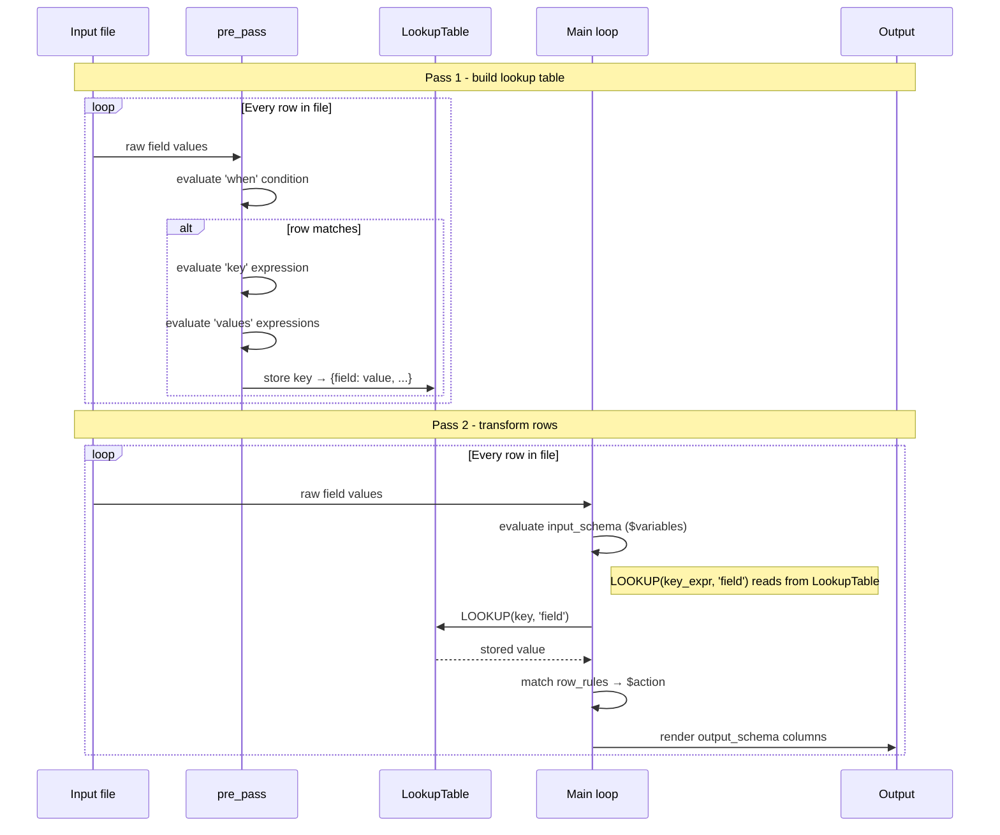
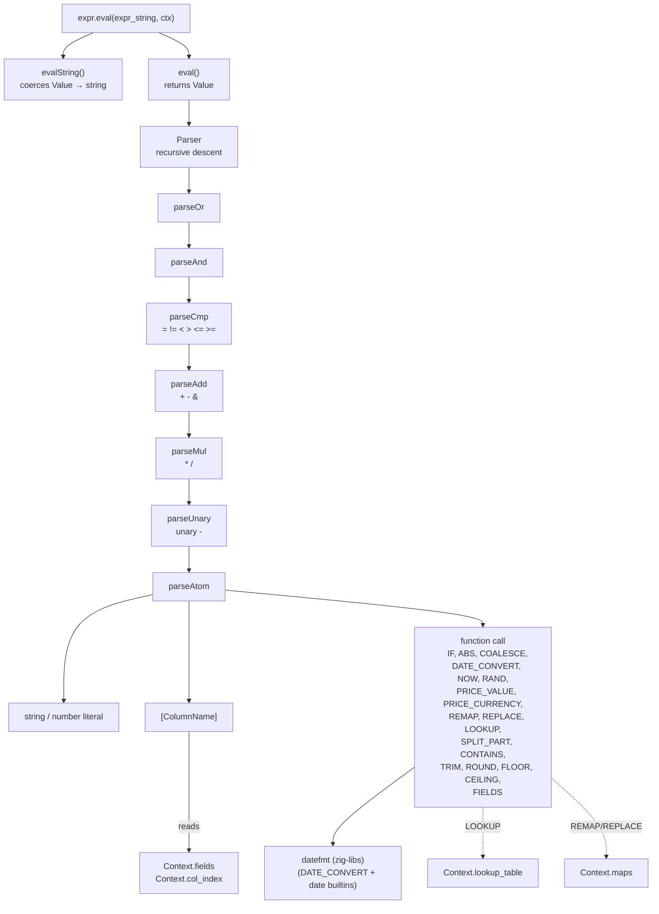

# CLI Pipeline

## Execution Flow

Step-by-step flow when `bxp-cli` is invoked.

---

## Per-File Processing (processBroker)

For each input file matched by `file_pattern_in`:

A single input row can produce **0, 1, or N output rows** depending on
`row_rules`:

- `rows: []` — silent skip (e.g. internal accounting events that don't
  belong in the activity log).
- `rows: [{...}]` — one-to-one (the typical buy/sell/deposit case).
- `rows: [{...}, {...}, ...]` — multi-row expansion. Used when a single
  source event represents multiple Wealthfolio activities — e.g. a Trading
  212 dividend with withholding tax may emit separate `DIVIDEND` and
  `TAX` rows from one input line.

The `--debug` flag prints rows that match no rule when
`row_rules_debug_missing: true` is set on the template — useful when
authoring a new template. xlsx files take an earlier path: `xlsxPrePass`
extracts each sheet to an intermediate `.csv` before this loop runs, so
xlsx and csv inputs follow the same code from the chunked CSV reader onwards.

The `Main loop - per row` box above is the **logical** view. Physically each
chunk's rows are evaluated by a fork-join worker pool — see
[Parallel Evaluation](#parallel-evaluation-per-block-fork-join) below.

---

## Parallel Evaluation (per-block fork-join)

`input_schema` / `row_rules` evaluation is the CPU-bound hot path, and each
output row is a pure function of one input row plus the (already-built)
pre_pass lookup table — so rows within a block are independent and evaluate
in parallel. `processBlockParallel` (`bxp-cli/src/pipeline.zig`) buffers a
block of rows, fans them out across `K = runtime.max_workers` worker tasks on
a shared `std.Thread.Pool` (owned by `main.zig`, carried on `Runtime`,
`K = std.Thread.getCpuCount()` typically), then re-stitches the results in
source order so the output stays byte-identical to the serial path.

Determinism guarantees that make the parallel path a drop-in for the serial
one:

- **Output order** — workers write into private buffers; the main thread
  drains them in worker-index (= source-row) order after `WaitGroup.wait()`,
  so `.csvx` rows and BXTB `output_row` frames come out in input order.
- **pre_pass writes** — each worker accumulates into its own `partial_lookup`
  map; the drain merges them into the shared `lookup_table` with
  last-writer-wins, matching the serial "later row overwrites earlier" rule.
- **Memory** — block size (`JSON_PARALLEL_BLOCK_SIZE = 1024` for JSON;
  chunk-bounded for CSV) amortises dispatch overhead while keeping the
  per-block arena footprint bounded.

The BXTB trace stream itself stays single-stream — the `chunk_id` frame field
is reserved for a future multi-stream dispatch but is always `0` today
(see [trace-protocol](../trace-protocol/index.md)).

For the broader runtime cost model (what else speeds up / slows down a run)
and the benchmark harness, see
[internals → Performance model](../internals/performance.md#performance-model).

---

## Two-Pass Pipeline Detail

The `pre_pass` mechanism enables **cross-row lookups** - values from one row
can be referenced when processing a different row.

**Example use case (AnyCoin):** A `trade payment` row holds the currency; a `trade fill`
row holds the ticker and quantity. Both share an `Order ID`. `pre_pass` indexes payment
rows by `Order ID`; the main loop uses `LOOKUP([Order ID], 'currency')` when processing
fill rows.

### Single block vs named blocks

`pre_pass` accepts two shapes:

- **Legacy single block** — `{ when, key, values }` directly. Internally bound
  to the synthetic namespace `_default`; accessed via 2-arg
  `LOOKUP(key_expr, 'field')`.
- **Named blocks** — `{ name1: { when, key, values }, name2: { ... } }`. Each
  block is its own namespace; accessed via 3-arg
  `LOOKUP('name1', key_expr, 'field')`. Use this when one template needs
  multiple independent lookup tables.

The lookup table is keyed internally by a composite `name\x00key\x00field`
string, which is why both forms share the same `LookupTable` storage —
the legacy 2-arg form just gets `_default` synthesized as the namespace.

---

## Expression Evaluator - Why a Custom DSL?

bxp's expression language (`expr.zig`) is a custom **SQL/Excel-style
expression DSL** — not an embedded Lua, JavaScript, Python, or off-the-shelf
expression engine. This section explains the choice so it doesn't have to be
re-researched on every audit.

### Naming convention

The DSL is intentionally **SQL/Excel-flavored**:

| Surface | bxp expr              | Origin                                  |
| ------- | --------------------- | --------------------------------------- |
| Column  | `[ColumnName]`        | Excel structured ref, SQL bracket-quote |
| Equal   | `=`                   | SQL (not `==`)                          |
| Concat  | `&`                   | Excel / SQL Server                      |
| Logic   | `AND`, `OR`, `NOT`    | SQL keywords                            |
| Cond    | `IF(cond, yes, no)`   | Excel `IF`                              |
| String  | `'text'`              | SQL single-quote                        |
| Funcs   | `UPPER_CASE` builtins | SQL/Excel convention                    |

Built-ins map onto recognisable SQL/Excel functions wherever possible:
`COALESCE`, `NULLIF`, `IN`, `SUBSTR`, `LEFT`/`RIGHT`, `UPPER`/`LOWER`,
`TRIM`, `ROUND`, `FLOOR`/`CEILING`, `REPLACE`, `SPLIT_PART` (PostgreSQL),
`REGEX_MATCH`/`REGEX_EXTRACT` (PostgreSQL `~` / `regexp_match`),
`STARTS_WITH`/`ENDS_WITH` (PostgreSQL `starts_with`/`ends_with`),
`CONTAINS` (SQL Server), `LOOKUP` (Excel). Domain extensions (`DATE_CONVERT`,
`PRICE_VALUE`, `PRICE_CURRENCY`, `REMAP`) follow the same `UPPER_CASE`
shape.

The string-matching builtins form a deliberate **cost ladder** — `IN`/`REMAP`
(hash lookup) < `CONTAINS`/`REPLACE` (literal scan) < `REGEX_MATCH`/`REGEX_EXTRACT`
(the Pike-VM pattern engine, a linear-time / ReDoS-safe fetch dependency
`quangd/regex.zig`). Regex is the only builtin backed by an external engine and
the most expensive rung: on 1M synthetic rows it measured **~1.9× the wall time**
of a literal-only equivalent producing byte-identical output, at **flat peak
RSS** (the engine is window/arena-bounded — no per-row growth). Reach for it only
when a pattern the cheaper tools cannot phrase is genuinely needed; see
[`docs/examples/advanced/freeform-payment-memos`](../../examples/advanced/freeform-payment-memos/index.md)
for the worked tradeoff and the full measurement table.

The target persona is an Excel-comfortable analyst (statement
authoring, CRM migration mapping), not a Python/JS programmer. A Lua-style
(`if x then ... end`) or Python-style (`y if cond else z`) syntax would
alienate that user; SQL/Excel idioms transfer directly from a spreadsheet
workflow.

### Why not embed Lua / JavaScript / Python / expr-lang?

Surveyed alternatives:

- **Lua** via ziglua (~250 KB, full programming language with GC)
- **JavaScript** via QuickJS (~700 KB, ES2020+ sandbox)
- **Go expr-lang / CEL** (no Zig port exists; would require a from-scratch implementation)
- **Python** (CPython too heavy to embed; ~5–10 MB runtime)

Tradeoff for our workload (per-row eval over 100k–10M rows):

| Aspect                                         | bxp expr (current)           | Hosted engine swap            |
| ---------------------------------------------- | ---------------------------- | ----------------------------- |
| Per-row eval cost (2M rows S1 bench)           | 6.5 s (measured 2026-05-25)  | 10–100× slower (GC, dispatch) |
| Binary footprint                               | included in bxp-cli          | +250 KB to +700 KB            |
| Trace highlighting (off/len in GUI playground) | shipped                      | rebuild from scratch          |
| `FnDoc` autocomplete (single source of truth)  | co-located with each builtin | rebuild binding layer         |
| Domain builtins (`DATE_CONVERT`, `LOOKUP`, …)  | inline impl, zero deps       | reimplement as native funcs   |
| Sandboxing                                     | implicit (no loops, no I/O)  | strip Lua `io`/`os` / harden  |

The value of `expr.zig` is **not** the parser (~600 LOC, recursive
descent). It's the **integration**: per-row arena pattern, trace stream
hooks, `FnDoc` autocomplete in `bxp-gui`, `error_detail` diagnostics
returned through `Context`, byte-exact reproducibility across the cross-runner
expression corpus and the dataset regression suite. All of that would have to be
rebuilt around any hosted engine while paying the perf and footprint cost.

### When to revisit

Only revisit the build-vs-buy decision if **both** become true:

1. A user-meaningful capability (e.g. user-defined functions, loops over
   sub-records, complex aggregations) lands on the roadmap that genuinely
   needs a full programming language.
2. A native-Zig expression engine matures with comparable perf, embedded
   sandboxing, and a stable allocator-aware API.

Until then, the SQL/Excel-style DSL is a deliberate fit for the user
persona and workload, not legacy inertia.

---

## Expression Evaluator - Call Stack

Side context dependencies (dotted lines): `[ColumnName]` references (and
`FIELDS(n)` positional access) read `Context.fields` via `Context.col_index`; `LOOKUP(...)` reads
`Context.lookup_table` populated by the pre-pass; `REMAP(...)` (whole-value) and
`REPLACE(..., 'name')` (substring) read `Context.maps` — the named-map registry
resolved at config-load time from the top-level `maps` registry merged with each
template's local `maps` block.

### Static analysis path (parallel to runtime eval)

The config validator's passes don't run expressions — they walk the parse
tree to find typos and dead references. Two top-level entry points in
`expr.zig`:

| Function                       | What it returns                                                       | Used by                                               |
| ------------------------------ | --------------------------------------------------------------------- | ----------------------------------------------------- |
| `staticReferences(src, alloc)` | Set of every `[X]` and `$var` referenced                              | `validateUnknownKeysCollect`, `validateUnusedCollect` |
| `staticCheckCalls(src)`        | `StaticCheckResult` — the first bad literal arg found, with its span  | config validation, `bridge_eval_expr`                 |

`staticCheckCalls` is the unified literal-argument checker: it walks every
call in the source, looks each name up in the `builtins` catalog, and reports
the first argument literal that violates its `FnDoc` `ArgKind` — a
`positive_integer` violation (`SPLIT_PART(_, _, ≤0)`) in `.split_part`, a
`date_format` violation (a bad `DATE_CONVERT` pattern) in `.date_format`. It
replaced the former per-builtin `staticCheckSplitPart` / `staticCheckDateFormat`
walkers, so adding a checked `ArgKind` needs no new entry point.

These share the parser front-end with `eval()` — same recursive descent, no
duplicated grammar — but return a finding instead of producing values;
`config.zig` is what turns that finding into a `Diagnostic`
(`expr.SplitPartBadIndex` / `expr.DateFormatBadToken`) in the `*Diagnostics`
sink.

---
