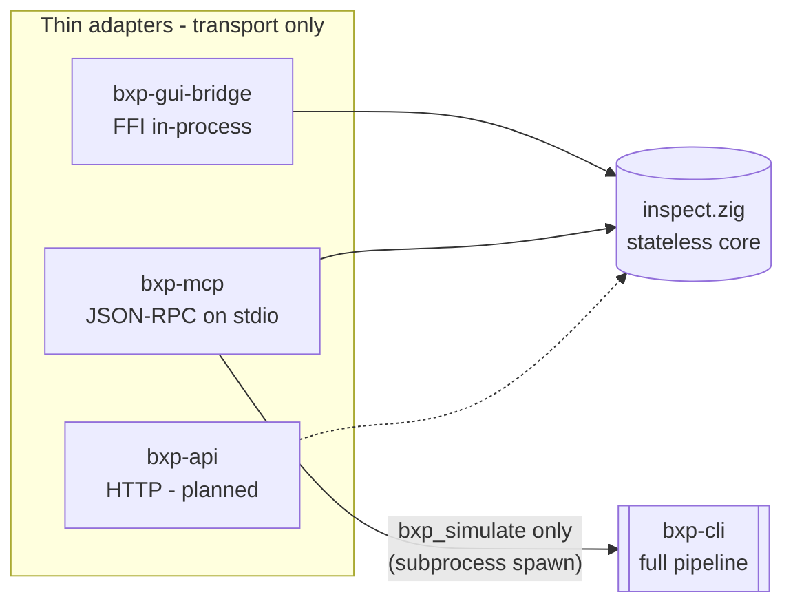

# MCP server

Developer orientation for **bxp-mcp**, the Model Context Protocol server that
exposes bxp's stateless surface (plus one full-run tool) as agent-callable
tools over JSON-RPC 2.0 on stdio.

For the deepest reference — exact JSON shapes, every design rationale — read
[`bxp-mcp/CLAUDE.md`](https://github.com/zaxified/bxp/blob/master/bxp-mcp/CLAUDE.md). This page is the fast map.

> **Two MCP servers — don't confuse them.** BXP ships two unrelated MCP servers.
> **This page is `bxp-mcp`**: a standalone Zig binary, **stateless** tools over
> **stdio**, wrapping the `bxp-core/inspect` core — an agent uses it to **author
> and verify a config offline** (no GUI). The other is **gui-mcp**
> (`GuiMcpServer`), embedded **inside the running Flutter app**: **stateful** tools
> over **localhost HTTP**, wrapping the live `TraceStore` — an agent uses it to
> **drive the live GUI**. Different binary, transport, state model, and lifecycle
> (gui-mcp exists only while the GUI is running); they share only the MCP protocol
> itself. gui-mcp lives in `bxp-gui` — see [`gui/index.md`](gui/index.md) and
> [`bxp-gui/CLAUDE.md`](https://github.com/zaxified/bxp/blob/master/bxp-gui/CLAUDE.md) ("Agent control").

## What it is, and why

An AI agent (Claude Code, or any MCP host) spawns `bxp-mcp` as a child process
and pipes JSON-RPC requests to it. The server lets the agent **author and verify
a bxp-cli config without driving the GUI**: validate config text, evaluate and
trace expressions, read the language docs, and run a real conversion end-to-end
against sample CSV.

It is one of several thin **adapters** over a single shared stateless core,
`bxp-core/src/inspect.zig`:



"One core, thin adapters": none of the adapters owns the stateless logic — it
lives in `inspect`. The transport follows from **who** calls and **from where**:
stdio = a local agent that spawns the server (private pipe, 1:1, zero config); a
port would be bxp-api's job (remote/shared/web). The boundary rule is _the core
must not know who is calling it_.

## Two execution models

| Model          | Tools                            | Cost         | How                                                                                                                          |
| -------------- | -------------------------------- | ------------ | ---------------------------------------------------------------------------------------------------------------------------- |
| **In-process** | every tool except `bxp_simulate` | microseconds | a tool call is a direct `inspect` function call — no spawn, no filesystem                                                    |
| **Spawn**      | `bxp_simulate`                   | a real run   | spawns the **co-located `bxp-cli`** (`sim.zig`); a full conversion needs `processBroker`, the worker pool, and real file I/O |

The "no spawn" rule is about µs-latency stateless calls. A full run is inherently
heavyweight, so the spawn cost is noise. `bxp-mcp` locates `bxp-cli` **next to
its own executable** — it ships in the same console/desktop bundle as
`bxp-cli`, so the agent always invokes it where `bxp-cli` sits
alongside.

## Tool catalog

All stateless tools share the `bxp-core/inspect` core with the GUI bridge (same
`inspect` core). The tools take config / expression **text** (not a file path) —
the agent passes the config it is authoring.

All nine, with the `inspect` entry point and the matching bridge call —
included from the generated catalog so a tenth tool cannot miss this page.
The per-tool descriptions and JSON schemas are in
[the MCP tools reference](../reference/mcp-tools.md).

--8<-- "reference/mcp-tools.md:impl-map"

!!! note "Row context: one shape across all three eval tools"

    `bxp_eval`, `bxp_eval_trace` and `bxp_eval_batch` all take `headers` /
    `fields` as **native JSON arrays of strings**. The first two additionally
    accept an array encoded into a string (`"[\"Price\"]"`) — the shape they
    declared until 2026-08-19 — so a caller written against the older schema
    keeps working. Any other shape is refused by name. See
    [`trace-protocol/inspect.md`](trace-protocol/inspect.md).

Agent workflow hint (also in the server's `initialize` instructions): call
`bxp_docs` first to learn the language, `bxp_eval_trace` to debug an expression,
`bxp_simulate` to verify a finished config for real.

## Wire protocol

Newline-delimited JSON-RPC 2.0 over stdin/stdout — **one JSON object per line**.
stderr is free for logs.

- **request** (has `id`) → exactly one response line with the same `id`.
- **notification** (no `id`, e.g. `notifications/initialized`) → no response.
  A request-only method (`initialize` / `tools/list` / `ping` / `tools/call`)
  arriving without an `id` is a stray notification and is silently dropped.
- **tool result** → `{content:[{type:text,text}], isError}`.
  - `isError:true` marks a tool **failure** — a missing required argument, an
    unexpected Zig error, a spawn/IO problem.
  - A domain `{"ok":false,…}` answer (an expression error, a not-found template
    id, an orchestration report) keeps `isError:false`: it is a valid result the
    agent should read, not a transport failure.
  - `structuredContent` (the parsed object) is added when the tool's **declared**
    output is a single JSON object (`tools.allowsStructured`). `bxp_eval_trace`
    is NDJSON by identity and stays text-only even when a function-free
    expression emits a single sentinel line.
- **server → client** `notifications/progress` are emitted mid-call when the
  request supplied `params._meta.progressToken` (`call.reportProgress`).

Methods handled: `initialize`, `tools/list`, `tools/call`, `ping`,
`notifications/initialized`, plus `resources/list`, `resources/read`,
`resources/templates/list`, `prompts/list` and `prompts/get` — the latter five
answered from empty catalogs, since bxp registers no resources or prompts.

### Protocol version negotiation

The server advertises the latest MCP protocol revision it knows
(`mcp.protocol_version`) and, on `initialize`, echoes the client's requested
`protocolVersion` when it is one of the supported revisions
(`mcp.supported_versions`), otherwise answers with the latest. The tool surface
is identical across supported revisions.

## Source layout

```text
bxp-mcp/
  src/
    main.zig     entry: base arena, --help, server identity + INSTRUCTIONS,
                 tools.register(), mcp.Server.serveStdio()
    tools.zig    tool catalog (the tools/list source) + handlers -> inspect
                 calls; register() pairs each row with its handler;
                 allowsStructured()
    sim.zig      bxp_simulate: stage config+CSV, spawn bxp-cli, read output,
                 diff, fold the BXTB sidecar trace into the report
  build.zig      path-deps ../bxp-core, imports `inspect` + `btrace` + `mcp`
  build.zig.zon
```

The JSON-RPC layer is the zig-libs **`mcp`** module — framing, handshake,
`tools/list`, dispatch-by-name, `structuredContent` gating and progress. It is
taken through bxp-core's re-export, so bxp-mcp shares that package's single
zig-libs pin; the module itself is pure `std` with no dependencies of its own.

That module is this package's **own former `server.zig`**, extracted upstream on
2026-07-04 and hardened there — which is why the 2026-08-16 migration was
near-free: `isSingleJsonObject`, the `tools/list` serializer and every JSON-RPC
error string were already byte-identical. Upstream adds resources + prompts +
sampling/elicitation, a 16 MiB line cap, JSON-RPC §4 id validation, a
JSON-escaped progress message, and 89 unit tests the local transport never had.

## Memory model

`main.zig` holds one **base arena** over the page allocator for startup (argv)
and the registered tool table. Every transient per-message allocation — the
incoming JSON parse, the handler's work, the response serialization temps —
routes through a **per-message arena** the `mcp` module creates and frees around
each response. A handler reaches it as `call.arena`: allocate freely, never
store past the call.

> **Aliasing lesson**, kept because it is why the tool-output buffer is shaped
> the way it is. The local transport originally reused one retained-capacity
> output buffer across requests on an arena reset with `retain_capacity` — which
> keeps pointers into arena memory the next request's JSON parse reuses, so a
> later call could alias its own output over the live request (observed
> corrupting a second `bxp_simulate` report). The fix was a fresh per-request
> buffer, and the `mcp` module has that shape structurally: `ToolCall.out` is
> per-call and the whole arena is destroyed, not reset, between messages.

## bxp_simulate in depth

`sim.zig` runs a full conversion the stateless tools cannot — it exercises
`pre_pass` / `LOOKUP` / `row_rules` against real input:

1. **Validate** the template's input shape via `inspect.templateIo`; reject
   xlsx/JSON-input templates (CSV input only).
2. **Stage** a stable, reused scratch workspace `<tmp>/bxp-mcp-sim/<uid>/`
   (sanitized id; wiped fresh per run, left in place for inspection): the config
   verbatim as `config.json`, the CSV as `data/input<suffix>` (suffix matched to
   `file_pattern_in`).
3. **Run** the co-located `bxp-cli` with the existing flags only —
   `--config`/`--template`/`--data <scratch>` (so the config's own `data_dir` is
   untouched) plus `--trace-file <ws>/trace.bxtb` (a sidecar BXTB stream,
   independent of stdout, so the human summary stays clean).
4. **Read back** every produced output file, parse the BXTB sidecar with
   `btrace.Reader`, and build the report.

Report (declares an `outputSchema`):

```jsonc
{
  "ok": true,                 // the run happened; consult exit_code/status
  "template": "…",
  "exit_code": 0,             // bxp-cli: 0 ok, 2 warnings, 1 error
  "status": "ok",
  "input":  { "records": 12, "csv": "…" },
  "output_records": 12,
  "outputs": [ { "file": "…", "records": 12, "csv": "…" } ],
  "summary": "…",             // bxp-cli stdout
  "diagnostics": "…",         // bxp-cli stderr
  "trace": { … },             // BXTB sidecar folded in (below)
  "workspace": "/tmp/bxp-mcp-sim/…"
}
```

- **`records` are data rows — the header is excluded** — so `input.records` /
  `output_records` line up with `trace.source_rows` / `written_rows`.
- An output file that can't be read back (e.g. exceeds the 16 MB cap) appears as
  `{file, error}` instead of `{file, records, csv}` — never silently dropped.
- `ok:false` is reserved for **orchestration** failures that prevented a run
  (template not found, unsupported input, spawn/IO problem) and carries
  `{ok:false, error, detail}`.

The `trace` object folds the BXTB sidecar into JSON: aggregate
`source_rows`/`written_rows`/`errors`/`warnings`, then per-category exact counts
plus a capped (`MAX_TRACE_SAMPLE = 200`) sample for `filtered` (reason:
`rule_skip` / `no_rule_match`), `row_errors`, and `output_rows` — each row
carrying the **1-based input line** resolved from its `source_locator` byte
offset. For the underlying BXTB frame format see
[`trace-protocol`](trace-protocol/index.md).

## Build, run, test

```bash
cd bxp-mcp
zig build
zig build test                 # unit tests (sim.zig pure helpers)
./zig-out/bin/bxp-mcp --help

# Drive it by hand — one JSON-RPC object per line on stdin:
printf '%s\n' \
  '{"jsonrpc":"2.0","id":1,"method":"initialize","params":{"capabilities":{}}}' \
  '{"jsonrpc":"2.0","id":2,"method":"tools/list"}' \
  '{"jsonrpc":"2.0","id":3,"method":"tools/call","params":{"name":"bxp_eval","arguments":{"expr":"1 + 2"}}}' \
  | ./zig-out/bin/bxp-mcp
```

The full smoke gate is `scripts/test-02-mcp.sh`: build + unit tests + a JSON-RPC
round-trip that drives one tool from each family and a complete `bxp_simulate`
run (verifying the co-located `bxp-cli` spawn and byte-identical output against a
dataset's `.expected`).

Register with an MCP client (e.g. Claude Code, `~/.claude.json`):

```json
{ "mcpServers": { "bxp": { "command": "/abs/path/to/bxp-mcp", "args": [] } } }
```
