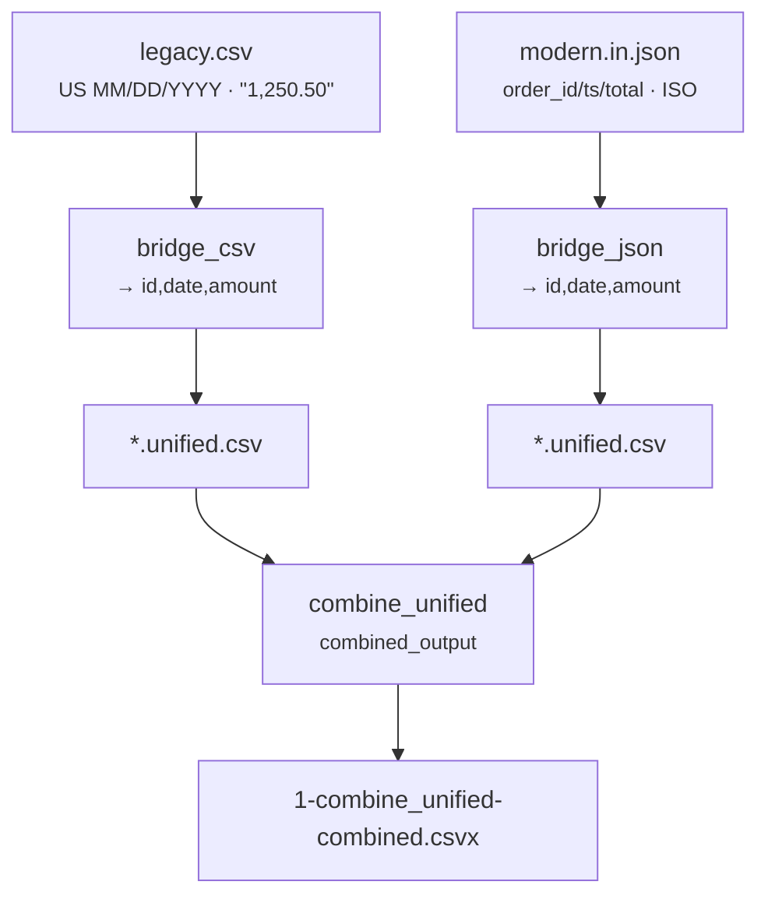

# Mixed-Format Bridge (CSV batch + JSON batch → one dataset)

[:material-github: View on GitHub](https://github.com/zaxified/bxp/tree/master/docs/examples/advanced/mixed-format-bridge){ .md-button }

!!! abstract "What"
    Combine records that arrive in **two different file formats** — an old
    CSV batch and a new JSON batch of the same kind of data — into one unified table.

!!! note "Synthetic / teaching example"
    The data here is **constructed**, not sourced.
    `legacy.csv` (US dates `MM/DD/YYYY`, US-grouped amounts `"1,250.50"`) and
    `modern.in.json` (different key names, ISO dates). The _problem class_ — a feed
    that migrated from CSV to JSON while the old files still matter — is universal;
    the rows are not.

## Why interesting

A template reads **one input format** (CSV _or_ JSON), so a mixed-format pile
can't be done in a single pass. The fix is one pass per format into the _same_
`output_schema`, then a fan-in pass to stack the normalised results — bridging
formats without leaving bxp or hand-writing a merge script.



**Problem class documented in.** (sources for the problem class — not for the data)

- Feed/API format migrations (CSV→JSON, v1→v2) are routine; historical batches
  in the old format have to be bridged to the new pipeline schema — a standard
  data-engineering backfill task.

## The trick — one pass per format, then a fan-in

Three templates, run all at once with `bxp-cli --config ./sample.json`. Each
writes a real file, and each is pinned by a golden, so the three snippets below
are exactly what the run produces. Each pass uses a distinct `file_pattern_in`,
which is what stops the three from picking up one another's output.

### Pass 1 · `bridge_csv` — the old CSV batch

Reads `legacy.csv` and normalises it to the target schema: US `MM/DD/YYYY`
becomes ISO, and the `,` thousands separator is stripped so the amount is a real
number.

```csv title="legacy.unified.csv"
--8<-- "examples/advanced/mixed-format-bridge/legacy.unified.csv"
```

### Pass 2 · `bridge_json` — the new JSON batch

Reads `modern.in.json`, whose keys are named differently (`order_id` / `ts` /
`total`) and whose dates are already ISO. Different input, different work — but
the **identical** `output_schema`:

```csv title="modern.unified.csv"
--8<-- "examples/advanced/mixed-format-bridge/modern.unified.csv"
```

Put those two side by side and the bridge is done: two formats, one shape. A
template reads one input format, so this is the step that could not have been a
single pass.

### Pass 3 · `combine_unified` — stack them

`combined_output: true` over `*.unified.csv` concatenates the two normalised
batches into one file, header written once. That is **Final result** below.

## Final result

A CSV batch and a JSON batch, different dates and number styles, land as one
consistent dataset:

```text
id,date,amount
A-1,2024-03-15,1250.5
A-2,2024-03-16,980
B-1,2024-03-20,540
B-2,2024-03-21,3120.75
```

## Sample data

Run it with `bxp-cli --config ./sample.json` — the two inputs and the full
commented template:

=== "sample.json (config)"

    ```js
    --8<-- "examples/advanced/mixed-format-bridge/sample.json"
    ```

=== "legacy.csv"

    ```{.csv .bxp-sample}
    --8<-- "examples/advanced/mixed-format-bridge/legacy.csv"
    ```

=== "modern.in.json"

    ```json
    --8<-- "examples/advanced/mixed-format-bridge/modern.in.json"
    ```

=== "1-combine_unified-combined.csvx (result)"

    ```csv
    --8<-- "examples/advanced/mixed-format-bridge/1-combine_unified-combined.csvx"
    ```
