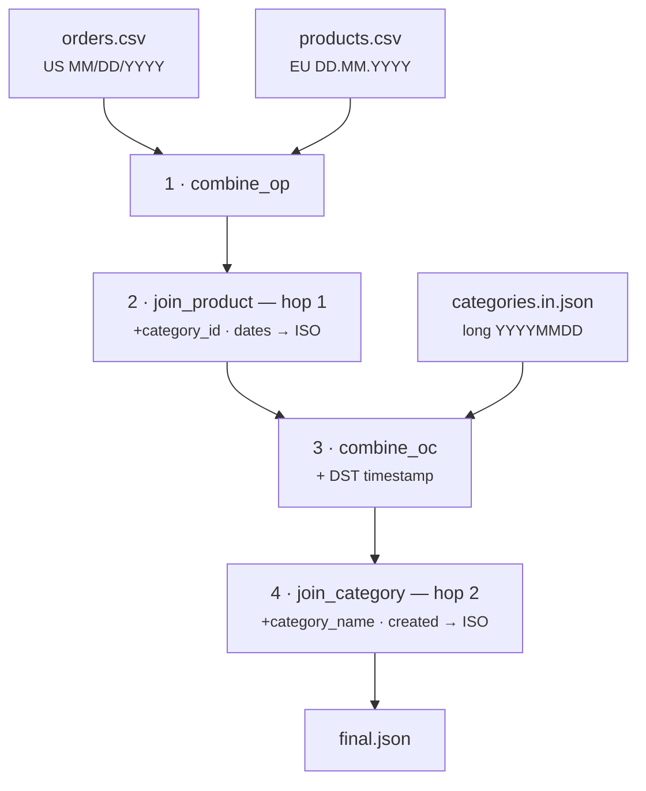

# Multi-Stage ETL — chained two-hop JOIN + DST timezone (capstone)

[:material-github: View on GitHub](https://github.com/zaxified/bxp/tree/master/docs/examples/advanced/multi-stage-etl){ .md-button }

!!! abstract "What"
    A transitive (two-hop) JOIN that no single pass can do —
    order → product → category → name — chained across passes, while normalising
    three different date formats and bridging CSV ↔ JSON, finishing with a
    DST-aware Europe/Prague timestamp.

!!! note "Synthetic / teaching example"
    The data here is **constructed**, not sourced — `orders.csv` (US `MM/DD/YYYY`),
    `products.csv` (EU `DD.MM.YYYY`), `categories.in.json` (long `YYYYMMDD`). The
    _problem class_ — snowflake relationships, format drift across sources, and
    timezone correctness — is universal; the rows are not.

## Why interesting

Two limits force the chaining: bxp reads **one file per pass**, and runs **one
pre_pass per pass**. The second hop's key (`category_id`) does not exist on an
order until the first hop has run, so it _cannot_ be a single lookup — you
combine, join, combine again, join again. On top of that, the author knows each
source's date convention up front, and the output target is Prague local time
with a correct **summer/winter offset** — which the engine has no built-in
timezone for, yet it's still computable.



**Problem class documented in.** (sources for the problem class — not for the data)

- Snowflake-schema multi-hop joins are standard dimensional modelling (Kimball).
- EU DST: clocks switch on the **last Sunday of March / October** (Directive
  2000/84/EC) — the rule `TZ_OFFSET` applies for `Europe/Prague`.

## The trick

Four passes, run all at once with `bxp-cli --config ./sample.json` (the template
is heavily commented — open the `sample.json` tab at the bottom):

1. `combine_op` — stack orders + products (`combined_output`, `_type` from key
   presence) so a pre_pass can see both.
2. `join_product` (hop 1) — index products, attach `category_id`; convert
   `order_date` US→ISO and `added_date` EU→ISO. Output JSON.
3. `combine_oc` — stack the enriched orders (JSON) with categories (JSON), and
   build the **DST-aware** timestamp here, where `order_date` is already ISO.
4. `join_category` (hop 2) — index categories, attach `category_name` and
   `created` (long→ISO); pure lookup + passthrough, no date math.

Each date is normalised in the pass where its source format is known
(`order_date` US→ISO and `added_date` EU→ISO in PASS 2, `created` long→ISO in
PASS 4), and the timestamp is derived once `order_date` is ISO — so the final
join pass stays clean.

### The Prague offset — one call with `TZ_OFFSET`

PASS 3 tags the ISO order date with its DST-aware Europe/Prague offset — CET
(`+01:00`) in winter, CEST (`+02:00`) in summer. `TZ_OFFSET` reads the correct
offset from the bundled IANA tz database, so daylight-saving time is handled with
no hand-rolled calendar math:

```js
IF(LEN([order_date]) = 0, '',                                          // (1)!
   [order_date] & 'T00:00:00' & TZ_OFFSET([order_date], 'Europe/Prague'))  // (2)!
```

1. Empty-guard — category rows (no `order_date`) and startup validation stay safe.
2. DST-aware `±HH:MM` offset for the date — `+01:00` in January, `+02:00` in July.

??? note "Under the hood — deriving the offset by hand"
    Before the timezone builtins existed you'd compute the same offset from
    calendar primitives. EU clocks switch on the **last Sunday of March /
    October** (Directive 2000/84/EC); `NTH_DOW(YEAR([order_date]), 3, 7, -1)`
    returns the last Sunday of March directly (ISO weekday `7`, occurrence `-1` =
    last), and a `DATEDIFF` in-window test picks the summer or winter offset:

    ```js
    IF(DATEDIFF([order_date], NTH_DOW(YEAR([order_date]), 3, 7, -1)) >= 0
       AND DATEDIFF([order_date], NTH_DOW(YEAR([order_date]), 10, 7, -1)) < 0,
       '+02:00', '+01:00')
    ```

    `TZ_OFFSET([order_date], 'Europe/Prague')` gives the identical result in one
    call. The dedicated
    [timezone-functions example](../../basic/timezone-functions/index.md) walks
    through all four TZ builtins (`TO_UTC` / `TZ_OFFSET` / `IS_DST` / `TZ_CONVERT`).

## Final result

Three orders, three source date formats, two join hops, and a timezone that
flips with the season — one clean JSON dataset. Note `order_ts`: `+01:00` in
January and November, `+02:00` in July:

```json
[
  {
    "order_id": "1001",
    "product_id": "P-9",
    "category_id": "C-3",
    "category_name": "Electronics",
    "order_ts": "2024-01-15T00:00:00+01:00",
    "product_added": "2023-01-02",
    "category_created": "2020-01-15"
  },
  {
    "order_id": "1002",
    "product_id": "P-7",
    "category_id": "C-1",
    "category_name": "Books",
    "order_ts": "2024-07-20T00:00:00+02:00",
    "product_added": "2023-06-15",
    "category_created": "2019-12-20"
  },
  {
    "order_id": "1003",
    "product_id": "P-9",
    "category_id": "C-3",
    "category_name": "Electronics",
    "order_ts": "2024-11-02T00:00:00+01:00",
    "product_added": "2023-01-02",
    "category_created": "2020-01-15"
  }
]
```

## Sample data

Run it with `bxp-cli --config ./sample.json` — the three inputs and the full
commented template:

=== "sample.json (config)"

    ```js
    --8<-- "examples/advanced/multi-stage-etl/sample.json"
    ```

=== "orders.csv"

    ```csv
    --8<-- "examples/advanced/multi-stage-etl/orders.csv"
    ```

=== "products.csv"

    ```csv
    --8<-- "examples/advanced/multi-stage-etl/products.csv"
    ```

=== "categories.in.json"

    ```json
    --8<-- "examples/advanced/multi-stage-etl/categories.in.json"
    ```
