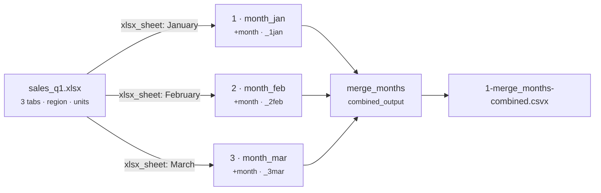

# XLSX Tabs → One Long Table (sheet per period)

[:material-github: View on GitHub](https://github.com/zaxified/bxp/tree/master/docs/examples/advanced/xlsx-tabs-merge){ .md-button }

!!! abstract "What"
    Flatten an Excel workbook that keeps **one tab per period** (January /
    February / March) into a single long table with a `month` column.

!!! note "Synthetic / teaching example"
    The data here is **constructed**, not sourced —
    `sales_q1.xlsx` has three same-shape sheets (`region`, `units`). The _problem
    class_ — reports split across monthly/topic tabs — is universal; the rows are not.

## Why interesting

"A tab per month" is how most business workbooks grow, and
it makes the data un-analysable: you can't filter or chart across tabs without
copy-pasting them together by hand. Pulling every sheet into one normalised
table, stamped with which tab it came from, is the routine first step — and one
most CSV tools can't do because they don't read `.xlsx` at all.



**Problem class documented in.** (sources for the problem class — not for the data)

- Tab-per-period workbooks are the archetypal "spreadsheet that should have been
  a table" — the motivation behind `tidyxl`/`unpivotr` (R) and countless
  "combine all sheets" macros.

## The trick — extract each tab, stamp it, then fan in

Four templates, run all at once with `bxp-cli --config ./sample.json`. January is
shown below; February and March are the same three lines with a different sheet
name. Both intermediate files are committed and pinned by goldens, so this is
what the run really writes.

### Pass 1 · `month_jan` — pull one sheet out of the workbook

An `xlsx_sheet` block selects **one** sheet by name and extracts it to a plain
CSV named by its `output_suffix`. This is the step that most CSV tools cannot do
at all, because they never open `.xlsx` in the first place — and it is the only
place you get to see what is actually inside the workbook:

```csv title="sales_q1_jan.sheet.csv — the January tab, extracted"
--8<-- "examples/advanced/xlsx-tabs-merge/sales_q1_jan.sheet.csv"
```

The sheet knows its own month only by being called "January". That fact is in
the tab name, not in any cell — which is exactly what the next step fixes.

### Pass 2 · the same template — stamp the month, number the part

The template's `input_schema` adds a `month` literal, so the month survives into
the data where a `GROUP BY` can reach it. The output name is numbered
(`_1jan`, `_2feb`, `_3mar`) purely so the fan-in stacks the months in calendar
order rather than alphabetical:

```csv title="sales_q1_1jan.part.csv"
--8<-- "examples/advanced/xlsx-tabs-merge/sales_q1_1jan.part.csv"
```

### Pass 3 · `merge_months` — fan in

`combined_output: true` over `*.part.csv` stacks the three numbered parts into
one long table — **Final result** below.

## Final result

Three Excel tabs become one table, in calendar order, with the
source month as a column:

```text
month,region,units
January,Praha,120
January,Brno,95
February,Praha,110
February,Brno,130
March,Praha,140
March,Brno,105
```

## Sample data

Run it with `bxp-cli --config ./sample.json` — the commented template selects
one sheet per month, then a fan-in pass merges them:

=== "sample.json (config)"

    ```js
    --8<-- "examples/advanced/xlsx-tabs-merge/sample.json"
    ```

=== "1-merge_months-combined.csvx (result)"

    ```csv
    --8<-- "examples/advanced/xlsx-tabs-merge/1-merge_months-combined.csvx"
    ```

The input is a binary file — [`sales_q1.xlsx` on GitHub](https://github.com/zaxified/bxp/tree/master/docs/examples/advanced/xlsx-tabs-merge/sales_q1.xlsx).
