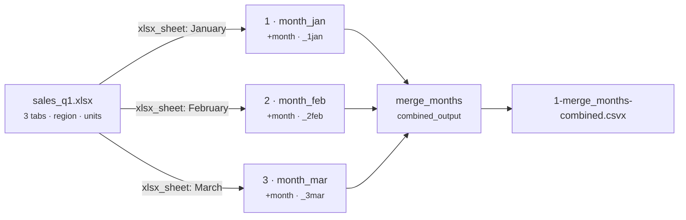

# XLSX Tabs → One Long Table (sheet per period)

[:material-github: View on GitHub](https://github.com/zaxified/bxp/tree/master/docs/examples/advanced/xlsx-tabs-merge){ .md-button }

!!! abstract "What"
    Flatten an Excel workbook that keeps **one tab per period** (January /
    February / March) into a single long table with a `month` column.

!!! note "Synthetic / teaching example"
    The data here is **constructed**, not sourced —
    `sales_q1.xlsx` has three same-shape sheets (`region`, `units`). The _problem
    class_ — reports split across monthly/topic tabs — is universal; the rows are not.

## Why interesting

"A tab per month" is how most business workbooks grow, and
it makes the data un-analysable: you can't filter or chart across tabs without
copy-pasting them together by hand. Pulling every sheet into one normalised
table, stamped with which tab it came from, is the routine first step — and one
most CSV tools can't do because they don't read `.xlsx` at all.



**Problem class documented in.** (sources for the problem class — not for the data)

- Tab-per-period workbooks are the archetypal "spreadsheet that should have been
  a table" — the motivation behind `tidyxl`/`unpivotr` (R) and countless
  "combine all sheets" macros.

## The trick

(see inline comments in `sample.json`) — an `xlsx_sheet` block
selects **one** sheet by name, so there is one template per month, each stamping
its own `month` literal, then a fan-in pass merges them. Run all at once with
`bxp-cli --config ./sample.json`:

1. `month_jan` / `month_feb` / `month_mar` — each `xlsx_sheet`-extracts its tab
   and writes a numbered part file (`_1jan` / `_2feb` / `_3mar`) so the merge
   stays in calendar order.
2. `merge_months` — `combined_output: true` over `*.part.csv` → one
   `1-merge_months-combined.csvx`.

## Final result

Three Excel tabs become one table, in calendar order, with the
source month as a column:

```text
month,region,units
January,Praha,120
January,Brno,95
February,Praha,110
February,Brno,130
March,Praha,140
March,Brno,105
```

## Sample data

Run it with `bxp-cli --config ./sample.json` — the commented template selects
one sheet per month, then a fan-in pass merges them:

=== "sample.json (config)"

    ```js
    --8<-- "examples/advanced/xlsx-tabs-merge/sample.json"
    ```

The input is a binary file — [`sales_q1.xlsx` on GitHub](https://github.com/zaxified/bxp/tree/master/docs/examples/advanced/xlsx-tabs-merge/sales_q1.xlsx).
