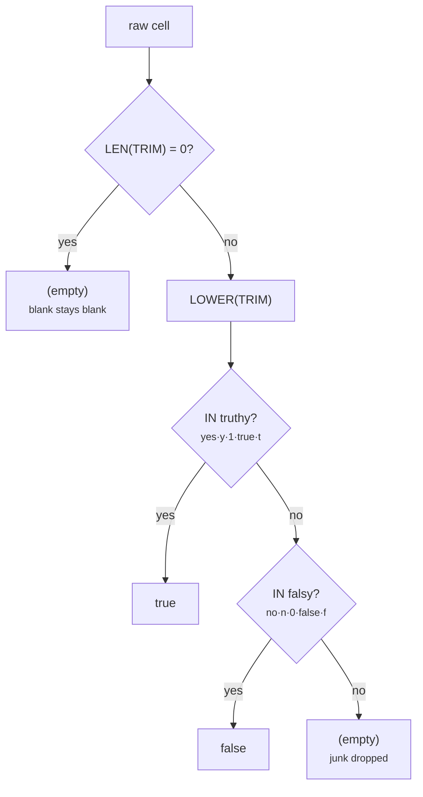

# Boolean Variants → Canonical true/false

[:material-github: View on GitHub](https://github.com/zaxified/bxp/tree/master/docs/examples/intermediate/boolean-variants){ .md-button }

!!! abstract "What"
    Fold boolean columns written every which way — `Yes`/`No`, `Y`/`N`,
    `1`/`0`, `true`/`false`, `TRUE`/`T`/`F`, mixed case — into a canonical
    `true`/`false`, with blanks and unrecognised junk left empty.

!!! note "Synthetic / teaching example"
    The data here is **constructed**, not sourced
    — `sample.csv` plants one of each boolean spelling plus a blank and a junk
    value. The _problem class_ is real and universal; the rows are not.

## Why interesting

"Boolean" is the least standardised column type in
practice: every system invents its own truthy/falsy spelling, and a join or
filter on the raw text silently splits `Yes` from `Y` from `true`. Normalising
to one representation is routine — but doing it correctly runs into two numeric
**coercion traps** worth knowing.



**Problem class documented in.** (sources for the problem class — not for the data)

- [pandas truthy/falsy parsing](https://pandas.pydata.org/docs/reference/api/pandas.read_csv.html)
  (`true_values` / `false_values`) exists because CSVs encode booleans as
  `Y`/`N`, `1`/`0`, `T`/`F`, `yes`/`no`, …

## The trick

(see inline comments in `sample.json`)

`LOWER(TRIM(...))` then `IN(...)` against the truthy / falsy spellings. The two
traps, both solved by guarding blanks with `ISEMPTY([Active])`{.bxp-try} **first**:

1. **Blank vs `'0'`.** bxp coerces an empty cell to `0` and the literal `'0'`
   to `0`, so a blank would wrongly match the `'0'` in the falsy list and become
   `false`. Guarding blanks up front keeps them empty.
2. **The guard itself.** A bare `TRIM([Active]) = ''`{.bxp-try} _also_ coerces
   (`"0"`→0 == `""`→0), so it would wrongly treat a real `"0"` as blank.
   `ISEMPTY` compares the **trimmed length** — no coercion — so `"0"` (length 1)
   survives to be read as `false`. Compare the two on **show all**: the `0` row
   is where they disagree.

## Final result

Ten spellings collapse to three states; the `0` is a real
`false`, the blank stays blank, and the junk `unknown` is dropped to empty:

```text
Yes / TRUE   →  true  / true
N   / 0      →  false / false
1   / false  →  true  / false
(blank) / unknown → (empty) / (empty)
```

Now a `WHERE active = 'true'` filter catches every truthy spelling at once.

## Sample data

Run it with `bxp-cli --config ./sample.json --template boolean_variants_clean`:

=== "sample.json (config)"

    ```js
    --8<-- "examples/intermediate/boolean-variants/sample.json"
    ```

=== "sample.csv"

    ```{.csv .bxp-sample}
    --8<-- "examples/intermediate/boolean-variants/sample.csv"
    ```

=== "sample.csvx (result)"

    ```csv
    --8<-- "examples/intermediate/boolean-variants/sample.csvx"
    ```
