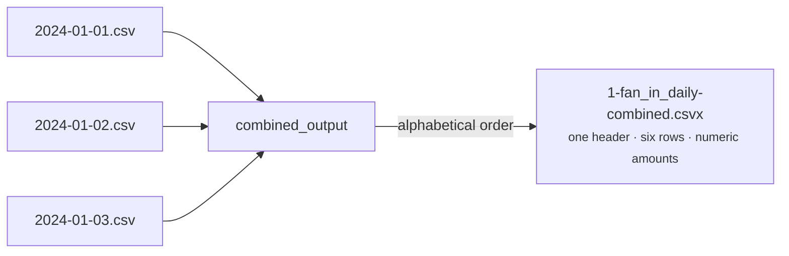

# Fan-In Many Files → One Table (`combined_output`)

[:material-github: View on GitHub](https://github.com/zaxified/bxp/tree/master/docs/examples/intermediate/fan-in-files){ .md-button }

!!! abstract "What"
    Stack a folder of same-shape exports — one CSV per day/month — into a
    single combined table, in deterministic order, with no manual `cat` and no
    repeated header rows.

!!! note "Synthetic / teaching example"
    The data here is **constructed**, not sourced
    — three daily files (`2024-01-01.csv` … `2024-01-03.csv`) with identical columns
    and continental numbers (`"1 250,50"`). The _problem class_ — periodic exports
    you have to glue back together — is universal; the rows are not.

## Why interesting

Almost every operational system emits one file per period
(daily sales, monthly statements, per-run logs). Re-assembling them with
`cat *.csv` duplicates the header on every file boundary and the order depends
on the shell glob; doing it in a spreadsheet is manual and error-prone. One
flag turns the whole folder into one clean table.



**Problem class documented in.** (sources for the problem class — not for the data)

- The classic `cat *.csv > all.csv` foot-gun (a header row per input) is one of
  the most-asked CSV questions on Stack Overflow and the reason tools like
  `csvstack` (csvkit) exist.

## The trick

(see inline comments in `sample.json`):

`combined_output: true`. Every file matched by `file_pattern_in` in `data_dir`
is run through the one template and the output rows are written to a single file,
`1-fan_in_daily-combined.csvx`, in **alphabetical filename order** — so naming
files by date gives a chronological stack. The per-row cleanup (`REPLACE` the
space thousands + comma decimal, `* 1`) is applied uniformly to every file.

!!! note "Per-file outputs, and adding a period later"
    bxp still also writes a per-file `<stem>.csvx` for each input; the
    combined file is the fan-in result.

    **Incremental re-runs.** Drop a new period file in (`2024-01-04.csv`) and
    re-run with `--fresh`: the per-file `.csvx` copies that already exist are
    skipped, but the combined roll-up is always rebuilt from **every** input — so
    the new day lands in `1-fan_in_daily-combined.csvx` while the old days are not
    re-written. The combined always reflects the full folder, never a stale subset.

## Final result

Three two-row files become one six-row table, in date order,
amounts already numeric:

```text
date,store,amount
2024-01-01,Praha,1250.5
2024-01-01,Brno,980
2024-01-02,Praha,1100
...
2024-01-03,Brno,1320
```

## Sample data

Run it with `bxp-cli --config ./sample.json --template fan_in_daily`:

=== "sample.json (config)"

    ```js
    --8<-- "examples/intermediate/fan-in-files/sample.json"
    ```

=== "2024-01-01.csv"

    ```{.csv .bxp-sample}
    --8<-- "examples/intermediate/fan-in-files/2024-01-01.csv"
    ```

=== "2024-01-02.csv"

    ```csv
    --8<-- "examples/intermediate/fan-in-files/2024-01-02.csv"
    ```

=== "2024-01-03.csv"

    ```csv
    --8<-- "examples/intermediate/fan-in-files/2024-01-03.csv"
    ```

=== "1-fan_in_daily-combined.csvx (result)"

    ```csv
    --8<-- "examples/intermediate/fan-in-files/1-fan_in_daily-combined.csvx"
    ```
