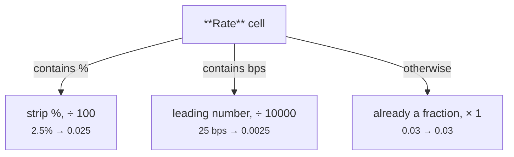

# Percent / Basis Points → Decimal Fraction

[:material-github: View on GitHub](https://github.com/zaxified/bxp/tree/master/docs/examples/intermediate/percent-to-fraction){ .md-button }

!!! abstract "What"
    Normalise a `Rate` column that mixes percent (`2.5%`), basis points
    (`25 bps`) and the odd already-decimal legacy value (`0.03`) into one consistent
    decimal fraction.

!!! note "Synthetic / teaching example"
    The data here is **constructed**, not sourced
    — `sample.csv` is hand-written rows covering each rate notation. The _problem
    class_ is real; the rows are not.

## Why interesting

Finance writes the same rate two ways — `2.5%` and `25 bps`
are identical — and stores them as text with their unit glued on. Any
arithmetic (`rate * principal`) throws on the `%` / `bps` suffix, and mixing
percent and basis points in one column means a single divide-by-100 is wrong for
half the rows. You need to detect the notation per cell before converting.



**Problem class documented in.** (sources for the problem class — not for the data)

- [Basis point](https://en.wikipedia.org/wiki/Basis_point) — 1 bp = 0.01% =
  0.0001; rate tables routinely mix `%` and `bps`.

## The trick

(see inline comments in `sample.json`):

```{.text .bxp-try}
IF(CONTAINS([Rate], '%'),   REPLACE([Rate], '%', '') / 100,
IF(CONTAINS([Rate], 'bps'), SPLIT_PART([Rate], ' ', 1) / 10000,
                            [Rate] * 1))
```

- `%` form → strip the sign, divide by 100.
- `bps` form → take the leading number, divide by 10000 (1 bp = 0.0001).
- anything else → already a fraction, `* 1` to normalise.

## Final result

Two notations for the same thing land on the same fraction, and
the legacy decimal passes straight through:

```text
2.5%     →  0.025
25 bps   →  0.0025
150 bps  →  0.015
0.03     →  0.03
```

Every rate is now a plain fraction ready to multiply against a balance — no unit
parsing in the consuming code.

## Sample data

Run it with `bxp-cli --config ./sample.json --template percent_to_fraction`:

=== "sample.json (config)"

    ```js
    --8<-- "examples/intermediate/percent-to-fraction/sample.json"
    ```

=== "sample.csv"

    ```{.csv .bxp-sample}
    --8<-- "examples/intermediate/percent-to-fraction/sample.csv"
    ```

=== "sample.csvx (result)"

    ```csv
    --8<-- "examples/intermediate/percent-to-fraction/sample.csvx"
    ```
