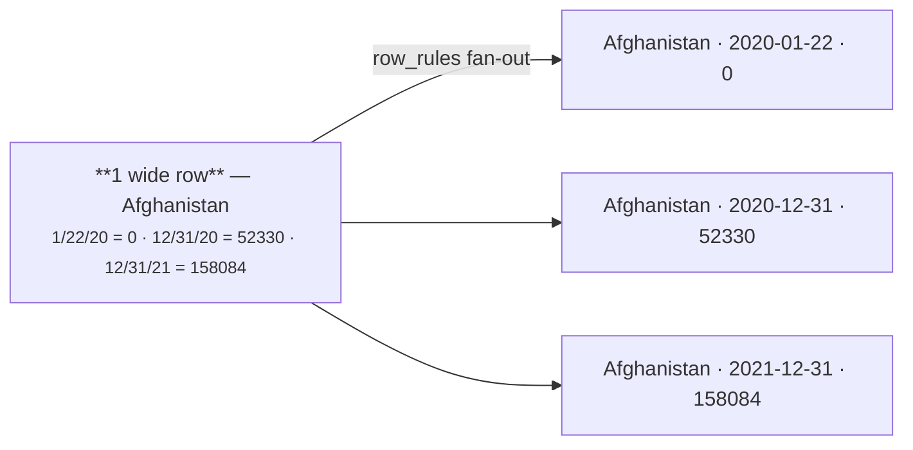

# JHU COVID-19 Wide → Long (unpivot)

[:material-github: View on GitHub](https://github.com/zaxified/bxp/tree/master/docs/examples/real-world/covid-wide-to-long){ .md-button }

!!! abstract "What"
    Reshape the Johns Hopkins COVID-19 confirmed-cases time series from its
    native **wide** layout (one column per day) into **long/tidy** rows (one row
    per country-date), using a single template.

## Why interesting

The JHU CSSE time series was the most-analysed dataset of the pandemic, and it
ships in the shape analysts least want: each day is its own column (`1/22/20`,
`1/23/20`, … out to `3/9/23`), so the file is ~1147 columns wide and every
plotting/grouping tool first has to **melt** it to long form. Unpivoting is
normally a `pandas.melt` / `tidyr::pivot_longer` step — but bxp does it
declaratively, in the template, with no code: one input row fans out to many
output rows via multi-row `row_rules`.



**Edge cases sourced from.**

- [pandas `melt` / wide-to-long](https://pandas.pydata.org/docs/user_guide/reshaping.html)
  and [tidyr `pivot_longer`](https://tidyr.tidyverse.org/articles/pivot.html)
  exist precisely because wide time-series need reshaping before analysis
- country names embed commas (`"Korea, South"`), so the file is double-quoted

**Data source.** [JHU CSSE COVID-19 Data Repository](https://github.com/CSSEGISandData/COVID-19)
— `time_series_covid19_confirmed_global.csv` (archived March 2023). CC BY 4.0.
(this slice: 23 countries × the first day + two year-end snapshot columns.)

## The trick

**Unpivot via multi-row `row_rules`.** Each entry in `rows: [ … ]` emits one
output row, pulling a different date column (`[12/31/20]`) and stamping the
matching ISO date as a literal. Three entries → three country-date rows per
input country.

!!! note "Field references with slashes"
    Date columns are named with slashes; `[1/22/20]` works as a field reference.
    Inside an override you reference _fields_ with `[..]`, not `$variables`.

## At full scale

```bash
bash fetch-full.sh          # downloads the full ~1147-column series into ./full/
bxp-cli --config full.json  # unpivots all ~289 country/region rows → ~867 long rows
```

The unpivot is the point, not raw volume (the file is only ~289 rows). The full
file is **1147 columns** wide — comfortably inside bxp's 16384-column cap, so
every day-column stays reachable and the run is warning-free; the three snapshot
columns this template reads sit at cols 5 / 349 / 714.

## Final result

`sample.csvx` turns one `Afghanistan` row holding `0 | 52330 | 158084` across
three columns into three tidy rows:

```text
Afghanistan,2020-01-22,0
Afghanistan,2020-12-31,52330
Afghanistan,2021-12-31,158084
```

That long shape drops straight into a `GROUP BY date` or a time-series plot — no
melt step, no Python. To add more snapshots, add more `rows` entries; to unpivot
_every_ day you would loop the columns, which is the natural feature boundary
(and the reason day-per-column files want this reshape in the first place).

## Sample data

Run it with `bxp-cli --config ./sample.json --template covid_wide_to_long`:

=== "sample.json (config)"

    ```js
    --8<-- "examples/real-world/covid-wide-to-long/sample.json"
    ```

=== "sample.csv"

    ```csv
    --8<-- "examples/real-world/covid-wide-to-long/sample.csv"
    ```

**Full-scale &amp; binary files** (run it on the complete dataset): [`fetch-full.sh`](https://github.com/zaxified/bxp/tree/master/docs/examples/real-world/covid-wide-to-long/fetch-full.sh) · [`full.json`](https://github.com/zaxified/bxp/tree/master/docs/examples/real-world/covid-wide-to-long/full.json).
