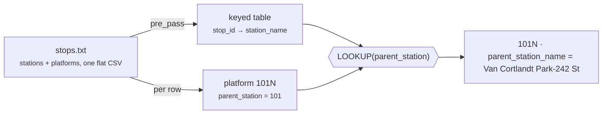

# GTFS Stops → Self-Join (pre_pass + LOOKUP)

[:material-github: View on GitHub](https://github.com/zaxified/bxp/tree/master/docs/examples/real-world/gtfs-stops-selfjoin){ .md-button }

!!! abstract "What"
    Enrich every NYC-subway platform row with its parent **station name**
    — a value that lives on a _different row of the same file_ — using bxp's
    `pre_pass` + `LOOKUP`. A self-join, no second file.

## Why interesting

GTFS `stops.txt` is hierarchical inside one flat CSV: a
parent **station** row (`location_type = 1`) is followed by directional
**platform** rows whose `parent_station` column holds the parent's `stop_id`
(`101N` → `101`). Downstream you almost always want the human station name next
to each platform, which means resolving that opaque id against another row —
the classic "join a table to itself" problem. Most CSV tools can't do it in one
pass; bxp scans the file once into a keyed table (`pre_pass`) and then every row
can `LOOKUP` back into it.



**Edge cases sourced from.**

- [GTFS reference — `stops.txt` / `parent_station`](https://gtfs.org/documentation/schedule/reference/#stopstxt)
  defines the `location_type` / `parent_station` hierarchy
- platform rows reference a `stop_id` that may appear _before or after_ them in
  the file — a single forward scan (`pre_pass`) handles either order

**Data source.** [MTA — NYC subway GTFS feed](https://www.mta.info/developers)
(`stops.txt`; this slice: the first 20 stations + their 40 platforms).
Public data.

## At full scale

```bash
bash fetch-full.sh          # downloads the MTA GTFS zip, extracts ./full/stops.txt
bxp-cli --config full.json  # resolves every platform → parent station name
```

On the full feed: 1,488 stops → 496 stations + 992 platforms, and **all 992
platforms resolve their parent station name** via the self-join.

## The trick

(see `sample.json`):

1. **`pre_pass`** scans the file first and indexes the parent stations
   (`location_type = 1`) by `stop_id`, storing `station_name` (+ coords).
2. **`LOOKUP([parent_station], 'station_name')`** in `input_schema` resolves
   each platform's opaque parent id to the name captured in the pre-pass.
   Stations have no parent, so an `IF([parent_station] = '', …)` guard keeps
   them clean.

## Final result

Row `101N` arrives with only `parent_station = 101` — an id
that means nothing on its own. The output row carries
`parent_station_name = "Van Cortlandt Park-242 St"`, pulled from row `101`
elsewhere in the same file. Without the pre_pass you'd need a second tool, a
second file, or a manual join; here it's two config lines.

## Sample data

Run it with `bxp-cli --config ./sample.json --template gtfs_stops_selfjoin`:

=== "sample.json (config)"

    ```js
    --8<-- "examples/real-world/gtfs-stops-selfjoin/sample.json"
    ```

=== "sample.csv"

    ```{.csv .bxp-sample}
    --8<-- "examples/real-world/gtfs-stops-selfjoin/sample.csv"
    ```

**Full-scale &amp; binary files** (run it on the complete dataset): [`fetch-full.sh`](https://github.com/zaxified/bxp/tree/master/docs/examples/real-world/gtfs-stops-selfjoin/fetch-full.sh) · [`full.json`](https://github.com/zaxified/bxp/tree/master/docs/examples/real-world/gtfs-stops-selfjoin/full.json).
