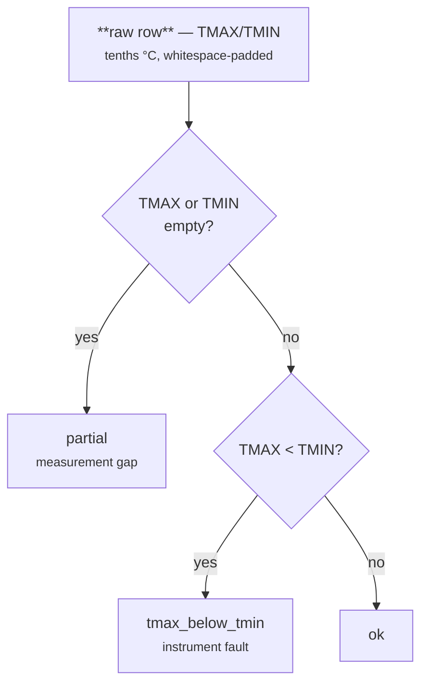

# NOAA GHCN Daily → Metric Units

[:material-github: View on GitHub](https://github.com/zaxified/bxp/tree/master/docs/examples/real-world/noaa-ghcn-daily){ .md-button }

!!! abstract "What"
    Convert NOAA Global Historical Climatology Network daily records into a CSV with proper SI units (°C and mm) and a per-row consistency flag.

## Why interesting

GHCN is the most widely cited open climate dataset in the world (10k+ stations, daily back to 1763 for some) and it ships with a unit convention that silently 10×-amplifies every reading for anyone who doesn't read the documentation: temperatures are stored as integer **tenths of degrees Celsius**, precipitation as **tenths of millimetres**, both left-padded with whitespace into a fixed-width column. A row showing `TMAX="   50"` is 5.0°C, not 50°C — climate-research repos on GitHub repeatedly ship this bug.



**Edge cases sourced from.**

- <https://www.ncei.noaa.gov/pub/data/ghcn/daily/readme.txt> — official GHCN
  daily README; documents the tenths-of-units convention, the whitespace
  padding, and the per-element quality flag columns
- <https://github.com/pangeo-data/pangeo/issues/598> — Pangeo community
  thread where users were getting 50°C readings before noticing the scaling

**Data source.** [NOAA GHCN Daily — Central Park station USW00094728](https://www.ncei.noaa.gov/data/global-historical-climatology-network-daily/access/USW00094728.csv)
(this slice: 12 real days hand-picked from the station's 157-year history so
that one short table shows every case the template handles — a dry day, a snow
day, sub-zero temperatures, a 0.0 °C minimum, a genuine measurement gap, and
both instrument faults).

## The tricks

(See the inline comments in `sample.json`.)

1. **TRIM + ÷10 unit conversion** — `IF(ISEMPTY([TMAX]), '', TRIM([TMAX]) / 10)`{.bxp-try}
   handles both the whitespace padding and the tenths-of-°C scaling, while
   keeping genuinely empty cells empty (a measurement gap stays empty rather
   than collapsing to 0.0 °C).
2. **Per-row consistency flag** — flag rows where `TMAX < TMIN` (instrument
   fault), `TMAX`/`TMIN` empty (`partial`), or otherwise `ok`. Climatology
   averages computed across the raw column would silently swallow these.

!!! warning "The guard must be `ISEMPTY`, not `[X] = ''`"
    A day with no rain is a real measurement of `0`, and in bxp `'0' = ''` is
    **true** — both sides coerce to the number 0. So the cheaper-looking guard
    reports "it didn't rain" as "we don't know", and a 0.0 °C minimum as a
    missing reading. `ISEMPTY` tests the trimmed *length*, which `"0"` survives.
    Compare them on **show all**: `TRIM([TMIN]) = ''`{.bxp-try} versus
    `ISEMPTY([TMIN])`{.bxp-try} — they disagree on 2020-01-06, a real 0.0 °C
    day. Across the full 157-year file that one choice moves **1,559 rows** out
    of the `partial` bucket.

## At full scale

The committed `sample.csv` is a 12-row teaching slice; the real Central Park
file is the complete daily history. Pull it and run the same template against
the whole thing:

```bash
bash fetch-full.sh          # downloads ./full/USW00094728.csv (~17 MB)
bxp-cli --config full.json  # processes the full history
```

Measured on the reference machine (ReleaseFast, 8 cores):

| metric            | value                                                       |
| ----------------- | ----------------------------------------------------------- |
| input             | 57,486 rows × **124 columns** / 17 MB                       |
| date span         | 1869-01-01 → 2026-05-23 (157 years)                         |
| wall time         | ~0.17 s                                                     |
| peak RSS          | ~18 MB (flat — does not grow with the file)                 |
| `ok`              | 57,477 rows                                                 |
| `partial`         | **7 rows** — one week in May 1869 with no temperatures      |
| `tmax_below_tmin` | **2 rows** — 1894-10-05 (15.6 < 16.1 °C), 1897-02-07 (3.9 < 6.1 °C) |

The consistency flag earns its keep here: two instrument-fault days and one
missing week hidden in 157 years of records, found in a fifth of a second.

GHCN's per-station file is also **124 columns** wide (every measurement element
pairs with a `_ATTRIBUTES` quality-flag column). bxp-cli's column ceiling is
**16384**, so a climate file sits comfortably under it — as do day-per-column
time series like the [Johns Hopkins COVID-19
series](../covid-wide-to-long/index.md) at 1147 columns.

## Final result

Whitespace-padded tenths become real SI values, and each row is classified:

```text
raw TMAX  raw TMIN  raw PRCP   →  tmax_c  tmin_c  prcp_mm  consistency
"   94"   "   67"   "   38"    →  9.4     6.7     3.8      ok            2020-01-03
"   72"   "    0"   "   10"    →  7.2     0       1        ok            2020-01-06
""        ""        "  178"    →  (empty) (empty) 17.8     partial       1869-05-02
"  156"   "  161"   "    8"    →  15.6    16.1    0.8      tmax_below_tmin  1894-10-05
```

Without the ÷10 step a casual reader sees `94` and concludes that 3 January
2020 in Central Park hit 94 °C. And note the difference between rows two and
three: `2020-01-06` really was 0.0 °C at dawn, while 1869-05-02 genuinely has
no thermometer reading — the first is a number, the second is empty, and only
the second is flagged `partial`.

!!! tip "Trace it in the GUI"
    Open `sample.csvx`, click any `tmax_c` cell: the trace pane shows the chain
    `IF(ISEMPTY("   94"), '', TRIM("   94") / 10) = 9.4`, one step at a time.

## Sample data

Run it with `bxp-cli --config ./sample.json --template noaa_daily_to_metric`:

=== "sample.json (config)"

    ```js
    --8<-- "examples/real-world/noaa-ghcn-daily/sample.json"
    ```

=== "sample.csv"

    ```{.csv .bxp-sample}
    --8<-- "examples/real-world/noaa-ghcn-daily/sample.csv"
    ```

=== "sample.csvx (result)"

    ```csv
    --8<-- "examples/real-world/noaa-ghcn-daily/sample.csvx"
    ```

**Full-scale &amp; binary files** (run it on the complete dataset): [`fetch-full.sh`](https://github.com/zaxified/bxp/tree/master/docs/examples/real-world/noaa-ghcn-daily/fetch-full.sh) · [`full.json`](https://github.com/zaxified/bxp/tree/master/docs/examples/real-world/noaa-ghcn-daily/full.json).
