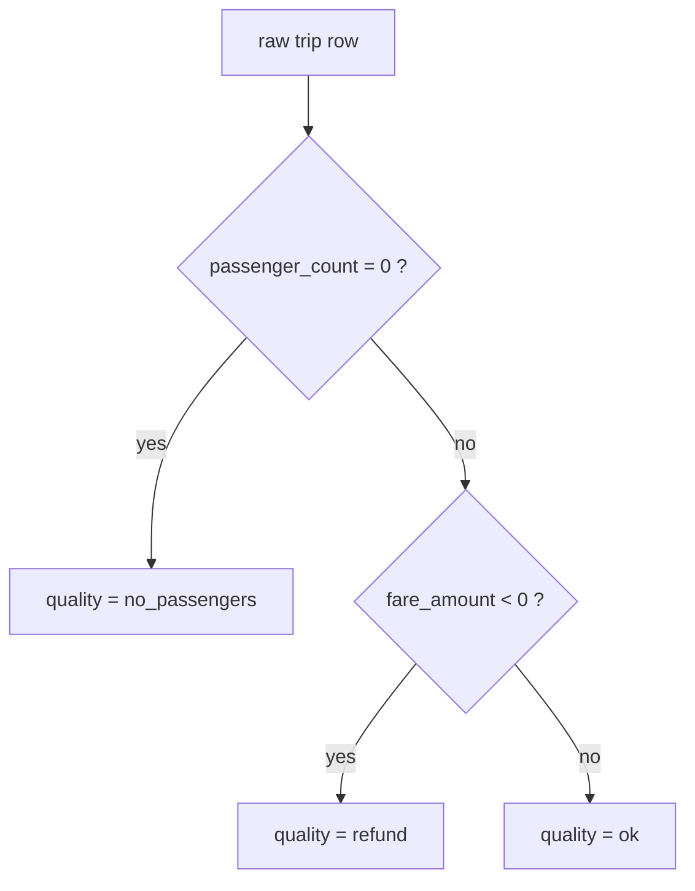

# NYC Yellow Taxi Trips → Analytics Schema

[:material-github: View on GitHub](https://github.com/zaxified/bxp/tree/master/docs/examples/real-world/nyc-taxi-trips){ .md-button }

!!! abstract "What"
    Convert raw NYC TLC Yellow Taxi trip records into an analytics-ready CSV with
    ISO timestamps, human-readable payment types, and a per-row data quality flag.

## Why interesting

NYC TLC publishes monthly Yellow Taxi CSVs containing ~10M rows per month,
publicly cited in hundreds of analytics tutorials, and they ship with two silent
data-quality landmines that wreck naive aggregations: trips with
`passenger_count = 0` (driver-only / no fare) and trips with `fare_amount < 0`
(refund/reversal posted as a negative row).

The data-quality sentinel classifies every row up front, so those landmines
stand out instead of quietly skewing every average-fare and tip-rate aggregate:



**Edge cases sourced from.**

- <https://www.nyc.gov/assets/tlc/downloads/pdf/data_dictionary_trip_records_yellow.pdf>
  — official TLC data dictionary (datetime format, payment_type codes 1-6)
- <https://chriswhong.com/open-data/foil_nyc_taxi/> — original FOIL release,
  documents the negative-fare refund convention

**Data source.** [NYC TLC Trip Record Data](https://www.nyc.gov/site/tlc/about/tlc-trip-record-data.page)
(this slice: 10 real trips hand-picked so that one short table carries all four
payment types present in the data, both `store_and_fwd_flag` values, and one of
each data-quality state). The TLC has since
retired its public CSV downloads in favour of Parquet, so the full-scale fetch
below pulls the identical records — same CSV layout, same `MM/DD/YYYY hh:mm:ss
AM/PM` timestamps — from the [NYC OpenData mirror](https://data.cityofnewyork.us/Transportation/2019-Yellow-Taxi-Trip-Data/2upf-qytp).

## The trick

1. **US datetime with AM/PM** — `02/09/2018 01:25:25 PM` → ISO 8601 via
   `DATE_CONVERT(..., 'MM/DD/YYYY hh:mm:ss A', 'YYYY-MM-DD[T]hh:mm:ss[Z]')`.
   Run it: `DATE_CONVERT([tpep_pickup_datetime], 'MM/DD/YYYY hh:mm:ss A', 'YYYY-MM-DD[T]hh:mm:ss[Z]')`{.bxp-try}
2. **store_and_fwd_flag** — `"N"`/`"Y"` → readable `false`/`true` with `IF`.
3. **payment_type code → label** — `REMAP()` over a 1-6 → text named map built
   from the TLC dictionary.
4. **Data-quality sentinel column** — `IF(NOT ISEMPTY([passenger_count]) AND [passenger_count] = 0, ...)`
   classifies each row as `ok` / `no_passengers` / `refund` so the anomalies
   stand out instead of contaminating aggregates.
   Run it: `IF(NOT ISEMPTY([passenger_count]) AND [passenger_count] = 0, 'no_passengers', IF([fare_amount] < 0, 'refund', 'ok'))`{.bxp-try}

## At full scale

The committed `sample.csv` is a 10-row teaching slice; the real 2019 dataset is
~84M trips. Pull it and run the same template against the whole thing:

```bash
bash fetch-full.sh          # downloads ./full/yellow_tripdata_2019.csv (~8 GB)
bxp-cli --config full.json  # processes all ~84M trips
```

Measured on the reference machine (ReleaseFast, 8 cores):

| metric          | value                                                                                   |
| --------------- | --------------------------------------------------------------------------------------- |
| input / output  | 84,399,019 rows (1:1) / 7.7 GB → 6.5 GB                                                 |
| wall time       | ~285 s (two `DATE_CONVERT` calls per row)                                               |
| peak RSS        | ~23 MB (flat — does not grow with 84M rows)                                             |
| `no_passengers` | **1,772,399 rows (2.1%)** — physically impossible, paid fare with `passenger_count = 0` |
| `refund`        | **169,241 rows** — negative-fare reversals posted as trips                              |

Constant ~23 MB while streaming 84 million rows and emitting 6.5 GB is the
headline: the data-quality flag isolates ~1.94M anomalous rows that no spot
check would ever surface — a tiny fraction of 84M, invisible in any spot check,
yet they silently skew every average-fare and tip-rate aggregate computed over
the raw column.

## Final result

Timestamps become ISO, the payment code becomes a word, and every row carries
its own verdict:

```text
raw                                                 →  converted
02/09/2018 01:25:25 PM  pax=2  pay=1  fare=6        →  2018-02-09T13:25:25Z  credit_card  ok
02/09/2018 01:16:19 PM  pax=1  pay=4  fare=4.5      →  2018-02-09T13:16:19Z  dispute      ok
02/09/2018 01:45:16 PM  pax=0  pay=1  fare=6.5      →  2018-02-09T13:45:16Z  credit_card  no_passengers
02/09/2018 01:04:43 PM  pax=6  pay=3  fare=-4       →  2018-02-09T13:04:43Z  no_charge    refund
```

The last two rows are the point. A trip with a paid fare and **zero passengers**
is physically impossible, and a **negative** fare is a reversal posted as if it
were a trip. Both look like ordinary rows to any tool that only checks types —
and both quietly drag down every average-fare and tip-rate aggregate. At full
scale that is ~1.94M rows.

!!! tip "Trace it in the GUI"
    Click the `quality` cell of the `refund` row: the trace pane walks the
    nested `IF` that decided it, one comparison at a time.

## Sample data

Run it with `bxp-cli --config ./sample.json --template nyc_taxi_to_analytics`:

=== "sample.json (config)"

    ```js
    --8<-- "examples/real-world/nyc-taxi-trips/sample.json"
    ```

=== "sample.csv"

    ```{.csv .bxp-sample}
    --8<-- "examples/real-world/nyc-taxi-trips/sample.csv"
    ```

=== "sample.csvx (result)"

    ```csv
    --8<-- "examples/real-world/nyc-taxi-trips/sample.csvx"
    ```

**Full-scale &amp; binary files** (run it on the complete dataset): [`fetch-full.sh`](https://github.com/zaxified/bxp/tree/master/docs/examples/real-world/nyc-taxi-trips/fetch-full.sh) · [`full.json`](https://github.com/zaxified/bxp/tree/master/docs/examples/real-world/nyc-taxi-trips/full.json).
