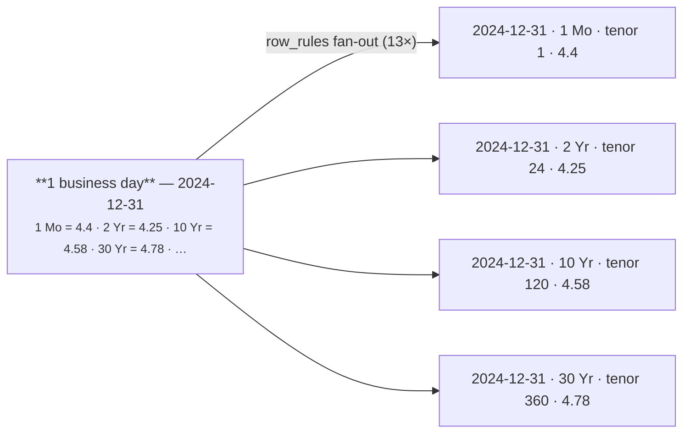

# US Treasury Yield Curve (wide → long) + tenor mapping

[:material-github: View on GitHub](https://github.com/zaxified/bxp/tree/master/docs/examples/real-world/treasury-yield-curve){ .md-button }

!!! abstract "What"
    Melt the US Treasury's daily par-yield-curve CSV from its native **wide**
    layout (one column per maturity — `1 Mo`, `2 Yr`, … `30 Yr`) into **long/tidy**
    rows (one row per date-tenor), converting the US date to ISO and mapping each
    maturity label to its length in months — all in one template.

## Why interesting

The Treasury par yield curve is one of the most-watched series in finance (it's
where "the 2s/10s inversion" is read off), and the official CSV ships in exactly
the shape analysis tools least want: each maturity is its own column, so before
you can sort the curve, plot it, or compute a spread you must (1) **melt** the 13
maturity columns to long form, and (2) turn the text maturity labels into a
**numeric tenor** — because `"10 Yr"` sorts _before_ `"2 Yr"` alphabetically,
scrambling the curve. Both steps are normally a `pandas.melt` + a hand-written
label→months dict; bxp does them declaratively in the template, with one daily
row fanning out to 13 tidy rows.



**Edge cases sourced from.**

- [pandas `melt`](https://pandas.pydata.org/docs/reference/api/pandas.melt.html)
  / [tidyr `pivot_longer`](https://tidyr.tidyverse.org/articles/pivot.html) —
  wide financial time series need reshaping before analysis.
- Maturity labels are text (`1 Mo` … `30 Yr`); a tidy tenor needs a numeric sort
  key, hence the `tenor_months` column.
- The header is **double-quoted** because maturity names contain a space
  (`"1 Mo"`); referenced as `[1 Mo]` once unquoted.

**Data source.** [US Treasury — Daily Treasury Par Yield Curve
Rates](https://home.treasury.gov/resource-center/data-chart-center/interest-rates/TextView?type=daily_treasury_yield_curve)
via the resource-center daily CSV endpoint. Public domain (US Government work).
(This slice: 60 business days from 2024.)

## The trick

- **Convert the date once** in `input_schema` —
  `DATE_CONVERT([Date], 'MM/DD/YYYY', 'YYYY-MM-DD')` — and every emitted row
  reuses that row-constant.
- **Unpivot via multi-row `row_rules`.** Each entry in `rows: [ … ]` emits one
  row, pulling a different maturity column (`[2 Yr]`) and stamping both the tenor
  label and its **length in months** as literals. 13 entries → 13 date-tenor rows
  per business day.

!!! note "Field references inside overrides"
    Inside an override you reference _fields_ with `[..]`, not other `$variables`.

## At full scale

```bash
bash fetch-full.sh          # downloads 2023+2024 daily rates into ./full/
bxp-cli --config full.json  # ~499 business days → ~6.5k tidy date-tenor rows
```

`fetch-full.sh` deliberately limits itself to 2023-2024: both years carry the
full 13-maturity schema. Older Treasury files have a _different_ column set (the
`2 Mo` tenor began 2018, `4 Mo` only in Oct 2022), so concatenating them under
one header would misalign columns.

## Final result

The 2024-12-31 row holding 13 yields across 13 columns becomes 13 tidy rows
carrying a numeric tenor:

```text
2024-12-31,1 Mo,1,4.4
2024-12-31,2 Yr,24,4.25
2024-12-31,10 Yr,120,4.58
2024-12-31,30 Yr,360,4.78
```

Sorted by `tenor_months` that _is_ the yield curve — it drops straight into a
`GROUP BY date` time series or an `ORDER BY tenor_months` curve plot, with no
melt step and no label→months dictionary in Python.

## Sample data

Run it with `bxp-cli --config ./sample.json --template treasury_curve_to_long`:

=== "sample.json (config)"

    ```js
    --8<-- "examples/real-world/treasury-yield-curve/sample.json"
    ```

=== "sample.csv"

    ```csv
    --8<-- "examples/real-world/treasury-yield-curve/sample.csv"
    ```

**Full-scale &amp; binary files** (run it on the complete dataset): [`fetch-full.sh`](https://github.com/zaxified/bxp/tree/master/docs/examples/real-world/treasury-yield-curve/fetch-full.sh) · [`full.json`](https://github.com/zaxified/bxp/tree/master/docs/examples/real-world/treasury-yield-curve/full.json).
