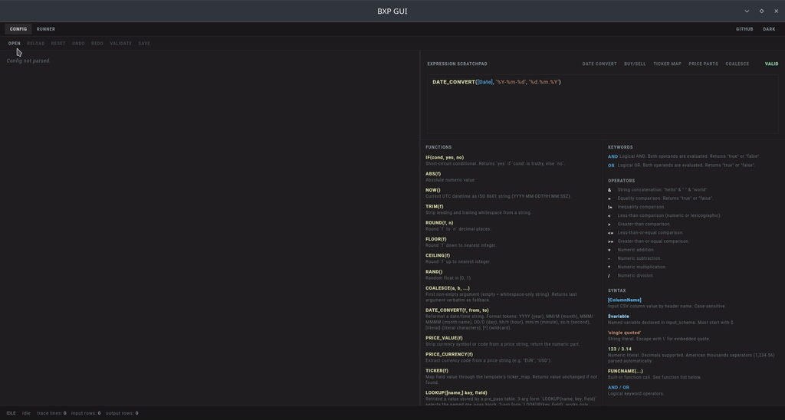

# Broker eXchange Parser (BXP)

A converter for broker export statements (CSV, XLSX, JSON) into
portfolio-tracker CSV formats using declarative JSON5 templates.
[Wealthfolio](https://wealthfolio.app/) and
[brycht.app](https://brycht.app/) are the two trackers with shipping
templates today; any other tracker is reachable by writing an
`output_schema` for it — no code changes. Everything runs locally; your
data never leaves the machine.

## What ships

BXP comes in two distributions that share one conversion engine:

- **BXP Desktop** — a Flutter GUI with a graphical template editor and a
  dry-run debugger, so you can edit templates and preview their behaviour
  against your real broker exports without leaving the app.
- **BXP Console** — the command-line engine and the MCP server, for
  scripting, CI, and AI-assisted authoring.

Three binaries do the work (the desktop bundle ships all three; the
console bundle ships the first two):

- **`bxp-cli`** — the conversion engine. Produces the actual `.csvx`
  files from your broker exports and the JSON5 templates. The GUI runs it
  (proxied through the bundled bridge library); you can also run it
  directly from a terminal.
- **`bxp-mcp`** — an MCP server (JSON-RPC over stdio) that exposes bxp's
  stateless surface to an AI agent — validate a config or expression,
  evaluate, list templates, read the docs — and runs a full conversion
  end-to-end via its `bxp_simulate` tool. Lets an assistant author and
  self-test a template without driving the GUI.
- **`bxp-gui`** — the desktop application itself.

## Architecture in one paragraph

bxp-cli is a two-pass declarative data pipeline. Pass one (optional
`pre_pass`) scans all rows and builds a lookup table for cross-row
joins. Pass two iterates rows, evaluates `input_schema` expressions
into per-row `$variable`s, then routes each row through the ordered
`row_rules` list — the first matching rule decides the row's activity
type and whether it produces 0, 1, or N output rows. `output_schema`
then projects the final `$variable`s into CSV columns in a fixed order.
Input may be CSV, XLSX, or JSON; output is RFC 4180–compliant CSV or
JSON.

## Where to go next

- New to BXP? Start with [Install](getting-started/install.md) then
  [Your first conversion](getting-started/first-conversion.md).
- Writing a template? Read the [Guide](guide/templates.md) — it covers
  the template layout, the expression language, dates, and the target
  specs.
- Looking up a function or flag? Jump to the
  [Reference](reference/expr-functions.md).
- Using an AI assistant? The **AI workflows** section covers
  [authoring a broker with an AI](ai/authoring-a-broker.md), the
  [live GUI MCP](ai/gui-mcp.md), and [agent handoff](ai/handoff.md).

## Contributing

The project is open-source. For the newest built-in templates,
community contributions, and issue tracking see the BXP GitHub
repository: <https://github.com/zaxified/bxp>. Apache-2.0 licensed; see
`LICENSE.md` in the source tree.
