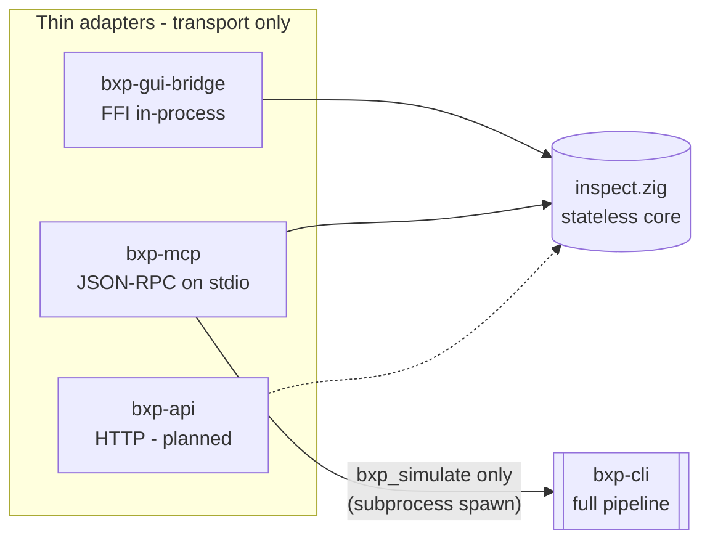

# bxp-mcp — MCP server

Developer orientation for **bxp-mcp**, the Model Context Protocol server that
exposes bxp's stateless surface (plus one full-run tool) as agent-callable
tools over JSON-RPC 2.0 on stdio.

For the deepest reference — exact JSON shapes, every design rationale — read
[`bxp-mcp/CLAUDE.md`](../bxp-mcp/CLAUDE.md). This page is the fast map.

## What it is, and why

An AI agent (Claude Code, or any MCP host) spawns `bxp-mcp` as a child process
and pipes JSON-RPC requests to it. The server lets the agent **author and verify
a bxp-cli config without driving the GUI**: validate config text, evaluate and
trace expressions, read the language docs, and run a real conversion end-to-end
against sample CSV.

It is one of several thin **adapters** over a single shared stateless core,
`bxp-core/src/inspect.zig`:



"One core, thin adapters": none of the adapters owns the stateless logic — it
lives in `inspect`. The transport follows from **who** calls and **from where**:
stdio = a local agent that spawns the server (private pipe, 1:1, zero config); a
port would be bxp-api's job (remote/shared/web). The boundary rule is _the core
must not know who is calling it_.

## Two execution models

| Model          | Tools                            | Cost         | How                                                                                                                          |
| -------------- | -------------------------------- | ------------ | ---------------------------------------------------------------------------------------------------------------------------- |
| **In-process** | every tool except `bxp_simulate` | microseconds | a tool call is a direct `inspect` function call — no spawn, no filesystem                                                    |
| **Spawn**      | `bxp_simulate`                   | a real run   | spawns the **co-located `bxp-cli`** (`sim.zig`); a full conversion needs `processBroker`, the worker pool, and real file I/O |

The "no spawn" rule is about µs-latency stateless calls. A full run is inherently
heavyweight, so the spawn cost is noise. `bxp-mcp` locates `bxp-cli` **next to
its own executable** — it ships in the same console/desktop bundle as
`bxp-cli`, so the agent always invokes it where `bxp-cli` sits
alongside.

## Tool catalog

All stateless tools share the `bxp-core/inspect` core with the GUI bridge (same
`inspect` core). The tools take config / expression **text** (not a file path) —
the agent passes the config it is authoring.

| Tool                 | `inspect` call                       | Returns                                                                                                                                                                  |
| -------------------- | ------------------------------------ | ------------------------------------------------------------------------------------------------------------------------------------------------------------------------ |
| `bxp_validate`       | `annotateRaw(config, "<config>", 0)` | annotated JSON with `$err_`/`$warn_`/`$info_` diagnostics (`check_fs = 0`, no filesystem)                                                                                |
| `bxp_validate_expr`  | `validateExprJson(expr)`             | authoring-time verdict for one expression: runtime eval + the static FnArgDoc lint (e.g. a literal `SPLIT_PART(…, 0)`); `{ok:true}` or `{ok:false,error,detail,off,len}` |
| `bxp_eval`           | `evalExpr(expr, headers?, fields?)`  | `{ok:true,value}` or `{ok:false,error,detail,off,len}`                                                                                                                   |
| `bxp_eval_batch`     | `evalBatch(request)`                 | `{results:[…]}` — the call `arguments` object _is_ the request                                                                                                           |
| `bxp_eval_trace`     | `evalTrace(expr, …, out)`            | NDJSON: one line per function call, then a `final` / `error` sentinel                                                                                                    |
| `bxp_docs`           | `docsJson()`                         | full language/schema JSON (functions, keywords, operators, tokens, config_schema)                                                                                        |
| `bxp_list_templates` | `listTemplates(config)`              | `{templates:[…]}` (no semantic validation)                                                                                                                               |
| `bxp_fetch_template` | `fetchTemplate(config, id)`          | the raw template JSON, or `{"$err_1":…}` for a bad id                                                                                                                    |
| `bxp_simulate`       | spawns `bxp-cli`                     | full end-to-end run report (see below)                                                                                                                                   |

Agent workflow hint (also in the server's `initialize` instructions): call
`bxp_docs` first to learn the language, `bxp_eval_trace` to debug an expression,
`bxp_simulate` to verify a finished config for real.

## Wire protocol

Newline-delimited JSON-RPC 2.0 over stdin/stdout — **one JSON object per line**.
stderr is free for logs.

- **request** (has `id`) → exactly one response line with the same `id`.
- **notification** (no `id`, e.g. `notifications/initialized`) → no response.
  A request-only method (`initialize` / `tools/list` / `ping` / `tools/call`)
  arriving without an `id` is a stray notification and is silently dropped.
- **tool result** → `{content:[{type:text,text}], isError}`.
  - `isError:true` marks a tool **failure** — a missing required argument, an
    unexpected Zig error, a spawn/IO problem.
  - A domain `{"ok":false,…}` answer (an expression error, a not-found template
    id, an orchestration report) keeps `isError:false`: it is a valid result the
    agent should read, not a transport failure.
  - `structuredContent` (the parsed object) is added when the tool's **declared**
    output is a single JSON object (`tools.allowsStructured`). `bxp_eval_trace`
    is NDJSON by identity and stays text-only even when a function-free
    expression emits a single sentinel line.
- **server → client** `notifications/progress` are emitted mid-call when the
  request supplied `params._meta.progressToken` (see `progress.zig`).

Methods handled: `initialize`, `tools/list`, `tools/call`, `ping`,
`notifications/initialized`.

### Protocol version negotiation

`PROTOCOL_VERSION = 2025-11-25` (latest advertised). `initialize` echoes the
client's requested `protocolVersion` when it is in `SUPPORTED_VERSIONS`
(`2025-11-25`, `2025-06-18`), otherwise answers with the latest. The tool
surface is identical across supported revisions.

## Source layout

```text
bxp-mcp/
  src/
    main.zig     entry: base arena, --help, server.run()
    server.zig   MCP stdio loop + JSON-RPC writers (pure std.json);
                 per-request arena reset between calls
    tools.zig    tool catalog (tools/list JSON) + handlers -> inspect calls;
                 dispatch() returns the isError flag; allowsStructured()
    sim.zig      bxp_simulate: stage config+CSV, spawn bxp-cli, read output,
                 diff, fold the BXTB sidecar trace into the report
    progress.zig server -> client notifications/progress
  build.zig      path-deps ../bxp-core, imports the `inspect` + `btrace` modules
  build.zig.zon
```

The JSON-RPC layer is hand-written over `std.json` — no third-party code, only
the `bxp-core` path dep.

## Memory model

`main.zig` holds one **base arena** over the page allocator for startup (argv)
and the server's persistent reused buffers (`line_buf` / `out_buf`, which retain
capacity across requests). Every transient per-request allocation — the incoming
JSON parse, `tools.dispatch`, the id/string serialization temps, and the
per-call `tool_buf` — routes through a separate **per-request arena** reset with
`retain_capacity` after each response. Memory reaches a steady state sized to the
largest single request instead of growing one request's allocations per call.

> **Aliasing lesson.** The tool-output buffer must be a _fresh_ per-request
> `tool_buf` on the request arena, not a persistent retained-capacity field: a
> retained buffer keeps pointers into arena memory that the next request's JSON
> parse reuses, so a later call could alias its own output over the live request.
> See the matching note in `bxp-mcp/CLAUDE.md`.

## bxp_simulate in depth

`sim.zig` runs a full conversion the stateless tools cannot — it exercises
`pre_pass` / `LOOKUP` / `row_rules` against real input:

1. **Validate** the template's input shape via `inspect.templateIo`; reject
   xlsx/JSON-input templates (CSV input only).
2. **Stage** a stable, reused scratch workspace `<tmp>/bxp-mcp-sim/<uid>/`
   (sanitized id; wiped fresh per run, left in place for inspection): the config
   verbatim as `config.json`, the CSV as `data/input<suffix>` (suffix matched to
   `file_pattern_in`).
3. **Run** the co-located `bxp-cli` with the existing flags only —
   `--config`/`--template`/`--data <scratch>` (so the config's own `data_dir` is
   untouched) plus `--trace-file <ws>/trace.bxtb` (a sidecar BXTB stream,
   independent of stdout, so the human summary stays clean).
4. **Read back** every produced output file, parse the BXTB sidecar with
   `btrace.Reader`, and build the report.

Report (declares an `outputSchema`):

```jsonc
{
  "ok": true,                 // the run happened; consult exit_code/status
  "template": "…",
  "exit_code": 0,             // bxp-cli: 0 ok, 2 warnings, 1 error
  "status": "ok",
  "input":  { "records": 12, "csv": "…" },
  "output_records": 12,
  "outputs": [ { "file": "…", "records": 12, "csv": "…" } ],
  "summary": "…",             // bxp-cli stdout
  "diagnostics": "…",         // bxp-cli stderr
  "trace": { … },             // BXTB sidecar folded in (below)
  "workspace": "/tmp/bxp-mcp-sim/…"
}
```

- **`records` are data rows — the header is excluded** — so `input.records` /
  `output_records` line up with `trace.source_rows` / `written_rows`.
- An output file that can't be read back (e.g. exceeds the 16 MB cap) appears as
  `{file, error}` instead of `{file, records, csv}` — never silently dropped.
- `ok:false` is reserved for **orchestration** failures that prevented a run
  (template not found, unsupported input, spawn/IO problem) and carries
  `{ok:false, error, detail}`.

The `trace` object folds the BXTB sidecar into JSON: aggregate
`source_rows`/`written_rows`/`errors`/`warnings`, then per-category exact counts
plus a capped (`MAX_TRACE_SAMPLE = 200`) sample for `filtered` (reason:
`rule_skip` / `no_rule_match`), `row_errors`, and `output_rows` — each row
carrying the **1-based input line** resolved from its `source_locator` byte
offset. For the underlying BXTB frame format see
[`trace-protokol.md`](trace-protokol.md).

## Build, run, test

```bash
cd bxp-mcp
zig build
zig build test                 # unit tests (sim.zig pure helpers)
./zig-out/bin/bxp-mcp --help

# Drive it by hand — one JSON-RPC object per line on stdin:
printf '%s\n' \
  '{"jsonrpc":"2.0","id":1,"method":"initialize","params":{"capabilities":{}}}' \
  '{"jsonrpc":"2.0","id":2,"method":"tools/list"}' \
  '{"jsonrpc":"2.0","id":3,"method":"tools/call","params":{"name":"bxp_eval","arguments":{"expr":"1 + 2"}}}' \
  | ./zig-out/bin/bxp-mcp
```

The full smoke gate is `scripts/test-02-mcp.sh`: build + unit tests + a JSON-RPC
round-trip that drives one tool from each family and a complete `bxp_simulate`
run (verifying the co-located `bxp-cli` spawn and byte-identical output against a
dataset's `.expected`).

Register with an MCP client (e.g. Claude Code, `~/.claude.json`):

```json
{ "mcpServers": { "bxp": { "command": "/abs/path/to/bxp-mcp", "args": [] } } }
```
